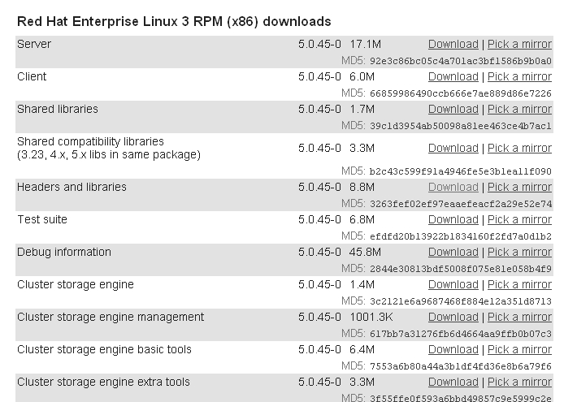
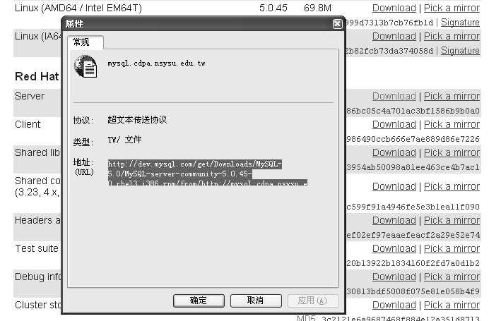

在Linux平台下，要下载MySQL可以采用以下两种方法。

**1．通过网页直接下载**

（1）打开浏览器，在地址栏中输入http://dev.mysql.com/downloads/mysql/5.0.html#linux，打开MySQL下载页面，单击“Red Hat Enterprise Linux 3 RPM (x86) downloads”下的“Server”和“Client”后面的“Download”或者“Pick a mirror”链接来选择一个镜像站点进行下载，如图1-2所示。

（2）将下载后的文件用FTP等工具传送到Linux服务器上。

**2．通过命令行方式下载**

（1）首先得到下载地址的URL（用鼠标右键单击“Download”或者镜像地址的链接，“属性”对话框中显示的“地址”信息即是URL），如图1-3所示。

图1-2 下载Server和Client

在图1-3中，本例显示的URL是：

http://dev.mysql.com/get/Downloads/MySQL-5.0/mysql-noinstall-5.0.45-win32.zip/from/ht tp://mysql.cdpa.nsysu.edu.tw/

（2）然后使用wget命令在Linux服务器上直接下载Server和Client软件包。

图1-3 下载地址的URL

在本例中，下载Server软件包的具体命令如下：

[zzx@localhost ～]$ wget http://dev.mysql.com/get/Downloads/MySQL-5.0/MySQL- server-community-5.0.45-0.rhel3.i386.rpm/from/http://mysyl.cdpa.nsysu.edu.tw/w/

--10:42:38-- http://dev.mysql.com/get/Downloads/MySQL-5.0/MySQL-server- community-5. 0.45-0.rhel3.i386.rpm/from/http://mysql.cdpa.nsysu.edu.tw/

=> 'index.html'

Resolving dev.mysql.com... 213.136.52.29

Connecting to dev.mysql.com|213.136.52.29|:80... connected.

HTTP request sent, awaiting response... 302 Found

Location: http://mysql.cdpa.nsysu.edu.tw/Downloads/MySQL-5.0/MySQL-server- community-5. 0.45-0.rhel3.i386.rpm [following]

--10:42:39-- http://mysql.cdpa.nsysu.edu.tw/Downloads/MySQL-5.0/MySQL-server-community -5.0.45-0.rhel3.i386.rpm

=> 'MySQL-server-community-5.0.45-0.rhel3.i386.rpm.1'

Resolving mysql.cdpa.nsysu.edu.tw... 140.110.123.9

Connecting to mysql.cdpa.nsysu.edu.tw|140.110.123.9|:80... connected.

HTTP request sent, awaiting response... 200 OK

Length: 18,092,605 (17M) [text/plain]

100%[==================================================================>] 18,092,605 2.00M/s ETA 00:00

10:42:57 (1.11 MB/s) - 'MySQL-server-community-5.0.45-0.rhel3.i386.rpm.1' saved [18092605/18092605]wget http://dev.mysql.com/get/Downloads/MySQL-5.0/ MySQL-client-community-5.0.45-0.rhel3.i386.rpm/from/http://mysql.cdpa.nsysu.edu.tw/

在本例中，下载Client软件包的具体命令如下：

[zzx@localhost ～]$ wget http://dev.mysql.com/get/Downloads/MySQL-5.0/MySQL- client-community-5.0.45-0.rhel3.i386.rpm/from/http://mysql.cdpa.nsysu.edu.tw/

--10:47:55-- http://dev.mysql.com/get/Downloads/MySQL-5.0/MySQL-client- community-5.0.45-0.rhel3.i386.rpm/from/http://mysql.cdpa.nsysu.edu.tw/

=> 'index.html'

Resolving dev.mysql.com... 213.136.52.29

Connecting to dev.mysql.com|213.136.52.29|:80... connected.

HTTP request sent, awaiting response... 302 Found

Location: http://mysql.cdpa.nsysu.edu.tw/Downloads/MySQL-5.0/MySQL-client- community-5.0.45-0.rhel3.i386.rpm [following]

--10:47:56-- http://mysql.cdpa.nsysu.edu.tw/Downloads/MySQL-5.0/MySQL-client- community-5.0.45-0.rhel3.i386.rpm

=> 'MySQL-client-community-5.0.45-0.rhel3.i386.rpm.1'

Resolving mysql.cdpa.nsysu.edu.tw... 140.110.123.9

Connecting to mysql.cdpa.nsysu.edu.tw|140.110.123.9|:80... connected.

HTTP request sent, awaiting response... 200 OK

Length: 6,257,771 (6.0M) [text/plain]

100%[==================================================================>] 6,257,771 1.14M/s ETA 00:00

10:48:05 (838.78 KB/s) - 'MySQL-client-community-5.0.45-0.rhel3.i386.rpm.1' saved [6257771/6257771]

