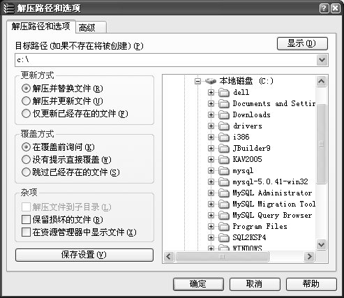
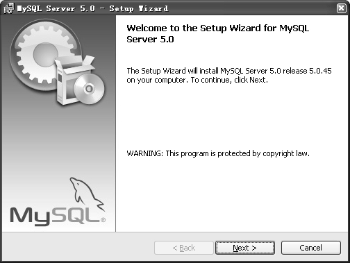
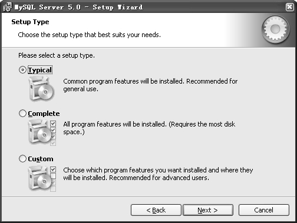
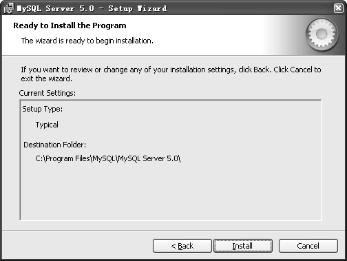
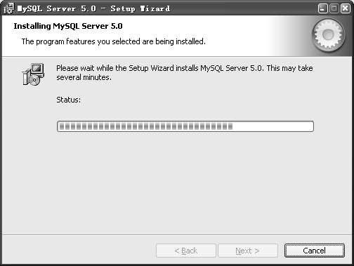
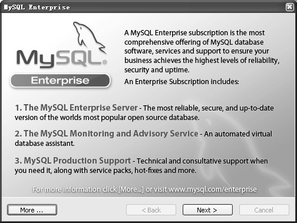
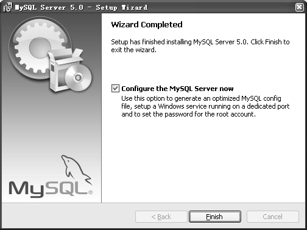
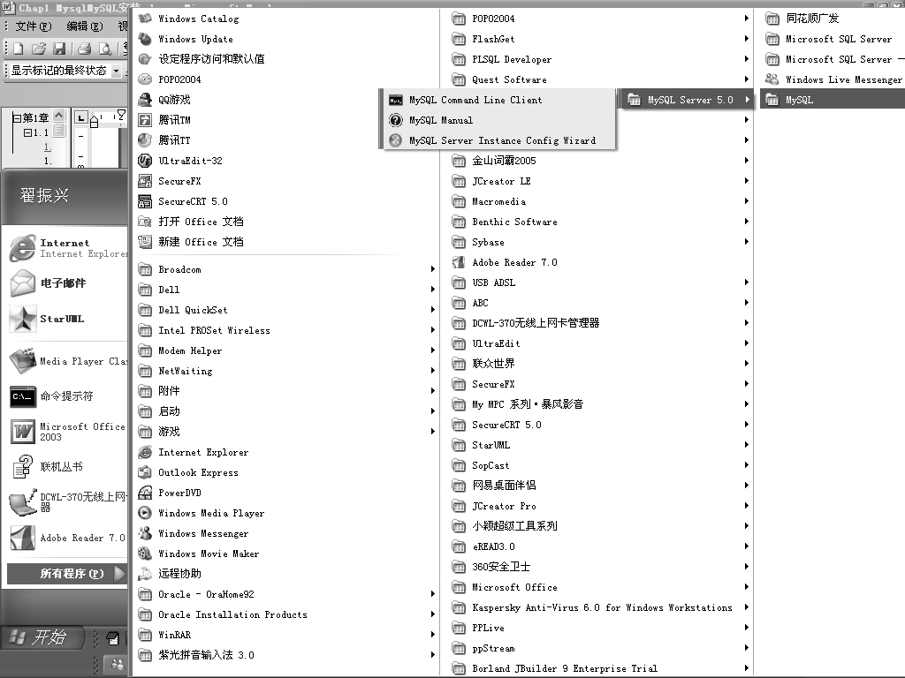

Windows平台下的安装包主要有两种，一种是noinstall包，顾名思义，不需要安装就可以直接使用；另一种是.zip 安装包，可以通过图形化界面进行安装。下面分别就两种安装方式进行介绍。

**1．noinstall安装**

在Windows平台下安装MySQL，其安装步骤非常简单，只要将下载的文件mysql-noinstall-5.0.45-win32.zip 放到自定义安装目录下，再用 WinRAR 等压缩工具解压即可。本例中解压到C:\目录下，如图1-4所示。

图1-4 用WinRAR解压noinstal 包到C:\下

**2．图形化方式安装**

在Windows平台下，采用图形化方式安装的操作步骤如下。

（1）将压缩文件mysql-5.0.45-win32.zip解压到自定义的一个目录下，在本例中解压到C:\。

（2）双击位于C:\下的setup.exe文件，进入MySQL欢迎安装界面，如图1-5所示。

图1-5 MySQL安装欢迎界面

（3）单击“Next”按钮，进入“Setup Type”界面，选择MySQL安装类型，如图 1-6所示。

图1-6 选择MySQL安装类型

这3种安装类型分别对应着不同的安装组件，其含义如下。

Typical 表示一般常用的组件都会被安装，默认情况下安装到 C:\Program Files\MySQL\MySQL Server5.0下。建议大多数情况下选择此安装套件。

Complete表示会安装所有的组件。此套件会占用较大的磁盘空间，一般情况下不要选。

Custom 表示用户可以选择要安装的组件，可以更改默认的安装路径。这种安装类型最灵活，适用于高级用户。

在这里选择Typical类型。

（4）单击“Next”按钮，进入“Ready to Install Program”界面，如图 1-7所示。

图1-7 MySQL安装前的确认界面

此界面给出了安装前的提示，确认安装类型和安装路径。如果想修改，可以单击“Back”按钮返回修改。

（5）单击“Install”按钮，开始安装过程，如图1-8所示。安装完毕前，系统会显示MySQL Enterprise版（企业版）的一些功能介绍界面，如图1-9所示，可以单击“Next”按钮继续查看，也可以单击右上角的关闭按钮跳过。

图1-8 MySQL安装进度

图1-9 MySQL Enterprise版的功能介绍

（6）最后，系统显示安装完毕，如图1-10所示。

图1-10 MySQL安装完成

（7）单击“Finish”按钮完成安装过程。如果想马上配置数据库连接，选中“Configure the MySQL Server now”复选框；如果想以后再配置，取消复选框的选中状态。这里取消选中状态，后面再进行配置的介绍。至此，MySQL 安装完毕，Windows 的“所有程序”菜单中已经多了“MySQL”一项，如图1-11所示。

图1-11 MySQL安装后的程序项

