对于 noinstall 方式安装的 MySQL，系统的参数配置、服务的启动和关闭都需要手工在命令窗口中完成。参数文件可以在多个位置进行设置，这里用一个 C:\my.cnf 来进行操作，其他更详细的参数位置可以参考第24章中的介绍。

对于初学者来说，my.cnf 并不知道该怎样配置。MySQL 为用户提供了几个样例文件，位于解压后的目录下，文件名类似于my-***.ini，其中“***”分别代表了不同的环境特点，例如my-small.ini、my-large.ini 分别代表了此文件适合于小型数据库和大型数据库。下面是一个my-small.ini的部分内容：

# Example MySQL config file for small systems.

#

# This is for a system with little memory (<= 64M) where MySQL is only used

# from time to time and it's important that the mysqld daemon

# doesn't use much resources.

…

# The following options will be passed to all MySQL clients

[client]

#password = your_password

port　=3306

socket　=/tmp/mysql.sock

# Here follows entries for some specific programs

# The MySQL server

[mysqld]

port　=3306

socket　=/tmp/mysql.sock

skip-locking

key_buffer = 16K

max_allowed_packet = 1M

table_cache = 4

sort_buffer_size = 64K

read_buffer_size = 256K

read_rnd_buffer_size = 256K

net_buffer_length = 2K

thread_stack = 64K

[mysqldump]

quick

max_allowed_packet = 16M

[mysql]

no-auto-rehash

[isamchk]

key_buffer = 8M

sort_buffer_size = 8M

[myisamchk]

key_buffer = 8M

sort_buffer_size = 8M

[mysqlhotcopy]

interactive-timeout

上面样例中的粗体代表了不同方面的参数，通常我们配置最多的是[mysqld]，也就是mysql服务器参数。如果将选择的my-***.ini文件另存为C:\my.cnf文件，则MySQL实例启动的时候就会读取此配置文件。

对于图形化的安装方式，MySQL 提供了一个图形化的实例配置向导，可以引导用户逐步进行实例参数的设置，具体操作步骤如下。

（1）单击“开始”Æ“所有程序”Æ“MySQL”Æ“MySQL Server 5.0”Æ“MySQL Server Instance Configuration Wizard”菜单，进入欢迎界面，如图 1-12所示。

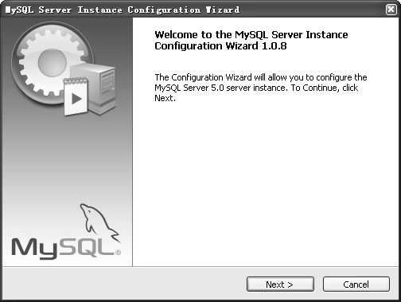
图1-12 MySQL实例配置欢迎界面

（2）单击“Next”按钮，进入选择配置类型界面，如图1-13所示。

界面中显示了 MySQL 提供的详细配置（Detailed Configuration）和标准配置（Standard Configuration）两种配置类型。它们的区别在于详细配置列出了更详细的个性化配置向导，配置过程相对复杂而且较慢；标准配置是一个通用的配置，配置过程简单快速。这里用详细配置为例来进行介绍。

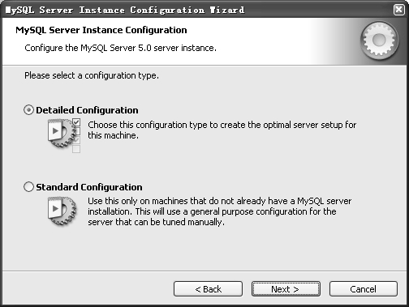
图1-13 MySQL实例配置类型选择界面

（3）选择“Detailed Configuration”单选按钮，单击“Next”按钮，进入如图 1-14所示的界面。

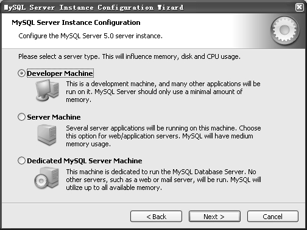
图1-14 MySQL应用类型选择界面

此界面中列出了MySQL的3种应用方式。

Developer Machine（开发机），使用最小数量的内存。

Server Machine（服务器），使用中等大小的内存。

Dedicated MySQL Server Machine（专用服务器），使用当前可用的最大内存。

（4）这里选择“Developer Machine”单选按钮，单击“Next”按钮，进入数据库用途选择界面，如图1-15所示。

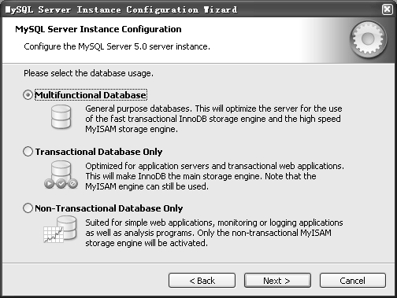
图1-15 MySQL数据库用途选择界面

该界面中列出了3种数据库用途选项。

Multifunctional Database（多功能数据库），此选项对事务性存储引擎（InnoDB）和非事务性（MyISAM）存储引擎的存取速度都很快。

Transactional Database Only（事务性数据库），此选项主要优化了事务性（InnoDB）存储引擎，但是非事务性存储引擎（MyISAM）也可以使用。

Non-Transactional Database Only（非事务型数据库），此选项主要优化了非事务性（MyISAM）存储引擎，注意事务性存储引擎（InnoDB）不能使用。

存储引擎在后面的章节中将会专门介绍，读者可以理解为不同的表类型。

（5）这里选择“Multifunctional Database”单选按钮。单击“Next”按钮，进入 InnoDB数据文件目录配置界面，如图1-16所示。

InnoDB 的数据文件会在数据库第一次启动的时候创建，默认会创建在 MySQL 的安装目录下。用户可以根据实际的空间状况进行路径的选择。这里保留默认值。

（6）单击“Next”按钮，进入并发连接设置界面，如图1-17所示，其中有3个选项，其含义分别如下。

Decision Support（DSS）/OLAP（决策支持系统），设置连接数为 20。

Online Transaction Processing（OLTP）（在线事务系统），设置连接数为 500。

Manual Setting（手工设置），手工输入并发连接数。

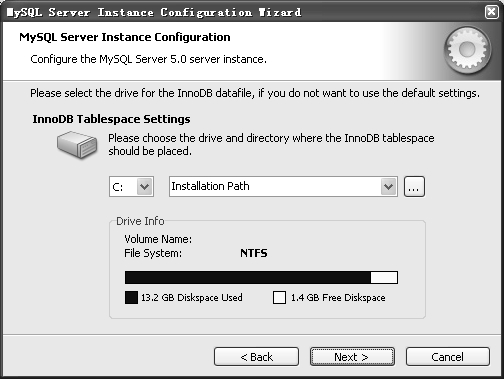
图1-16 MySQL InnoDB数据文件路径选择界面

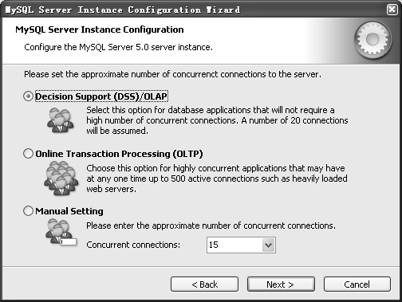
图1-17 MySQL并发连接设置界面

（7）选择“Decision Support（DSS）/OLAP”单选按钮后，单击“Next”按钮，进入网络选项设置，如果1-18所示。

本界面中主要设置MySQL服务的端口号，选项“Enable TCP/IP Networking”表示是否运行TCP/IP连接，而选项“Enable Strict Mode”表示是否采用严格模式来启动服务。至于什么是MySQL的模式，将在本书的第16章中详细介绍。

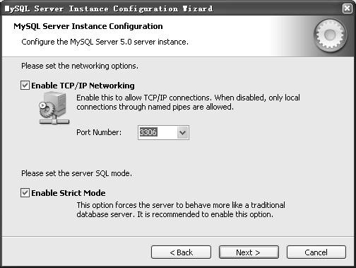
图1-18 MySQL并发连接设置界面

（8）选择“Enable TCP/IP Networking”和“Enable Strict Mode”复选框后，单击“Next”按钮，进入默认字符集选择界面，如图1-19所示。

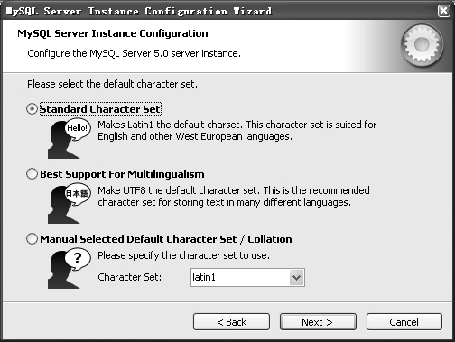
图1-19 MySQL实例默认字符集选择界面

该界面上的3种选项分别表示如下。

Standard Character Set（标准字符集），默认是Latin1。

Best Support For Multilingualism（对多语言支持最好的字符集），是指UTF-8。

Manual Selected Default Character Set/Collation（手工选择字符集）。

字符集将会在第9章中详细介绍。

（9）选择“Standard Character Set”单选按钮后，单击“Next”按钮，进入Windows选项设置界面，如图1-20所示。

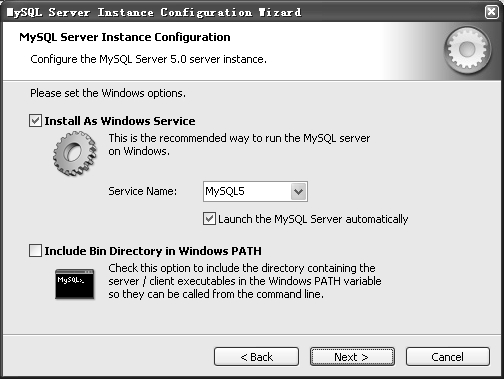
图1-20 MySQL相关的Windows选项设置

这个界面上部是设置MySQL是否作为Windows的一个服务，如果是，设置一个服务名称并设置是否Windows重启的时候自动装载。这里保留默认选项，将服务名称改为“MySQL5”。下面的“Include Bin Directory in Windows PATH”复选框表示MySQL的 Bin目录是否写入Windows的PATH中，这里选中该复选框。

（10）单击“Next”按钮，进入MySQL的安全选项配置界面，如图1-21所示。

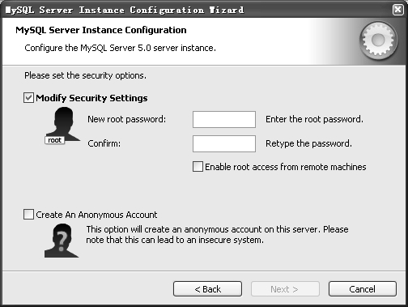
图1-21 MySQL的安全设置

图 1-21中显示了MySQL的两个安全设置复选框，“Modify Security Settings”复选框确定是否修改默认 root密码，因为默认的 root密码是空，所以建议用户一定要修改；“Create An Anonymous Account”复选框确定是否创建一个匿名用户，建议用户不要创建，因为这样会给系统带来安全漏洞。这里为了简便起见，将root口令改为123（正式的生产环境中一定要采用更为复杂的密码）。

（11）单击“Next”按钮，进入准备执行界面，如图1-22所示。

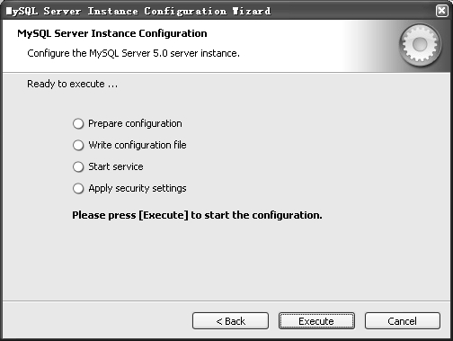
图1-22 准备执行配置界面

（12）确认设置没有问题后，单击“Execute”按钮，开始执行。执行成功后的界面如图1-23所示。

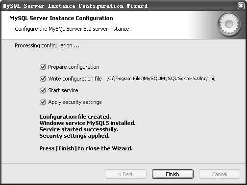
图1-23 MySQL配置执行成功界面

单击“Finish”按钮后，安装过程全部完成。这时可以发现，Windows的服务列表中已经增加了“MySQL5”这一项，如图1-24所示，可以通过启动、停止这个服务来启动和关闭MySQL。

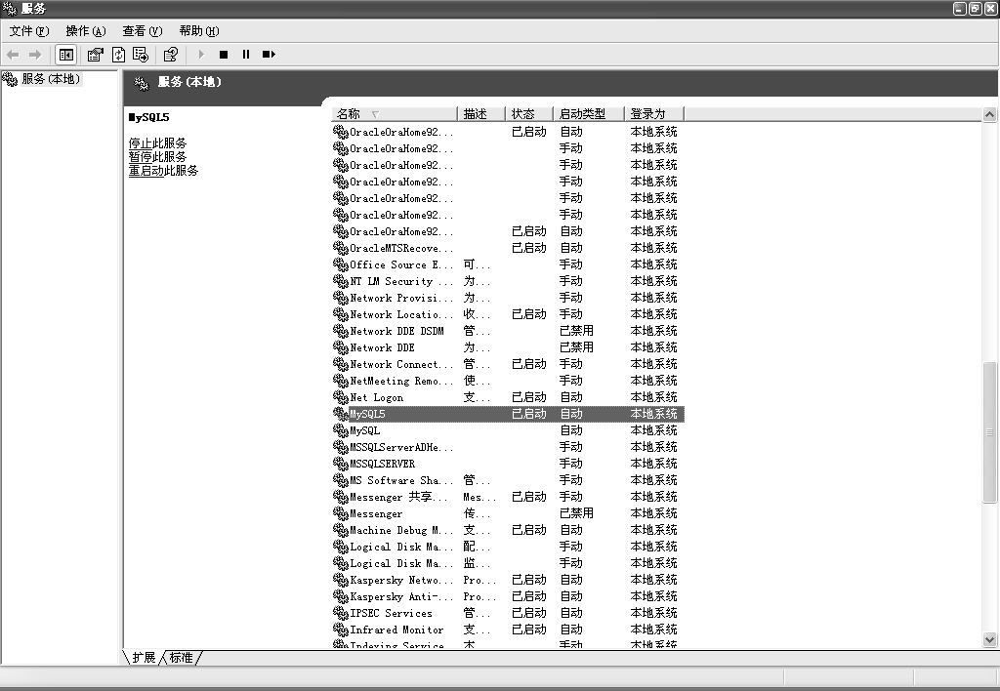
图1-24 Window服务列表中的“MySQL5”

