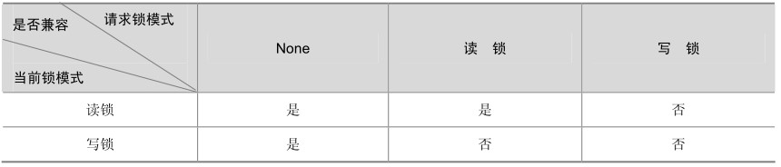
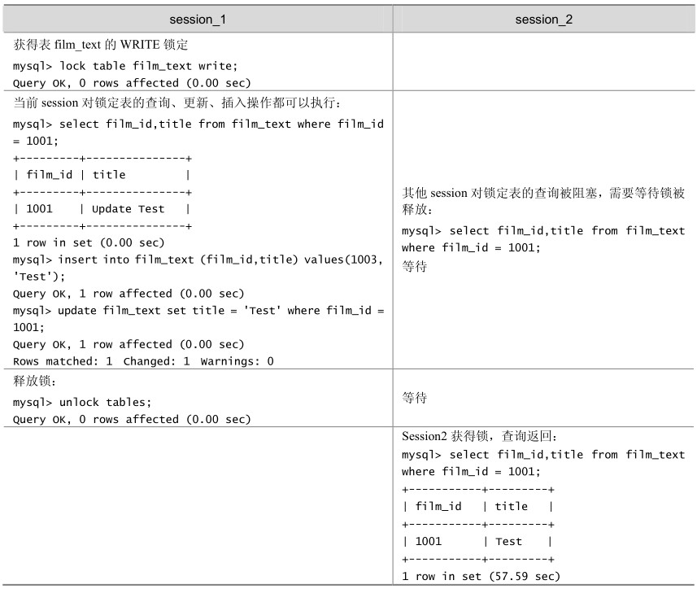

MySQL的表级锁有两种模式：表共享读锁（Table Read Lock）和表独占写锁（Table Write Lock）。锁模式的兼容性如表20-1所示。

表20-1 MySQL中的表锁兼容性

可见，对 MyISAM 表的读操作，不会阻塞其他用户对同一表的读请求，但会阻塞对同一表的写请求；对 MyISAM 表的写操作，则会阻塞其他用户对同一表的读和写操作；MyISAM表的读操作与写操作之间，以及写操作之间是串行的！根据如表 20-2 所示的例子可以知道，当一个线程获得对一个表的写锁后，只有持有锁的线程可以对表进行更新操作。其他线程的读、写操作都会等待，直到锁被释放为止。

表20-2 MyISAM存储引擎的写阻塞读例子

