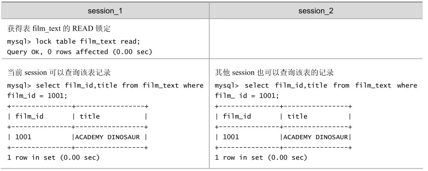
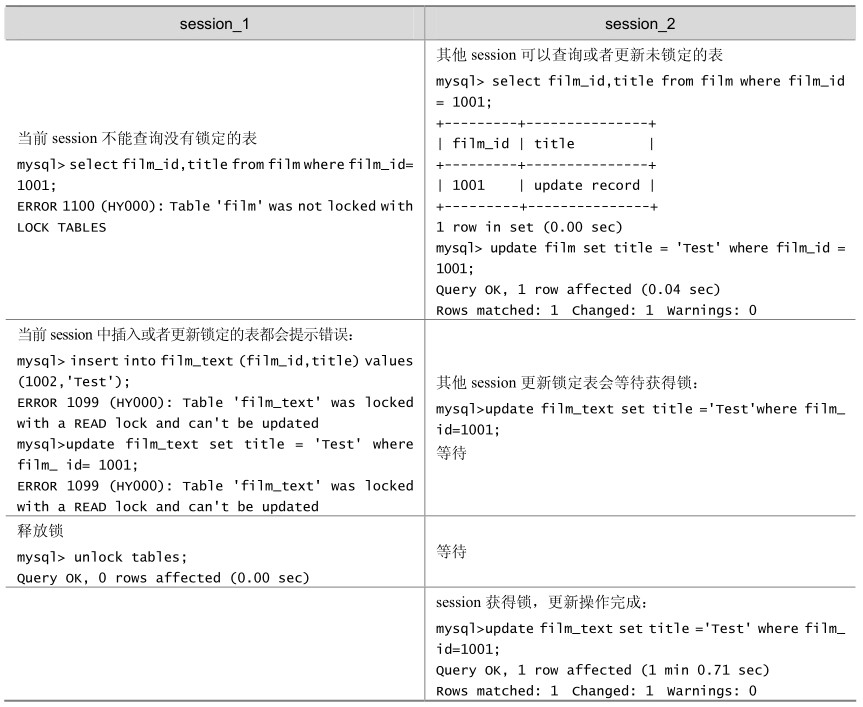

mysql> select a.first_name,a.last_name,b.first_name,b.last_name from actor a,actor b where a.first_name = b.first_name and a.first_name = 'Lisa' and a.last_name = 'Tom' and a.last_name <> b.last_name;

MyISAM在执行查询语句（SELECT）前，会自动给涉及的所有表加读锁，在执行更新操作（UPDATE、DELETE、INSERT等）前，会自动给涉及的表加写锁，这个过程并不需要用户干预，因此，用户一般不需要直接用LOCK TABLE命令给MyISAM表显式加锁。在本书的示例中，显式加锁基本上都是为了方便说明问题，并非必须如此。

给 MyISAM 表显式加锁，一般是为了在一定程度模拟事务操作，实现对某一时间点多个表的一致性读取。例如，有一个订单表orders，其中记录有各订单的总金额total，同时还有一个订单明细表 order_detail，其中记录有各订单每一产品的金额小计 subtotal，假设我们需要检查这两个表的金额合计是否相符，可能就需要执行如下两条SQL语句：

Select sum(total) from orders;

Select sum(subtotal) from order_detail;

这时，如果不先给两个表加锁，就可能产生错误的结果，因为第一条语句执行过程中， order_detail表可能已经发生了改变。因此，正确的方法应该是：

Lock tables orders read local, order_detail read local;

Select sum(total) from orders;

Select sum(subtotal) from order_detail;

Unlock tables;

要特别说明以下两点内容。

上面的例子在LOCK TABLES时加了“local”选项，其作用就是在满足MyISAM表并发插入条件的情况下，允许其他用户在表尾并发插入记录，有关 MyISAM 表的并发插入问题，在后面的章节中还会进一步介绍。

在用LOCK TABLES给表显式加表锁时，必须同时取得所有涉及表的锁，并且MySQL不支持锁升级。也就是说，在执行LOCK TABLES后，只能访问显式加锁的这些表，不能访问未加锁的表；同时，如果加的是读锁，那么只能执行查询操作，而不能执行更新操作。在自动加锁的情况下也是如此，MyISAM总是一次获得SQL语句所需要的全部锁。这也正是MyISAM表不会出现死锁（Deadlock Free）的原因。

在如表 20-3所示的例子中，一个 session使用LOCK TABLE命令给表 film_text加了读锁，这个 session 可以查询锁定表中的记录，但更新或访问其他表都会提示错误；同时，另外一个session可以查询表中的记录，但更新就会出现锁等待。

表20-3 MyISAM存储引擎的读阻塞写例子

续表

当使用LOCK TABLES时，不仅需要一次锁定用到的所有表，而且，同一个表在SQL语句中出现多少次，就要通过与SQL语句中相同的别名锁定多少次，否则也会出错！举例说明如下。

（1）对actor表获得读锁：

mysql> lock table actor read;

Query OK, 0 rows affected (0.00 sec)

（2）但是通过别名访问会提示错误：

mysql> select a.first_name,a.last_name,b.first_name,b.last_name from actor a,actor b where a.first_name = b.first_name and a.first_name = 'Lisa' and a.last_name = 'Tom' and a.last_name <> b.last_name;

ERROR 1100 (HY000): Table 'a' was not locked with LOCK TABLES

（3）需要对别名分别锁定：

mysql> lock table actor as a read,actor as b read;

Query OK, 0 rows affected (0.00 sec)

（4）按照别名的查询可以正确执行：

+------------+-----------+------------+-----------+

| first_name | last_name | first_name | last_name |

+------------+-----------+------------+-----------+

| Lisa | Tom | LISA | MONROE |

+------------+-----------+------------+-----------+

1 row in set (0.00 sec)

