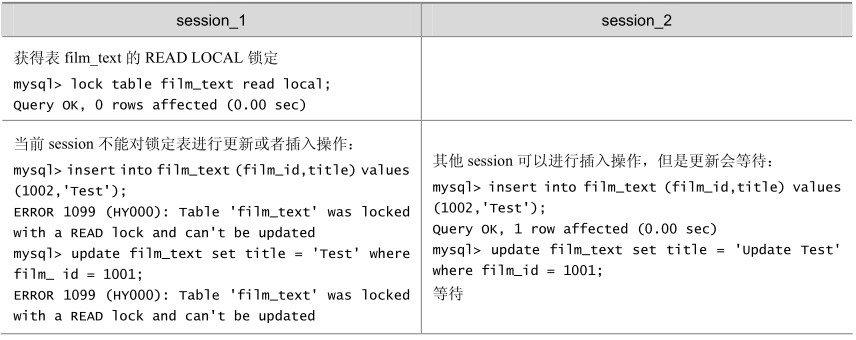
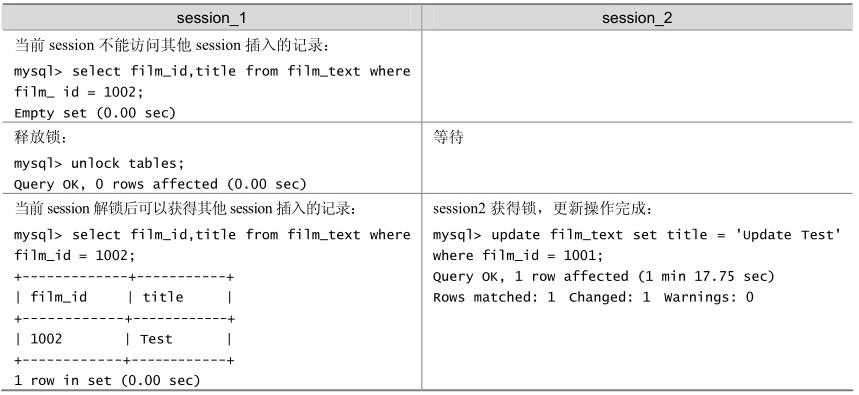

上文提到过MyISAM表的读和写是串行的，但这是就总体而言的。在一定条件下，MyISAM表也支持查询和插入操作的并发进行。

MyISAM 存储引擎有一个系统变量 concurrent_insert，专门用以控制其并发插入的行为，其值分别可以为0、1或2。

当concurrent_insert设置为0时，不允许并发插入。

当concurrent_insert设置为1时，如果MyISAM表中没有空洞（即表的中间没有被删除的行），MyISAM允许在一个进程读表的同时，另一个进程从表尾插入记录。这也是MySQL的默认设置。

当concurrent_insert设置为2时，无论MyISAM表中有没有空洞，都允许在表尾并发插入记录。

在如表 20-4所示的例子中，session_1获得了一个表的READ LOCAL锁，该线程可以对表进行查询操作，但不能对表进行更新操作；其他的线程（session_2），虽然不能对表进行删除和更新操作，但却可以对该表进行并发插入操作，这里假设该表中间不存在空洞。

表20-4 MyISAM存储引擎的读写（INSERT）并发例子

续表

可以利用MyISAM存储引擎的并发插入特性来解决应用中对同一表查询和插入的锁争用。例如，将concurrent_insert系统变量设为2，总是允许并发插入；同时，通过定期在系统空闲时段执行 OPTIMIZE TABLE 语句来整理空间碎片，收回因删除记录而产生的中间空洞。有关OPTIMIZE TABLE语句的详细介绍，可以参见 18.3一节的内容。

