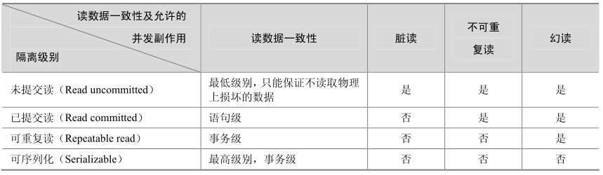

**1．事务（Transaction）及其ACID属性**

事务是由一组 SQL 语句组成的逻辑处理单元，事务具有以下 4 个属性，通常简称为事务的ACID属性。

**原子性**（Atomicity）：事务是一个原子操作单元，其对数据的修改，要么全都执行，要么全都不执行。

**一致性**（Consistent）：在事务开始和完成时，数据都必须保持一致状态。这意味着所有相关的数据规则都必须应用于事务的修改，以保持数据的完整性；事务结束时，所有的内部数据结构（如B树索引或双向链表）也都必须是正确的。

**隔离性**（Isolation）：数据库系统提供一定的隔离机制，保证事务在不受外部并发操作影响的“独立”环境执行。这意味着事务处理过程中的中间状态对外部是不可见的，反之亦然。

**持久性**（Durable）：事务完成之后，它对于数据的修改是永久性的，即使出现系统故障也能够保持。

银行转账就是事务的一个典型例子。

**2．并发事务处理带来的问题**

相对于串行处理来说，并发事务处理能大大增加数据库资源的利用率，提高数据库系统的事务吞吐量，从而可以支持更多的用户。但并发事务处理也会带来一些问题，主要包括以下几种情况。

**更新丢失**（Lost Update）：当两个或多个事务选择同一行，然后基于最初选定的值更新该行时，由于每个事务都不知道其他事务的存在，就会发生丢失更新问题—最后的更新覆盖了由其他事务所做的更新。例如，两个编辑人员制作了同一文档的电子副本。每个编辑人员独立地更改其副本，然后保存更改后的副本，这样就覆盖了原始文档。最后保存其更改副本的编辑人员覆盖另一个编辑人员所做的更改。如果在一个编辑人员完成并提交事务之前，另一个编辑人员不能访问同一文件，则可避免此问题。

**脏读**（Dirty Reads）：一个事务正在对一条记录做修改，在这个事务完成并提交前，这条记录的数据就处于不一致状态；这时，另一个事务也来读取同一条记录，如果不加控制，第二个事务读取了这些“脏”数据，并据此做进一步的处理，就会产生未提交的数据依赖关系。这种现象被形象地叫做“脏读”。

**不可重复读**（Non-Repeatable Reads）：一个事务在读取某些数据后的某个时间，再次读取以前读过的数据，却发现其读出的数据已经发生了改变或某些记录已经被删除了！这种现象就叫做“不可重复读”。

**幻读**（Phantom Reads）：一个事务按相同的查询条件重新读取以前检索过的数据，却发现其他事务插入了满足其查询条件的新数据，这种现象就称为“幻读”。

**3．事务隔离级别**

在上面讲到的并发事务处理带来的问题中，“更新丢失”通常是应该完全避免的。但防止更新丢失，并不能单靠数据库事务控制器来解决，需要应用程序对要更新的数据加必要的锁来解决，因此，防止更新丢失应该是应用的责任。

“脏读”、“不可重复读”和“幻读”，其实都是数据库读一致性问题，必须由数据库提供一定的事务隔离机制来解决。数据库实现事务隔离的方式，基本上可分为以下两种。

一种是在读取数据前，对其加锁，阻止其他事务对数据进行修改。

另一种是不用加任何锁，通过一定机制生成一个数据请求时间点的一致性数据**快照**（Snapshot），并用这个快照来提供一定级别（语句级或事务级）的一致性读取。从用户的角度来看，好像是数据库可以提供同一数据的多个版本，因此，这种技术叫做**数据多版本并发控制**（MultiVersion Concurrency Control，简称MVCC或MCC），也经常称为**多版本数据库**。

数据库的事务隔离越严格，并发副作用越小，但付出的代价也就越大，因为事务隔离实质上就是使事务在一定程度上“串行化”进行，这显然与“并发”是矛盾的。同时，不同的应用对读一致性和事务隔离程度的要求也是不同的，比如许多应用对“不可重复读”和“幻读”并不敏感，可能更关心数据并发访问的能力。

为了解决“隔离”与“并发”的矛盾，ISO/ANSI SQL92定义了 4个事务隔离级别，每个级别的隔离程度不同，允许出现的副作用也不同，应用可以根据自己的业务逻辑要求，通过选择不同的隔离级别来平衡“隔离”与“并发”的矛盾。表 20-5 很好地概括了这 4 个隔离级别的特性。

表20-5 4种隔离级别比较

最后要说明的是：各具体数据库并不一定完全实现了上述4个隔离级别，例如，Oracle只提供Read committed和Serializable两个标准隔离级别，另外还提供自己定义的Read only隔离级别；SQL Server除支持上述 ISO/ANSI SQL92定义的 4个隔离级别外，还支持一个叫做“快照”的隔离级别，但严格来说它是一个用MVCC实现的Serializable隔离级别。MySQL支持全部4个隔离级别，但在具体实现时，有一些特点，比如在一些隔离级别下是采用MVCC一致性读，但某些情况下又不是，这些内容在后面的章节中将会做进一步介绍。

