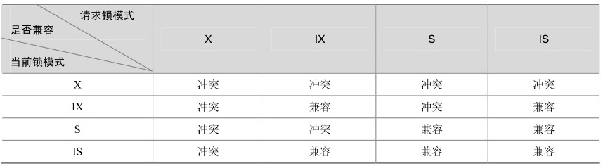
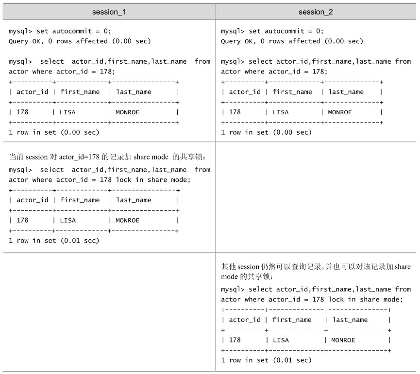
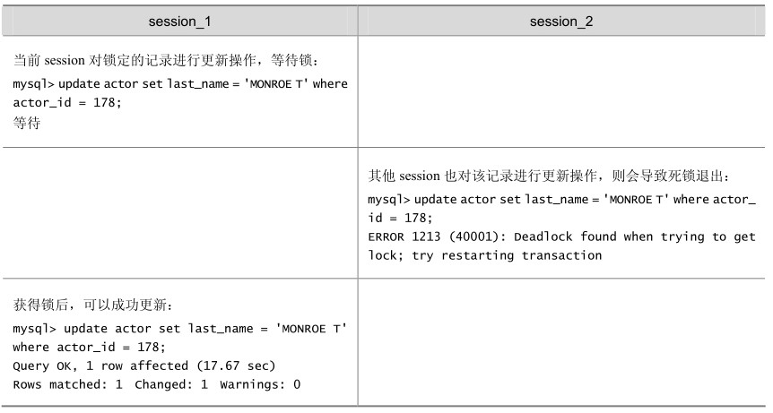
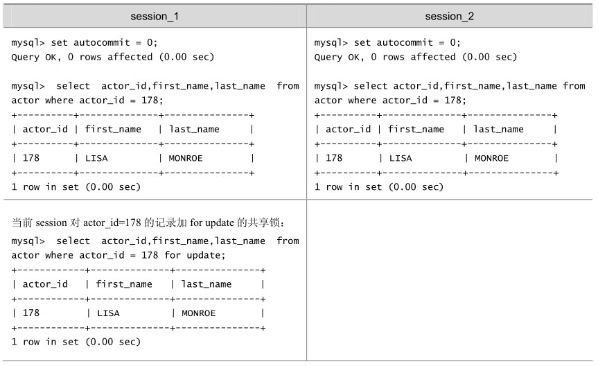

InnoDB实现了以下两种类型的行锁。

共享锁（S）：允许一个事务去读一行，阻止其他事务获得相同数据集的排他锁。

排他锁（X）：允许获得排他锁的事务更新数据，阻止其他事务取得相同数据集的共享读锁和排他写锁。

另外，为了允许行锁和表锁共存，实现多粒度锁机制，InnoDB 还有两种内部使用的意向锁（Intention Locks），这两种意向锁都是表锁。

意向共享锁（IS）：事务打算给数据行加行共享锁，事务在给一个数据行加共享锁前必须先取得该表的IS锁。

意向排他锁（IX）：事务打算给数据行加行排他锁，事务在给一个数据行加排他锁前必须先取得该表的IX锁。

上述锁模式的兼容情况具体如表20-6所示。

表20-6 InnoDB行锁模式兼容性列表

如果一个事务请求的锁模式与当前的锁兼容，InnoDB 就将请求的锁授予该事务；反之，如果两者不兼容，该事务就要等待锁释放。

意向锁是InnoDB自动加的，不需用户干预。对于UPDATE、DELETE和INSERT语句， InnoDB会自动给涉及数据集加排他锁（X）；对于普通SELECT语句，InnoDB不会加任何锁；事务可以通过以下语句显示给记录集加共享锁或排他锁。

共享锁（S）：SELECT * FROM table_name WHERE ... LOCK IN SHARE MODE。

排他锁（X）：SELECT * FROM table_name WHERE ... FOR UPDATE。

用SELECT ... IN SHARE MODE获得共享锁，主要用在需要数据依存关系时来确认某行记录是否存在，并确保没有人对这个记录进行UPDATE或者DELETE操作。但是如果当前事务也需要对该记录进行更新操作，则很有可能造成死锁，对于锁定行记录后需要进行更新操作的应用，应该使用SELECT... FOR UPDATE方式获得排他锁。

在如表 20-7所示的例子中，使用了SELECT ... IN SHARE MODE加锁后再更新记录，看看会出现什么情况，其中actor表的actor_id字段为主键。

表20-7 InnoDB存储引擎的共享锁例子

续表

当使用SELECT...FOR UPDATE加锁后再更新记录，出现如表 20-8所示的情况。

表20-8 InnoDB存储引擎的排他锁例子

续表

