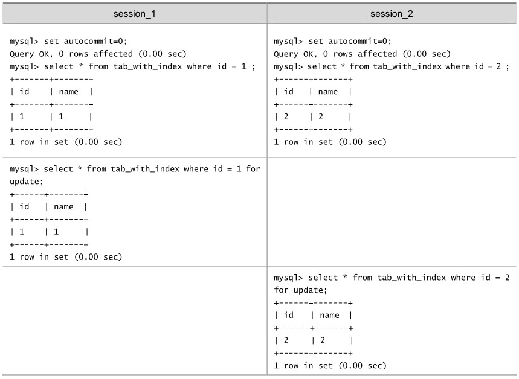
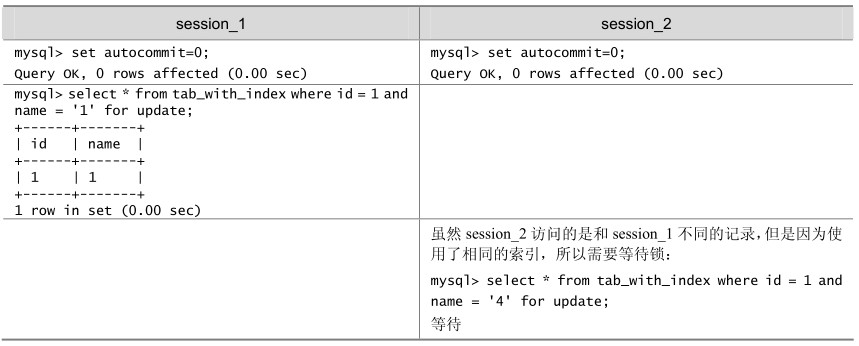
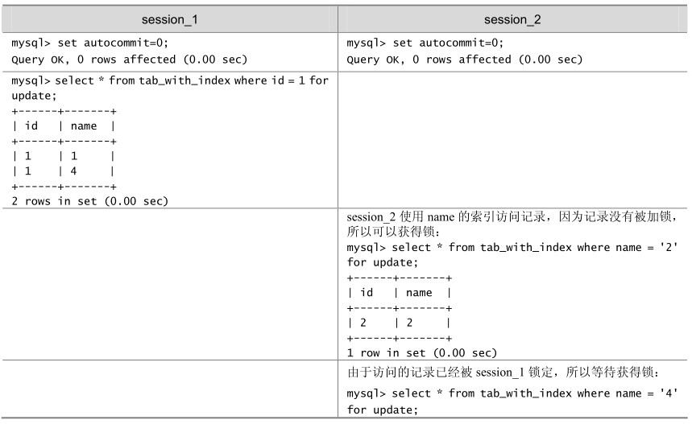

table: tab_with_index

InnoDB行锁是通过给索引上的索引项加锁来实现的，如果没有索引，InnoDB将通过隐藏的聚簇索引来对记录加锁。InnoDB行锁分为3种情形。

Record lock：对索引项加锁。

Gap lock：对索引项之间的“间隙”、第一条记录前的“间隙”或最后一条记录后的“间隙”加锁。

Next-key lock：前两种的组合，对记录及其前面的间隙加锁。

InnoDB这种行锁实现特点意味着：如果不通过索引条件检索数据，那么InnoDB将对表中的所有记录加锁，实际效果跟表锁一样！

在实际应用中，要特别注意InnoDB行锁的这一特性，否则可能导致大量的锁冲突，从而影响并发性能。下面通过一些实际例子来加以说明。

（1）在不通过索引条件查询时，InnoDB会锁定表中的所有记录。

在如表20-9所示的例子中，开始tab_no_index表没有索引：

mysql> create table tab_no_index(id int,name varchar(10)) engine=innodb;

Query OK, 0 rows affected (0.15 sec)

mysql> insert into tab_no_index values(1,'1'),(2,'2'),(3,'3'),(4,'4');

Query OK, 4 rows affected (0.00 sec)

Records: 4 Duplicates: 0 Warnings: 0

表20-9 InnoDB存储引擎的表在不使用索引时对全部记录加锁的例子

在表20-9中，看起来session_1只给一行加了排他锁，但session_2在请求其他行的排他锁时，却出现了锁等待！原因就是在没有索引的情况下，InnoDB 会对所有记录都加锁。当给其增加一个索引后，InnoDB就只锁定了符合条件的行，如表20-10所示。

创建tab_with_index表，id字段有普通索引：

mysql> create table tab_with_index(id int,name varchar(10)) engine=innodb;

Query OK, 0 rows affected (0.15 sec)

mysql> alter table tab_with_index add index id(id);

Query OK, 4 rows affected (0.24 sec)

Records: 4 Duplicates: 0 Warnings: 0

表20-10 InnoDB存储引擎的表在使用索引时使用行锁的例子

（2）由于 MySQL 的行锁是针对索引加的锁，不是针对记录加的锁，所以虽然是访问不同行的记录，但是如果是使用相同的索引键，是会出现锁冲突的。应用设计的时候要注意这一点。

在如表20-11所示的例子中，表tab_with_index的id字段有索引，name字段没有索引：

mysql> alter table tab_with_index drop index name;

Query OK, 4 rows affected (0.22 sec)

Records: 4 Duplicates: 0 Warnings: 0

mysql> insert into tab_with_index values(1,'4');

Query OK, 1 row affected (0.00 sec)

mysql> select * from tab_with_index where id = 1;

+------+------+

| id | name |

+------+------+

| 1| 1|

| 1| 4|

+------+------+

2 rows in set (0.00 sec)

表20-11 InnoDB存储引擎使用相同索引键的阻塞例子

（3）当表有多个索引的时候，不同的事务可以使用不同的索引锁定不同的行，不论是使用主键索引、唯一索引或普通索引，InnoDB都会使用行锁来对数据加锁。

在如表20-12所示的例子中，表tab_with_index的id字段有主键索引，name字段有普通索引：

mysql> alter table tab_with_index add index name(name);

Query OK, 5 rows affected (0.23 sec)

Records: 5 Duplicates: 0 Warnings: 0

表20-12 InnoDB存储引擎的表使用不同索引的阻塞例子

（4）即便在条件中使用了索引字段，但是否使用索引来检索数据是由MySQL通过判断不同执行计划的代价来决定的，如果MySQL认为全表扫描效率更高，比如对一些很小的表，它就不会使用索引，这种情况下InnoDB也会对所有记录加锁。因此，在分析锁冲突时，别忘了检查SQL的执行计划，以确认是否真正使用了索引。关于MySQL在什么情况下不使用索引的详细讨论，参见本章“索引问题”一节的介绍。

在下面的例子中，检索值的数据类型与索引字段不同，虽然MySQL能够进行数据类型转换，但却不会使用索引，从而导致InnoDB对所有记录加锁。通过用explain检查两条SQL的执行计划，读者可以清楚地看到这一点。

例子中tab_with_index表的name字段有索引，但是name字段是varchar类型的，如果where条件中不是和varchar类型进行比较，则会对name进行隐式的数据类型转换，从而导致索引无法使用，走了全表扫描。

mysql> alter table tab_with_index add index name(name);

Query OK, 4 rows affected (8.06 sec)

Records: 4 Duplicates: 0 Warnings: 0

mysql> explain select * from tab_with_index where name = 1 \G

*************************** 1. row ***************************

id: 1

select_type: SIMPLE

table: tab_with_index

type: ALL

possible_keys: name

key: NULL

key_len: NULL

ref: NULL

rows: 4

Extra: Using where

1 row in set (0.00 sec)

mysql> explain select * from tab_with_index where name = '1' \G

*************************** 1. row ***************************

id: 1

select_type: SIMPLE

type: ref

possible_keys: name

key: name

key_len: 23

ref: const

rows: 1

Extra: Using where

1 row in set (0.00 sec)

