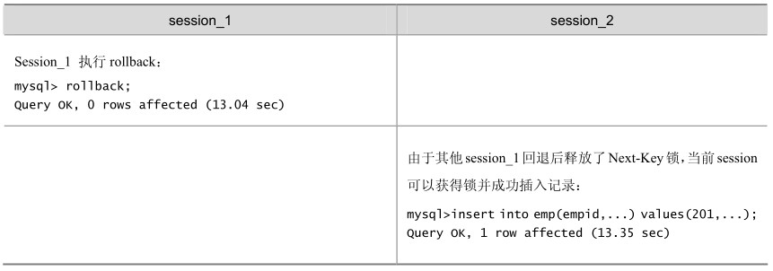

当我们用范围条件而不是相等条件检索数据，并请求共享或排他锁时，InnoDB 会给符合条件的已有数据记录的索引项加锁；对于键值在条件范围内但并不存在的记录，叫做“间隙（GAP）”，InnoDB也会对这个“间隙”加锁，这种锁机制就是所谓的Next-Key锁。

举例来说，假如emp表中只有101条记录，其empid的值分别是1、2、…、100、101，下面的SQL：

Select * from emp where empid > 100 for update;

是一个范围条件的检索，InnoDB不仅会对符合条件的empid值为101的记录加锁，也会对empid大于101（这些记录并不存在）的“间隙”加锁。

InnoDB使用Next-Key锁的目的，一方面是为了防止幻读，以满足相关隔离级别的要求，对于上面的例子，要是不使用间隙锁，如果其他事务插入了empid大于100的任何记录，那么本事务如果再次执行上述语句，就会发生幻读；另一方面，是为了满足其恢复和复制的需要。有关其恢复和复制对锁机制的影响，以及不同隔离级别下InnoDB使用Next-Key锁的情况，在后续的章节中会做进一步介绍。

很显然，在使用范围条件检索并锁定记录时，InnoDB 这种加锁机制会阻塞符合条件范围内键值的并发插入，这往往会造成严重的锁等待。因此，在实际应用开发中，尤其是并发插入比较多的应用，我们要尽量优化业务逻辑，尽量使用相等条件来访问更新数据，避免使用范围条件。

还要特别说明的是，InnoDB除了通过范围条件加锁时使用Next-Key锁外，如果使用相等条件请求给一个不存在的记录加锁，InnoDB也会使用Next-Key锁！

在如表20-13所示的例子中，假如emp表中只有101条记录，其empid的值分别是1、2、…、100、101。

表20-13 InnoDB存储引擎的Next-Key锁阻塞例子

续表

