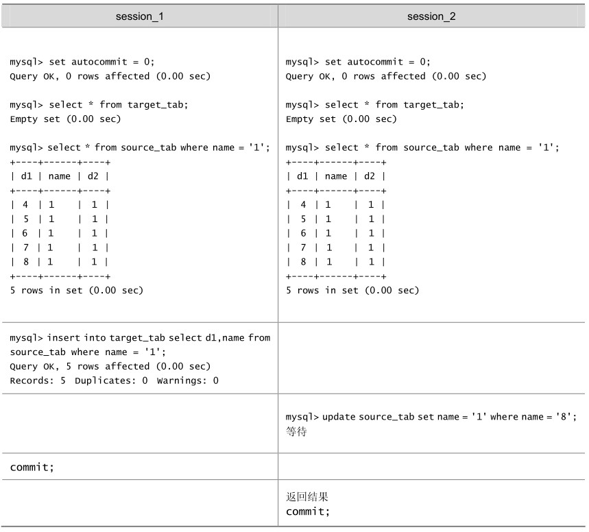
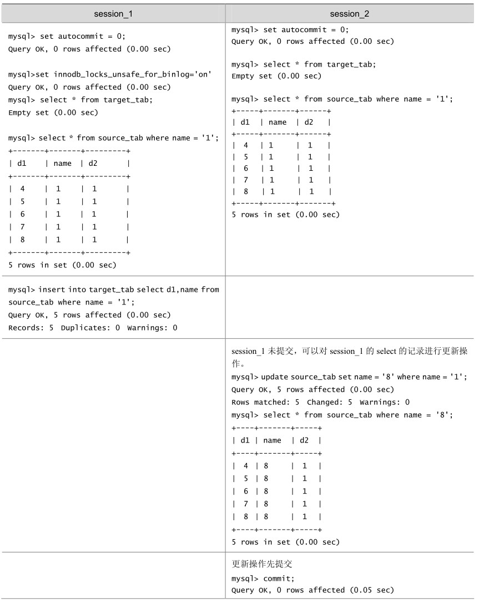
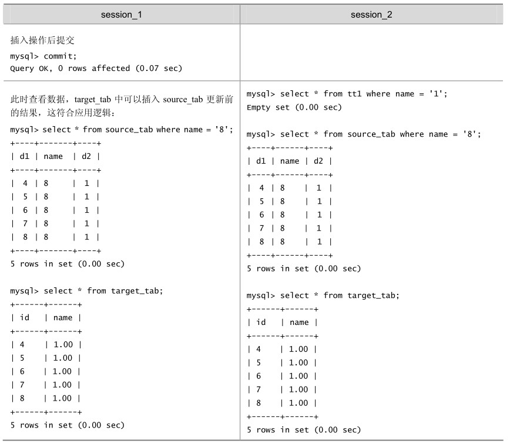

MySQL通过BINLOG记录执行成功的INSERT、UPDATE、DELETE等更新数据的SQL语句，并由此实现MySQL数据库的恢复和主从复制（可以参见本书“管理维护篇”的介绍）。MySQL 5.6支持 3种日志格式，即基于语句的日志格式SBL、基于行的日志格式RBL和混合格式。它还支持4种复制模式。

基于SQL语句的复制SBR：这也是MySQL最早支持的复制模式。

基于行数据的复制RBR：这是MySQL 5.1以后开始支持的复制模式，主要优点是支持对非安全SQL的复制。

混合复制模式：对安全的SQL语句采用基于SQL语句的复制模式，对于非安全的SQL语句采用居于行的复制模式。

使用全局事务ID（GTIDs）的复制：主要是解决主从自动同步一致问题。

对基于语句日志格式（SBL）的恢复和复制而言，由于MySQL的BINLOG是按照事务提交的先后顺序记录的，因此要正确恢复或复制数据，就必须满足：在一个事务未提交前，其他并发事务不能插入满足其锁定条件的任何记录，也就是不允许出现幻读。这已经超过了 ISO/ANSI SQL92“可重复读”隔离级别的要求，实际上是要求事务要串行化。这也是许多情况下，InnoDB要用到Next-Key锁的原因，比如在用范围条件更新记录时，无论在Read Committed或是Repeatable Read隔离级别下，InnoDB都要使用Next-Key锁，但这并不是隔离级别要求的，有关InnoDB在不同隔离级别下加锁的差异在下一小节还会介绍。

对于“insert into target_tab select * from source_tab where ...”和“create table new_tab ...select ... From source_tab where ...（CTAS）”这种SQL语句，用户并没有对 source_tab做任何更新操作，但MySQL对这种SQL语句做了特别处理。先来看如表20-14所示的例子。

表20-14 CTAS操作给原表加锁的例子

在上面的例子中，只是简单地读source_tab表的数据，相当于执行一个普通的SELECT语句，用一致性读就可以了。Oracle 正是这么做的，它通过 MVCC 技术实现的多版本数据来实现一致性读，不需要给source_tab加任何锁。我们知道InnoDB也实现了多版本数据，对普通的SELECT一致性读，也不需要加任何锁；但这里InnoDB却给source_tab加了共享锁，并没有使用多版本数据一致性读技术！

MySQL 为什么要这么做呢？其原因还是为了保证恢复和复制的正确性。因为在不加锁的情况下，如果在上述语句执行过程中，其他事务对source_tab做了更新操作，就可能导致数据恢复的结果错误。为了演示这一点，我们再重复一下前面的例子，不同的是在 session_1 执行事务前，先将系统变量innodb_locks_unsafe_for_binlog的值设置为“on”（其默认值为off），具体结果如表20-15所示。

表20-15 CTAS操作不给原表加锁带来的安全问题例子

续表

从上可见，设置系统变量innodb_locks_unsafe_for_binlog的值为“on”后，InnoDB不再对source_tab加锁，结果也符合应用逻辑，但是如果分析BINLOG的内容：

…

SET TIMESTAMP=1169175130;

BEGIN;

# at 274

#070119 10:51:57 server id 1 end_log_pos 105 Query thread_id=1 exec_ time=0 error_code=0

SET TIMESTAMP=1169175117;

update source_tab set name = '8' where name = '1';

# at 379

#070119 10:52:10 server id 1 end_log_pos 406 Xid = 5

COMMIT;

# at 406

#070119 10:52:14 server id 1 end_log_pos 474 Query thread_id=2 exec_ time=0 error_code=0

SET TIMESTAMP=1169175134;

BEGIN;

# at 474

#070119 10:51:29 server id 1 end_log_pos 119 Query thread_id=2 exec_ time=0 error_code=0

SET TIMESTAMP=1169175089;

insert into target_tab select d1,name from source_tab where name = '1';

# at 593

#070119 10:52:14 server id 1 end_log_pos 620 Xid = 7

COMMIT;

…

可以发现，在 BINLOG 中，更新操作的位置在 INSERT...SELECT 之前，如果使用这个BINLOG进行数据库恢复，恢复的结果与实际的应用逻辑不符；如果进行复制，就会导致主从数据库不一致！

通过上面的例子，读者就不难理解为什么MySQL在处理“Insert into target_tab select * from source_tab where ...”和“create table new_tab ...select ... From source_tab where ...”时要给source_tab加锁，而不是使用对并发影响最小的多版本数据来实现一致性读。还要特别说明的是，如果上述语句的SELECT是范围条件，InnoDB还会给源表加Next-Key锁。

因此，INSERT...SELECT...和CREATE TABLE...SELECT...语句，可能会阻止对源表的并发更新。如果查询比较复杂，会造成严重的性能问题，读者在应用中应尽量避免使用。实际上，MySQL将这种 SQL叫做不确定（non-deterministic）的 SQL，属于“Unsafe SQL”，不推荐使用。

如果应用中一定要用这种 SQL 来实现业务逻辑，又不希望对源表的并发更新产生影响，可以采取以下3种措施。

一是采取上面示例中的做法，将 innodb_locks_unsafe_for_binlog 的值设置为“on”，强制MySQL使用多版本数据一致性读。但付出的代价是可能无法用BINLOG正确地恢复或复制数据，因此，不推荐使用这种方式。

二是通过使用“select * from source_tab ... Into outfile”和“load data infile ...”语句组合来间接实现，采用这种方式MySQL不会给source_tab加锁。

三是使用基于行的BINLOG格式和基于行数据的复制。

