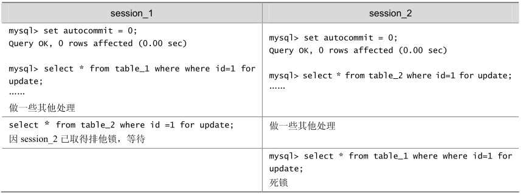
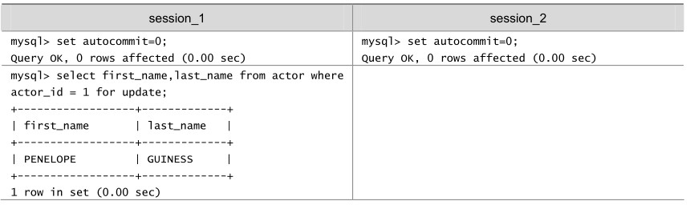
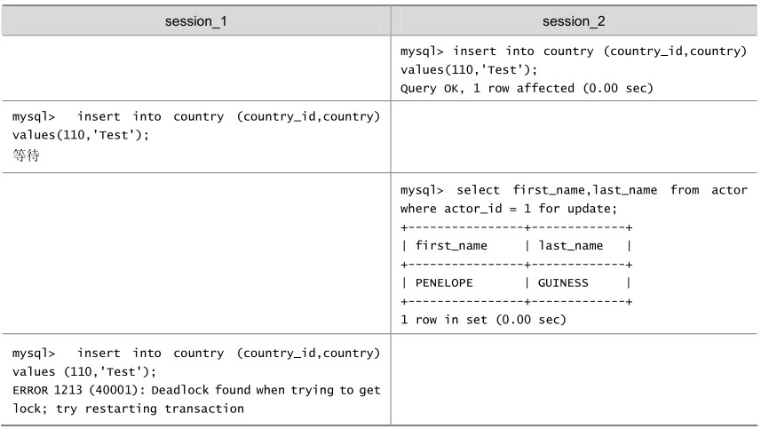
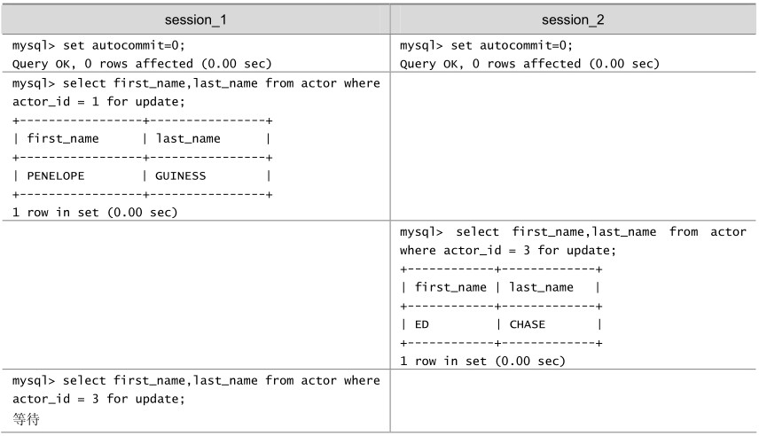
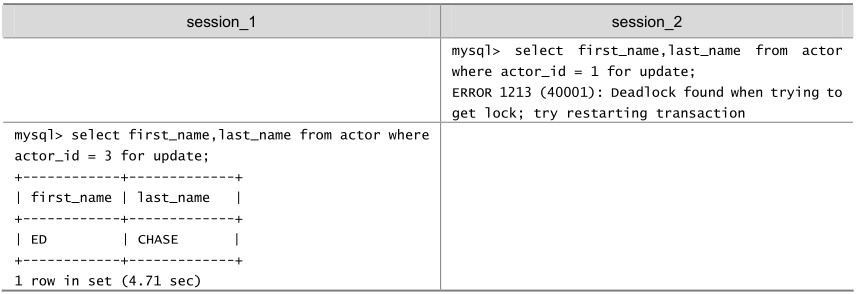
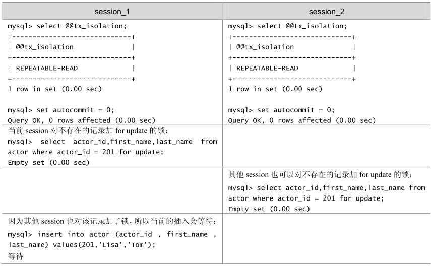
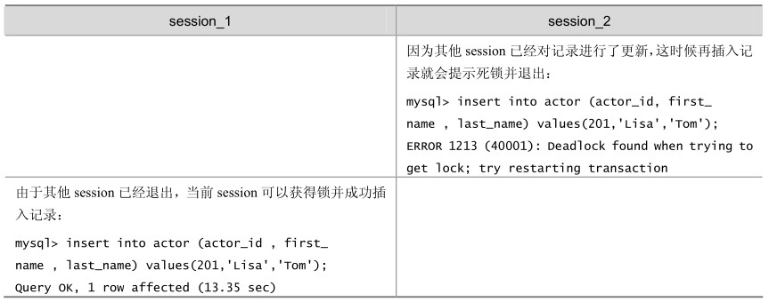
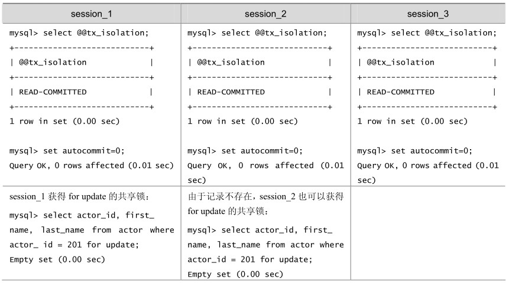
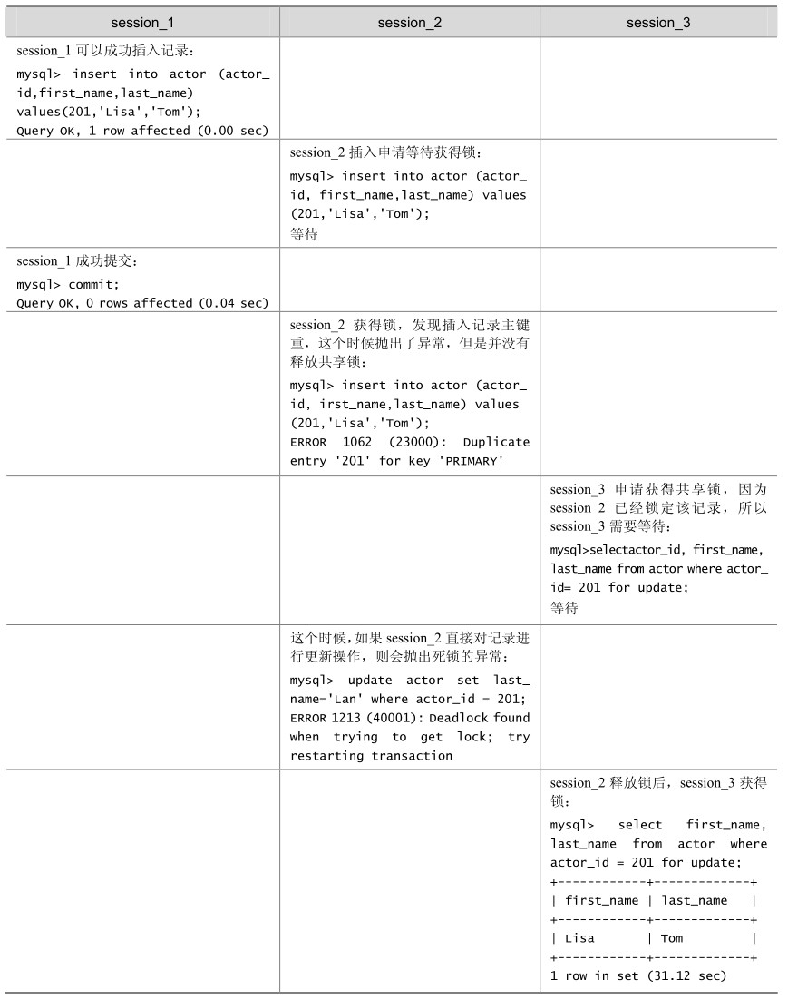

上文讲过，MyISAM表锁是 deadlock free的，这是因为MyISAM总是一次获得所需的全部锁，要么全部满足，要么等待，因此不会出现死锁。但在InnoDB中，除单个SQL组成的事务外，锁是逐步获得的，这就决定了在InnoDB中发生死锁是可能的。如表20-17所示的就是一个发生死锁的例子。

表20-17 InnoDB存储引擎中的死锁例子

在上面的例子中，两个事务都需要获得对方持有的排他锁才能继续完成事务，这种循环锁等待就是典型的死锁。

发生死锁后，InnoDB 一般都能自动检测到，并使一个事务释放锁并回退，另一个事务获得锁，继续完成事务。但在涉及外部锁或涉及表锁的情况下，InnoDB 并不能完全自动检测到死锁，这需要通过设置锁等待超时参数innodb_lock_wait_timeout来解决。需要说明的是，这个参数并不是只用来解决死锁问题，在并发访问比较高的情况下，如果大量事务因无法立即获得所需的锁而挂起，会占用大量计算机资源，造成严重性能问题，甚至拖垮数据库。我们通过设置合适的锁等待超时阈值，可以避免这种情况发生。

通常来说，死锁都是应用设计的问题，通过调整业务流程、数据库对象设计、事务大小，以及访问数据库的 SQL 语句，绝大部分死锁都可以避免。下面就通过实例来介绍几种避免死锁的常用方法。

（1）在应用中，如果不同的程序会并发存取多个表，应尽量约定以相同的顺序来访问表，这样可以大大降低产生死锁的机会。在下面的例子中，由于两个 session访问两个表的顺序不同，发生死锁的机会就非常高！但如果以相同的顺序来访问，死锁就可以避免。

表20-18 InnoDB存储引擎中表顺序造成的死锁例子

续表

（2）在程序以批量方式处理数据的时候，如果事先对数据排序，保证每个线程按固定的顺序来处理记录，也可以大大降低出现死锁的可能。

表20-19 InnoDB存储引擎中表数据操作顺序不一致造成的死锁例子

续表

（3）在事务中，如果要更新记录，应该直接申请足够级别的锁，即排他锁，而不应先申请共享锁，更新时再申请排他锁，因为当用户申请排他锁时，其他事务可能又已经获得了相同记录的共享锁，从而造成锁冲突，甚至死锁。具体演示可参见20.3.3小节中的例子。

（4）前面讲过，在REPEATABLE-READ隔离级别下，如果两个线程同时对相同条件记录用SELECT...FOR UPDATE加排他锁，在没有符合该条件记录情况下，两个线程都会加锁成功。程序发现记录尚不存在，就试图插入一条新记录，如果两个线程都这么做，就会出现死锁。这种情况下，将隔离级别改成READ COMMITTED，就可避免问题，如表 20-20所示。

表20-20 InnoDB存储引擎中隔离级别引起的死锁例子1

续表

（5）当隔离级别为 READ COMMITTED 时，如果两个线程都先执行 SELECT...FOR UPDATE，判断是否存在符合条件的记录，如果没有，就插入记录。此时，只有一个线程能插入成功，另一个线程会出现锁等待，当第1个线程提交后，第2个线程会因主键重出错，但虽然这个线程出错了，却会获得一个排他锁！这时如果有第3个线程又来申请排他锁，也会出现死锁。

对于这种情况，可以直接做插入操作，然后再捕获主键重异常，或者在遇到主键重错误时，总是执行ROLLBACK释放获得的排他锁，如表20-21所示。

表20-21 InnoDB存储引擎中隔离级别引起的死锁例子2

续表

尽管通过上面介绍的设计和SQL优化等措施，可以大大减少死锁，但死锁很难完全避免。因此，在程序设计中总是捕获并处理死锁异常是一个很好的编程习惯。

如果出现死锁，可以用SHOW INNODB STATUS命令来确定最后一个死锁产生的原因。返回结果中包括死锁相关事务的详细信息，如引发死锁的 SQL 语句，事务已经获得的锁，正在等待什么锁，以及被回滚的事务等。据此可以分析死锁产生的原因和改进措施。下面是一段SHOW INNODB STATUS输出的样例：

mysql> show innodb status \G

…

------------------------

LATEST DETECTED DEADLOCK

------------------------

070710 14:05:16

*** (1) TRANSACTION:

TRANSACTION 0 117470078, ACTIVE 117 sec, process no 1468, OS thread id 1197328736 inserting

mysql tables in use 1, locked 1

LOCK WAIT 5 lock struct(s), heap size 1216

MySQL thread id 7521657, query id 673468054 localhost root update

insert into country (country_id,country) values(110,'Test')

…

*** (2) TRANSACTION:

TRANSACTION 0 117470079, ACTIVE 39 sec, process no 1468, OS thread id 1164048736 starting index read, thread declared inside InnoDB 500

mysql tables in use 1, locked 1

4 lock struct(s), heap size 1216, undo log entries 1

MySQL thread id 7521664, query id 673468058 localhost root statistics

select first_name,last_name from actor where actor_id = 1 for update

*** (2) HOLDS THE LOCK(S):

…

*** (2) WAITING FOR THIS LOCK TO BE GRANTED:

…

*** WE ROLL BACK TRANSACTION (1)

…

