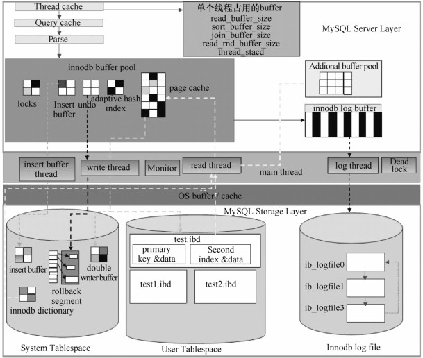

MySQL实例由一组后台线程、一些内存块和若干服务线程组成，如图21-1所示。

图21-1 MySQL系统结构

在默认情况下，MySQL有7组后台线程，分别是1个主线程，4组IO线程，1个锁线程，1个错误监控线程。MySQL 5.5之后又新增了一个 purge线程。这些后台线程的主要功能如下。

master thread：主要负责将脏缓存页刷新到数据文件，执行 purge操作，触发检查点，合并插入缓冲区等。

insert buffer thread：主要负责插入缓冲区的合并操作。

read thread：负责数据库读取操作，可配置多个读线程。

write thread：负责数据库写操作，可配置多个写线程。

log thread：用于将重做日志刷新到 logfile中。

purge thread：MySQL 5.5之后用单独的 purge thread执行 purge操作。

lock thread：负责锁控制和死锁检测等。

错误监控线程：主要负责错误监控和错误处理。

我们可以通过 show engine innodb status命令来查看这些线程的状态：

show engine innodb status\G;

130225 14:33:40 INNODB MONITOR OUTPUT

Per second averages calculated from the last 11 seconds

BACKGROUND THREAD

srv_master_thread loops: 15179418 1_second, 15178078 sleeps, 1514950 10_second, 33681 background, 33676 flush

srv_master_thread log flush and writes: 16124484

FILE I/O

I/O thread 0 state: waiting for completed aio requests (insert buffer thread)

I/O thread 1 state: waiting for completed aio requests (log thread)

I/O thread 2 state: waiting for completed aio requests (read thread)

I/O thread 3 state: waiting for completed aio requests (read thread)

I/O thread 4 state: waiting for completed aio requests (read thread)

I/O thread 5 state: waiting for completed aio requests (read thread)

I/O thread 6 state: waiting for completed aio requests (write thread)

I/O thread 7 state: waiting for completed aio requests (write thread)

I/O thread 8 state: waiting for completed aio requests (write thread)

I/O thread 9 state: waiting for completed aio requests (write thread)

Pending normal aio reads: 0 [0, 0, 0, 0] , aio writes: 0 [0, 0, 0, 0] ,

ibuf aio reads: 0, log i/o’s: 0, sync i/o’s: 0

Pending flushes (fsync) log: 0; buffer pool: 0

43318253 OS file reads, 276753292 OS file writes, 68457022 OS fsyncs

4.64 reads/s, 16384 avg bytes/read, 21.45 writes/s, 1.55 fsyncs/

…

END OF INNODB MONITOR OUTPUT

