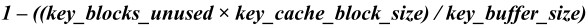

MyISAM存储引擎使用 key buffer缓存索引块，以加速MyISAM索引的读写速度。对于MyISAM表的数据块，MySQL没有特别的缓存机制，完全依赖于操作系统的IO缓存。

**1．key_buffer_size设置**

key_buffer_size决定MyISAM索引块缓存区的大小，它直接影响MyISAM表的存取效率。可以在MySQL的参数文件中设置key_buffer_size的值，对于一般MyISAM数据库，建议至少将1/4可用内存分配给key_buffer_size：

…

Key_buffer_size = 4G

…

我们可以通过检查key_read_requests、key_reads、key_write_requests和key_writes等MySQL状态变量来评估索引缓存的效率。一般来说，索引块物理读比率 ***key_reads / key_read_requests***应小于 0.01。索引块写比率 ***key_writes / key_write_requests***也应尽可能小，但这与应用特点有关，对于更新和删除操作特别多的应用，***key_writes / key_write_requests***可能会接近 1，而对于每次更新很多行记录的应用，***key_writes / key_write_requests***就会比较小。

除通过索引块的物理读写比率衡量 key buffer的效率外，我们也可以通过评估 key buffer的使用率来判断索引缓存设置是否合理。key buffer使用率计算公式如下：

一般来说，使用率在80%左右比较合适，大于80%，可能因索引缓存不足而导致性能下降；小于80%，会导致内存浪费。

**2．使用多个索引缓存**

MySQL通过各 session共享的 key buffer提高了MyISAM索引存取的性能，但它并不能消除 session间对 key buffer的竞争。比如，一个 session如果对某个很大的索引进行扫描，就可能将其他的索引数据块挤出索引缓存区，而这些索引块可能是其他 session 要用的热数据。为减少 session间对 key buffer的竞争，MySQL从 5.1版本开始引入了多索引缓存的机制，从而可以将不同表的索引缓存到不同的 key buffer中。

可以通过下述命令创建新的 key buffer：

mysql> set global hot_cache.key_buffer_size=128*1024;

Query OK, 0 rows affected (0.01 sec)

其中，hot_cache是新建索引缓存的名称，global关键字表示新建的缓存对每一个新的连接都有效。

创建的索引缓存可以使用以下命令删除：

mysql> set global hot_cache.key_buffer_size=0;

Query OK, 0 rows affected (0.00 sec)

但我们不能删除默认的key_buffer：

mysql> show variables like ‘key_buffer_size’;

+-----------------+---------+

| Variable_name | Value |

+-----------------+---------+

| key_buffer_size | 8388600 |

+-----------------+---------+

1 row in set (0.00 sec)

mysql> set global key_buffer_size=0;

Query OK, 0 rows affected, 1 warning (0.00 sec)

mysql> show warnings;

+---------+------+------------------------------+

| Level | Code | Message |

+---------+------+------------------------------+

| Warning | 1438 | Cannot drop default keycache |

+---------+------+------------------------------+

1 row in set (0.01 sec)

在默认情况下，MySQL将使用默认 key buffer缓存MyISAM表的索引，我们可以用 cache index命令指定表的索引缓存：

mysql> cache index sales,sales2 in hot_cache;

+---------------+--------------------+----------+----------+

| Table | Op | Msg_type | Msg_text |

+---------------+--------------------+----------+----------+

| sakila.sales | assign_to_keycache | status | OK |

| sakila.sales2 | assign_to_keycache | status | OK |

+---------------+--------------------+----------+----------+

2 rows in set (0.04 sec)

除上述通过命令动态创建并分配辅助索引缓存外，更常见的做法是通过配置文件在MySQL启动时自动创建并加载索引缓存：

key_buffer_size = 4G

hot_cache.key_buffer_size = 2G

cold_cache.key_buffer_size = 1G

init_file=/path/to/data-directory/mysqld_init.sql

在mysqld_init.sql中，可以通过 cache index命令分配索引缓存，并用 load index into cache命令来进行索引预加载：

cache index sales in hot_cache;

cache index sales2 in cold_cache;

load index into cache sales, sales2;

**3．调整“中点插入策略”**

默认情况下，MySQL使用简单的LRU（Least Recently Used）策略来选择要淘汰的索引数据块。但这种算法不是很精细，在某些情况下会导致真正的热块被淘汰。

如果出现这种情况，除了使用上面介绍的多个索引缓存机制外，还可以利用中点插入策略（Midpoint Insertion Strategy）来优化索引块淘汰算法。所谓“中点插入策略”，是对简单LRU淘汰算法的改进，它将LRU链分成两部分：hot子表和warm子表，当一个索引块读入内存时，先被放到LRU链表的“中点”，即warm子表的尾部，当达到一定的命中次数后，该索引块会被晋升到hot子表的尾部；此后，该数据块在hot子表流转，如果其到达hot子表的头部并超过一定时间，它将由hot子表的头部降级到warm子表的头部；当需要淘汰索引块时，缓存管理程序会选择优先淘汰warm表头部的内存块。不难理解，这种算法能够避免偶尔被访问的索引块将访问频繁的热块淘汰。

可以通过调节key_cache_division_limit来控制多大比例的缓存用做warm子表，key_cache_division_limit 的默认值是 100，意思是全部缓存块都放在 warm子表，其实也就是不启用“中点插入策略”。如果我们希望将大致 30%的缓存用来 cache 最热的索引块，可以对key_cache_division_limit做如下设置：

Set global key_cache_division_limit = 70

Set global hot_cache. key_cache_division_limit = 70;

除调节warm子表的比例外，还可以通过key_cache_age_threshold控制数据块由hot子表向warm子表降级的时间，值越小，数据块将越快被降级。对于有N个块的索引缓存来说，如果一个在 hot子表头部的索引块，在最后 ***N×key_cache_age_threshold / 100***次缓存命准内未被访问过，就会被降级到warm子表。

**4．调整read_buffer_size和read_rnd_buffer_size**

如果需要经常顺序扫描MyISAM表，可以通过增大read_buffer_size的值来改善性能。但需要注意的是：read_buffer_size是每个session独占的，如果默认值太大，就会造成内存浪费，甚至导致物理内存耗尽。

对于需要做排序的MyISAM表查询，如带有 order by子句的 SQL，适当增大 read_rnd_buffer_size的值，也可以改善此类SQL的性能。但同样要注意的是：read_rnd_buffer_size也是按session分配的，默认值不能设置得太大。

