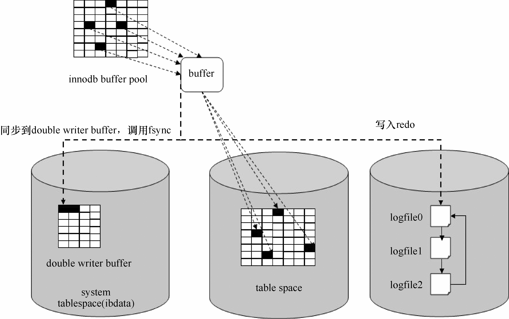

InnoDB的缓存机制与MyISAM不尽相同，本节重点节绍其缓存内部机制和优化方法。

**1．InnoDB缓存机制**

InnoDB用一块内存区做IO缓存池，该缓存池不仅用来缓存InnoDB的索引块，而且也用来缓存InnoDB的数据块，这一点与MyISAM不同。

在内部，InnoDB缓存池逻辑上由 free list、flush list和LRU list组成。顾名思义，free list是空闲缓存块列表，flush list是需要刷新到磁盘的缓存块列表，而LRU list是 InnoDB正在使用的缓存块，它是 InnoDB buffer pool的核心。

InnoDB使用的LRU算法与MyISAM的“中点插入策略”LRU算法很类似，大致原理是：将LRU list分为 young sublist和 old sublist，数据从磁盘读入时，会将该缓存块插入到LRU list的“中点”，即 old sublist的头部；经过一定时间的访问（由 innodb_old_blocks_time系统参数决定），该数据块将会由 old sublist转移到 young sublist的头部，也就是整个LRU list的头部；随着时间的推移，young sublist和 old sublist中较少被访问的缓存块将从各自链表的头部逐渐向尾部移动；需要淘汰数据块时，优先从链表尾部淘汰。这种设计同样是为了防止偶尔被访问的索引块将访问频繁的热块淘汰。

脏页的刷新存在于FLUSH list和LRU list这两个链表，LRU上也存在可以刷新的脏页，这里是直接可以刷新的，默认BP（INNODB_BUFFER_POOL）中不存在可用的数据页的时候，会扫描LRU list尾部的 innodb_lru_scan_depth个数据页（默认是 1024个数据页），进行相关刷新操作。从LRU list淘汰的数据页会立刻放入到 free list中去。

我们可以通过调整 InnoDB buffer pool的大小、改变young sublist和old sublist的分配比例、控制脏缓存的刷新活动、使用多个InnoDB缓存池等方法来优化InnoDB的性能。

**2．innodb_buffer_pool_size的设置**

innodb_buffer_pool_size 决定 InnoDB 存储引擎表数据和索引数据的最大缓存区大小。和MyISAM存储引擎不同，Innod buffer pool同时为数据块和索引块提供数据缓存，这与Oracle的缓存机制很相似。在保证操作系统及其他程序有足够内存可用的情况下，innodb_buffer_pool_size的值越大，缓存命中率越高，访问InnoDB表需要的磁盘I/O就越少，性能也就越高。在一个专用的数据库服务器上，可以将 80%的物理内存分配给 InnoDB buffer pool，但一定要注意避免设置过大而导致页交换。

通过以下命令查看 buffer pool的使用情况：

mysqladmin -S /tmp/mysql.sock ext|grep -i innodb_buffer_pool

| Innodb_buffer_pool_pages_data | 129920 |

| Innodb_buffer_pool_pages_dirty | 129 |

| Innodb_buffer_pool_pages_flushed | 420478838 |

| Innodb_buffer_pool_pages_free | 0 |

| Innodb_buffer_pool_pages_total | 131072 |

| Innodb_buffer_pool_read_ahead | 246 |

| Innodb_buffer_pool_read_ahead_evicted | 16214428 |

| Innodb_buffer_pool_read_requests | 3890802451 |

| Innodb_buffer_pool_reads | 37571543 |

| Innodb_buffer_pool_wait_free | 0 |

| Innodb_buffer_pool_write_requests | 1146633668 |

可用以下公式计算InnoDB缓存池的命中率：

如果命中率太低，则应考虑扩充内存、增加innodb_buffer_pool_size的值。

**3．调整old sublist大小**

在LRU list中，old sublist的比例由系统参数 innodb_old_blocks_pct决定，其取值范围是5～95，默认值是37（约等于3/8）。通过以下命令可以查看其当前设置：

mysql> show global variables like '%innodb_old_blocks_pct%';

+-----------------------+-------+

| Variable_name | Value |

+-----------------------+-------+

| innodb_old_blocks_pct | 37|

+-----------------------+-------+

可以根据 InnoDB Monitor的输出信息来调整 innodb_old_blocks_pct的值。例如，在没有较大表扫描或索引扫描的情况下，如果 young/s 的值很低，可能就需要适当增大innodb_old_blocks_pct的值或减小innodb_old_blocks_time的值。

**4．调整innodb_old_blocks_time的设置**

innodb_old_blocks_time参数决定了缓存数据块由old sublist转移到young sublist的快慢，当一个缓存数据块被插入到 midpoint（old sublist）后，至少要在 old sublist 停留超过innodb_old_blocks_time（ms）后，才有可能被转移到new sublist。例如，将 innodb_old_blocks_time设置为1000（即1s），当出现 table scan时，InnoDB先将数据块载入到midpoint（old sublist）上，程序读取数据块，因为这时，数据块在old sublist中的停留时间还不到 innodb_old_blocks_time，所以不会被转移到有young sublist中，这样就避免了表扫描污染buffer pool的情况。

可以根据 InnoDB Monitor的输出信息来调整 innodb_old_blocks_time的值。在进行表扫描时，如果non-youngs/s很低，young/s很高，就应考虑将innodb_old_blocks_time适当调大，以防止表扫描将真正的热数据淘汰。更酷的是，这个值可以动态设置，如果要进行大的表扫描操作，可以很方便地临时做调整。

**5．调整缓存池数量，减少内部对缓存池数据结构的争用**

MySQL内部不同线程对InnoDB缓存池的访问在某些阶段是互斥的，这种内部竞争也会产生性能问题，尤其在高并发和 buffer pool较大的情况下。为解决这个问题，InnoDB的缓存系统引入了innodb_buffer_pool_instances配置参数，对于较大的缓存池，适当增大此参数的值，可以降低并发导致的内部缓存访问冲突，改善性能。InnoDB 缓存系统会将参数innodb_buffer_pool_size指定大小的缓存平分为 innodb_buffer_pool_instances个 buffer pool。

**6．控制 innodb buffer刷新，延长数据缓存时间，减缓磁盘 I/O**

在InnoDB找不到干净的可用缓存页或检查点被触发等情况下，InnoDB的后台线程就会开始把“脏的缓存页”回写到磁盘文件中，这个过程叫**缓存刷新**。

我们通常都希望 buffer pool中的数据在缓存中停留的时间尽可能长，以备重用，从而减少磁盘IO的次数。同时，磁盘IO较慢，是数据库系统最主要的性能瓶颈，我们往往也希望通过延迟缓存刷新来减轻 IO系统的压力。InnoDB buffer pool的刷新快慢主要取决于两个参数。

一个是innodb_max_dirty_pages_pct，它控制缓存池中脏页的最大比例，默认值是75%，如果脏页的数量达到或超过该值，InnoDB的后台线程将开始缓存刷新。

另一个是innodb_io_capacity，它代表磁盘系统的IO能力，其值在一定程度上代表磁盘每秒可完成 I/O 的次数。innodb_io_capacity 的默认值是 200，对于转速较低的磁盘，如7200RPM的磁盘，可将innodb_io_capacity的值降低到100，而对于固态硬盘和由多个磁盘组成的盘阵，innodb_io_capacity的值可以适当增大。

innodb_io_capacity决定一批刷新脏页的数量，当缓存池脏页的比例达到innodb_max_dirty_pages_pct时，InnoDB大约将innodb_io_capacity个已改变的缓存页刷新到磁盘；当脏页比例小于innodb_max_dirty_pages_pct时，如果innodb_adaptive_flushing的设置为true，InnoDB将根据函数buf_flush_get_desired_flush_rate返回的重做日志产生速度来确定要刷新的脏页数。在合并插入缓存时，InnoDB每次合并的页数是0.05×innodb_io_capacity。

可以根据一些InnoDB Monitor的值来调整innodb_max_dirty_pages_pct和innodb_io_capacity。例如，若innodb_buffer_pool_wait_free的值增长较快，则说明InnoDB经常在等待空闲缓存页，如果无法增大缓存池，那么应将innodb_max_dirty_pages_pct的值调小，或将innodb_io_capacity的值提高，以加快脏页的刷新。

**7．InnoDB doublewrite**

在进行脏页刷新时，InnoDB 采用了双写（doublewrite）策略，这么做的原因是：MySQL的数据页大小（一般是 16KB）与操作系统的 IO 数据页大小（一般是 4KB）不一致，无法保证InnoDB缓存页被完整、一致地刷新到磁盘，而InnoDB的redo日志只记录了数据页改变的部分，并未记录数据页的完整前像，当发生部分写或断裂写时（比如将缓存页的第一个 4KB写入磁盘后，服务器断电），就会出现页面无法恢复的问题，为解决这个问题，InnoDB引入了doublewrite技术。

InnoDB doublewrite机制的实现原理是：用系统表空间中的一块连续磁盘空间（100个连续数据页，大小为 2MB）作为 doublewrite buffer，当进行脏页刷新时，首先将脏页的副本写到系统表空间的 doublewrite buffer中，然后调用 fsync()刷新操作系统 IO缓存，确保副本被真正写入磁盘，最后InnoDB后台IO线程将脏页刷新到磁盘数据文件。其原理示意图如图21-2所示。

图21-2 InnoDB doublewrite原理示意图

在做恢复时，如果发现不一致的页，InnoDB会用系统表空间 doublewrite buffer区的相应副本来恢复数据页。

默认情况下，InnoDB doublewrite是开启的，可以用以下命令查看：

mysql> show global variables like '%doublewrite%';

+-------------------------+-------+

| Variable_name | Value |

+-------------------------+-------+

| innodb_doublewrite | ON |

| innodb_doublewrite_file | |

+-------------------------+-------+

2 rows in set (0.00 sec)

由于同步到 doublewrite buffer是对连续磁盘空间的顺序写，因此开启双写对性能的影响并不太大。对于要求超高性能，又能容忍极端情况下少量数据丢失的应用，可以通过在配置文件中增加innodb_doublewrite=0参数设置来关闭doublewrite，以尽量满足性能方面的要求。

