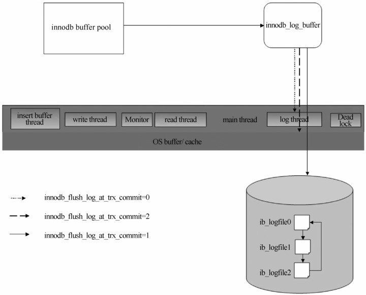
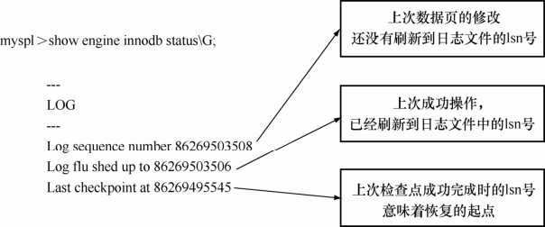

redo log是 InnoDB保证事务ACID属性的重要机制，其工作原理图如图 21-3所示。

图21-3 redo日志回写磁盘示意图

当更新数据时，InnoDB内部的操作流程大致是：

（1）将数据读入 InnoDB buffer pool，并对相关记录加独占锁；

（2）将UNDO信息写入undo表空间的回滚段中；

（3）更改缓存页中的数据，并将更新记录写入 redo buffer中；

（4）提交时，根据 innodb_flush_log_at_trx_commit的设置，用不同的方式将 redo buffer中的更新记录刷新到 InnoDB redo log file中，然后释放独占锁；

（5）最后，后台IO线程根据需要择机将缓存中更新过的数据刷新到磁盘文件中。

可以通过 show engine innodb status命令查看当前日志的写入情况，如图 21-4所示。

图21-4 查看当前日志的写入情况

其中，LSN（Log Sequence Number）称为日志序列号，它实际上对应日志文件的偏移量，其生成公式是：

例如，日志文件大小为600MB，目前的LSN是1GB，现在要将512字节的更新记录写入redo log，则实际写入过程如下。

求出偏移量：由于 LSN 数值远大于日志文件大小，因此通过取余方式，得到偏移量为400MB。

写入日志：找到偏移400MB的位置，写入512字节日志内容，下一个事务的LSN就是1000000512。

由以上介绍可知，除 InnoDB buffer pool外，InnoDB log buffer的大小、redo日志文件的大小以及innodb_flush_log_at_trx_commit参数的设置等，都会影响InnoDB的性能。下面我们就介绍这几个参数的优化调整。

