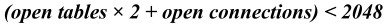

参数max_connections控制允许连接到MySQL数据库的最大数量，默认值是151。如果状态变量connection_errors_max_connections不为零，并且一直在增长，就说明不断有连接请求因数据库连接数已达到最大允许的值而失败，应考虑增大max_connections的值。

MySQL最大可支持的数据库连接取决于很多因素，包括给定操作系统平台线程库的质量、内存大小、每个连接的负荷以及期望的响应时间等。在Linux平台下，MySQL支持500～1000个连接不是难事，如果内存足够、不考虑响应时间，甚至能达到上万个连接。而在 Windows平台下，受其所用线程库的影响，最大连接数有以下限制：

每一个session操作MySQL数据库表都需要占用文件描述符，数据库连接本身也要占用文件描述符，因此，在增大max_connections时，也要注意评估open-files-limit的设置是否够用。

