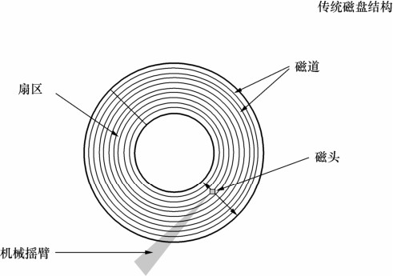

目前来说，传统的磁盘仍然是主流的存储设备，从传统的硬盘上读取数据分为以下3个步骤。

（1）将磁头移动到磁盘表面的正确位置，花费的时间叫寻道时间。

（2）等待磁盘旋转，需要的数据会移动到磁头下面，花费的时间取决于磁盘的转速，转速越高的磁盘需要的时间越短。

（3）磁盘继续旋转，直到所有需要的数据都经过磁头。

磁盘在做这样动作的时候的快慢可以归结为两个因素：访问时间（步骤1和2）和传输速度，这两个因素也叫延迟和吞吐量。

传统的磁盘结构如图22-1所示。

图22-1 传统磁盘结构

I/O 请求处理的快慢有很大程度上取决于磁盘的寻道时间。为了减少寻道时间，操作系统不对每次 I/O 请求都直接寻道处理，而是将 I/O 请求放入队列，对请求进行合并和排序，来减少磁盘寻道操作次数。

I/O 请求合并是指将两个或者多个 I/O 请求合并成一个新请求，例如当新来的请求和当前请求队列中的某个请求需要访问的是相同或者相邻扇区时，那么就可以把两个请求合并为对同一个或者多个相邻扇区的请求，这样只需要一次寻道就足够。通过合并，多个 I/O 请求被压缩为一次 I/O，最后只需要一次寻址就可以完成多次寻址的效果。

对于相邻扇区的访问通过合并处理，对于非相邻扇区的访问则通过排序处理。机械臂的转动是朝着扇区增长方向的，如果把I/O请求按照扇区增长排序，一次旋转就可以访问更多的扇区，能够缩短所有请求的实际寻道时间。

为此Linux实现了 4种 I/O调度算法，分别是NOOP算法（No Operation）、最后期限算法（Deadline）、完全公平队列算法（CFQ）以及预期算法（Anticipatory）。用户可以在内核引导时指定一种I/O调度算法，也可以在系统运行时动态修改I/O调度算法。从内核2.5开始，默认的I/O调度算法是Deadline，之后默认I/O调度算法为Anticipatory，直到内核2.6.17为止，从内核2.6.18开始，CFQ成为默认的I/O调度算法。

**NOOP算法**（No Operation）不对 I/O请求排序，除了合并请求也不会进行其他任何优化，用最简单的先进先出FIFO队列顺序提交I/O请求。NOOP算法面向的主要是随机访问设备，例如SSD等。NOOP算法更适合随机访问设备的原因主要是：随机访问设备不存在传统机械磁盘的机械臂移动（也就是磁头移动）造成的寻道时间，那么就没有必要做多余的事情。

**最后期限算法**（Deadline）除了维护了一个拥有合并和排序功能的请求队列之外，额外维护了两个队列，分别是读请求队列和写请求队列，它们都是带有超时的FIFO队列。当新来一个I/O请求时，会被同时插入普通队列和读/写队列，然后I/O调度器正常处理普通队列中的请求。当调度器发现读/写请求队列中的请求超时的时候，会优先处理这些请求，保证尽可能不产生饥饿请求。Deadline在全局吞吐量和延迟方面做了权衡，牺牲一定的全局吞吐量来避免出现饥饿请求的可能。当系统存在大量顺序请求的时候，Deadline可能导致请求无法被很好的排序，引发频繁寻道。

**预期算法**（Anticipatory）是基于预测的I/O算法，它和Deadline很类似，也维护了三个请求队列，区别在于，Anticipatory处理完一个I/O请求之后并不会直接返回处理下一个请求，而是等待片刻（默认 6ms），等待期间如果有新来的相邻扇区的请求，会直接处理新来的请求，当等待时间结束后，调度才返回处理下一个队列请求。Anticipatory适合写入较多的环境，例如文件服务器等，不适合MySQL等随机读取较多的数据库环境。

**完全公平队列**（Complete Fair Queuing/CFQ）把 I/O请求按照进程分别放入进程对应的队列中。CFQ的公平是针对进程而言的，每一个提交I/O请求的进程都会有自己的I/O队列，CFQ以时间片算法为前提，轮转调动队列，默认从当前队列中取出4个请求处理，然后处理下一个队列的4个请求，确保每个进程享有的I/O资源是均衡的。

从上面的算法中可以看到，在不同的场景下选择不同的 I/O 调度器是十分必要的。在完全随机的访问环境下，CFQ和Deadline性能差异很小，但是在有大的连续I/O出现的情况下，CFQ可能会造成小I/O的响应延时增加，所以建议MySQL数据库环境设置为Deadline算法，这样更稳定。对于 SSD 等设备，采用 NOOP或者 Deadline 通常也可以获取比默认调度器更好的性能。

查看当前系统支持的I/O调度算法：

shell> dmesg | grep -i scheduler

查看当前设备（/dev/sda）使用的I/O调度算法：

shell> more /sys/block/sda/queue/scheduler

noop anticipatory deadline [cfq]

修改当前块设备（/dev/sda）使用的I/O调度算法，修改I/O调度算法后直接生效：

shell> echo "deadline" > /sys/block/sda/queue/scheduler

永久地修改 I/O调度算法，可以通过修改内核引导参数，增加 elevator=调度程序名：

shell> vi /boot/grub/menu.lst

更改内容：

kernel /boot/vmlinuz-2.6.18-308.el5 ro root=LABEL=/ elevator=deadline

