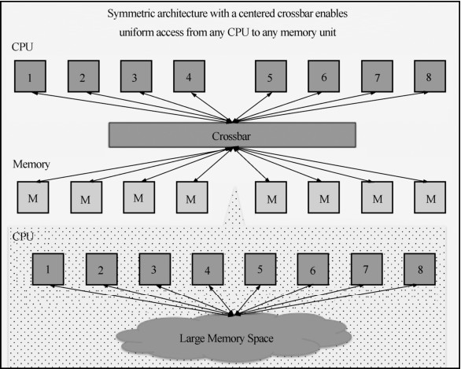
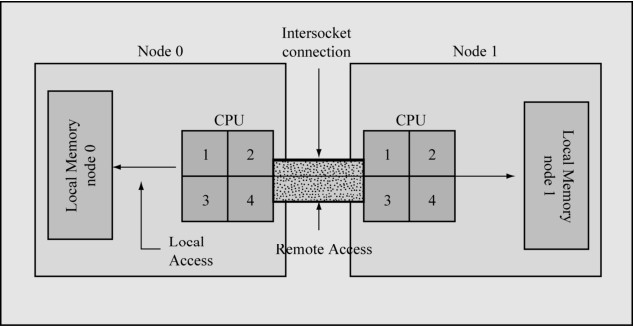

从系统架构来看，目前的商用服务器大体可以分为三类：**对称多处理器结构**（Symmetric Multi-Processor，SMP）、**非一致存储访问结构**（Non-Uniform Memory Access，NUMA）以及**海量并行处理结构**（Massive Parallel Processing，MPP）。一般服务器是SMP或者NUMA架构的较多。

SMP 架构是指在一台计算机上汇集了一组处理器（多 CPU），各个 CPU 之间共享内存子系统和总线结构，如图22-2所示。SMP架构同时使用多个CPU，系统将任务队列对称地分布于多个CPU上，从而极大地提高了整个系统的数据处理能力。所有的CPU都可以平等地访问内存、I/O和外设。架构中多个CPU没有区别，共享相同的物理内存，每个CPU访问内存中的任何地址所需时间是相同的，因此 SMP 也被称为一致存储器访问结果（Uniform Memory Access，UMA）。对SMP服务器进行扩展的方式有增加内存、使用更快的CPU、增加CPU、扩充I/O，以及增加更多的磁盘等。

图22-2 SMP架构

SMP服务器的主要特征是共享，系统中所有的资源（CPU、内存、I/O等）都是共享的。正是由于共享，导致了SMP服务器的扩展能力非常有限。对SMP服务器来说，扩展最受限制的是内存，由于每个CPU都必须通过相同的总线访问相同的内存资源，如果两个CPU同时请求防问一个内存资源（例如同一段内存地址），由硬件、软件的锁机制来解决资源争用的问题。所以随着 CPU 数量的增加，CPU 之间内存访问冲突加剧，最终造成 CPU 资源的浪费，使得CPU性能的有效性大幅度降低。

SMP架构 Share Everything导致在扩展能力上被限制，NUMA架构出现了。NUMA把一台计算机分成多个节点（Node），每个节点内部拥有多个CPU，节点内部使用共有的内存控制器，节点之间是通过互联模块进行连接和信息交互，如图 22-3 所示。因此节点的所有内存对于本节点所有的CPU都是等同的，而对于其他节点中的所有CPU都是不同的。因此每个CPU可以访问整个系统内存，但是访问本地节点的内存速度最快（不需要经过互联模块），访问非本地节点的内存的速度较慢（需要经过互联模块），即CPU访问内存的速度与节点的距离有关，距离称为Node Distance。

图22-3 NUMA架构

显示当前NUMA的节点情况：

shell> numactl --hardware

available: 2 nodes (0-1)

node 0 size: 24194 MB

node 0 free: 117 MB

node 1 size: 24240 MB

node 1 free: 17 MB

node distances:

node 0 1

0: 10 21

1: 21 10

shell> free -m

total used free shared buffers cached

Mem: 48273 48138 135 0 343 14891-/+ buffers/cache: 32903 15369

Swap: 2047 22 2025

当前服务器上有两个节点Node 0和Node 1，Node 0的本地内存约为 24GB，Node 1的本地内存约为24GB。系统一共有48GB内存。

节点之间距离（Node Distance）是指从节点 1上访问节点 0上的内存需要付出的代价的一种表现形式。例子中，Linux为节点本地内存声明距离为10，非本地内存声明距离为21。

NUMA的内存分配策略有以下4种。

缺省default：总是在本地节点分配（分配在当前进程运行的节点上）。

绑定bind：强制分配到指定节点上。

交叉interleave：在所有节点或者指定节点上交叉分配内存。

优先preferred：在指定节点上分配，失败则在其他节点上分配。

显示当前系统NUMA策略：

shell> numactl --show

policy: default

preferred node: current

physcpubind: 0 1 2 3 4 5 6 7 8 9 10 11 12 13 14 15

cpubind: 0 1

nodebind: 0 1

membind: 0 1

因为NUMA默认的内存分配策略是优先在进程所在CPU的本地内存中分配，会导致CPU节点之间内存分配不均衡，当某个CPU节点内存不足时，会导致Swap产生，而不是从远程节点分配内存，这就是Swap Insanity现象。

MySQL是单进程多线程架构的数据库，当NUMA采用默认内存分配策略时，MySQL进程会被并且仅仅会被分配到NUMA的一个节点上去。假设这个节点的本地内存为8GB，而MySQL配置了14GB内存，MySQL分配的14GB内存中，超过节点本地内存部分（14GB-8GB=6GB内存）Linux宁愿使用Swap也不会使用其他节点的物理内存。在这种情况下，能观察到虽然系统总共可用物理内存还未使用完，但是MySQL进程已经开始在使用Swap了。

MySQL 对 NUMA 特性支持不好，如果单机只运行一个 MySQL 实例，可以选择关闭NUMA，关闭的方式有两种：

硬件层，在BIOS中设置关闭；

OS内核，启动时设置numa=off。

修改/etc/grub.conf文件，在 kernel那行追加 numa=off：

shell> vi /etc/grub.conf

…

title Red Hat Enterprise Linux (2.6.32-279.el6.x86_64)

root (hd0,0)

kernel /boot/vmlinuz-2.6.32-279.el6.x86_64 ro root=UUID=7971e5ab-ee55-4848-80f6-33 f811702a51 rd_NO_LUKS rd_NO_LVM LANG=en_US.UTF-8 rd_NO_MD SYSFONT=latarcyrheb-sun16

crashke

rnel=auto KEYBOARDTYPE=pc KEYTABLE=us rd_NO_DM rhgb quiet numa=off

保存后重启服务器，再次检查NUMA只剩下一个节点就成功了：

shell> numactl --hardware

available: 1 nodes (0)

node 0 cpus: 0 1 2 3 4 5 6 7 8 9 10 11 12 13 14 15 16 17 18 19 20 21 22 23

node 0 size: 65490 MB

node 0 free: 60968 MB

node distances:

node 0

0: 10

或者通过numactl命令将NUMA内存分配策略修改为interleave。

修改mysqld_safe启动脚本，添加 cmd="/usr/bin/numactl --interleave all $cmd"一行即可，启动MySQL时指定内存分配策略为interleave：

shell> vi $MYSQL_HOME/bin/mysqld_safe

…

cmd="/usr/bin/numactl --interleave all $cmd"

for i in "$ledir/$MYSQLD" "$defaults" "--basedir=$MY_BASEDIR_VERSION" \

"--datadir=$DATADIR" "--plugin-dir=$plugin_dir" "$USER_OPTION"

do

cmd="$cmd "`shell_quote_string "$i"`

done

保存后重启MySQL进程即可。

如果单机运行多个MySQL实例，可以将MySQL绑定到不同CPU节点上，同时配置合适的MySQL的内存参数，并且采用绑定的内存分配策略，强制在本节点分配内存。

NUMA技术可以很好地解决SMP架构的扩展问题，但是NUMA一样存在缺陷，由于访问远程内存的延时远远超过访问本地内存，因此随着 CPU 数量增加，系统性能并不能够线性增加。

MPP解决了NUMA架构增加CPU并不能线性提升性能的问题，MPP由多个SMP服务器通过一定的节点互联网络进行连接，每个节点只访问自己的本地资源（内存、存储等），不访问其他节点的资源，是一种Share Nothing的架构，因而理论上可以无限扩展。

在MPP架构中，每个节点的CPU不能访问其他节点的内存，此时节点之间的信息交互是通过节点互联网络来实现的，这个过程称为Data Redistribution。但是MPP服务器需要复杂的机制来调度和平衡各个节点的负载和并行处理。目前一些基于 MPP 技术的服务器会通过例如数据库软件等系统级别的软件来屏蔽底层的复杂性。例如，Teradata就是基于MPP技术的一个关系数据库软件。

