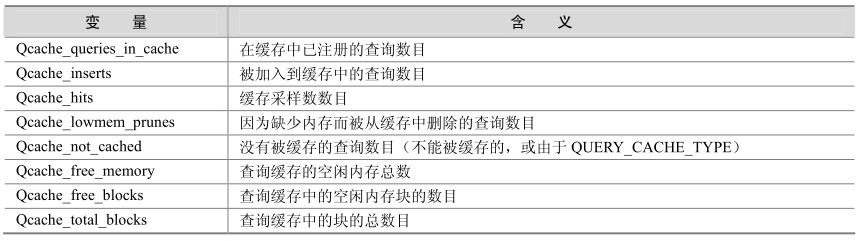

MySQL的查询缓存（MySQL Query Cache）是在 4.1版本以后新增的功能，它的作用是存储SELECT查询的文本以及相应结果。如果随后收到一个相同的查询，服务器会从查询缓存中重新得到查询结果，而不再需要解析和执行查询。

查询缓存的适用对象是更新不频繁的表，当表更改（包括表结构和表数据）后，查询缓存值的相关条目被清空。查询缓存相关的参数主要有以下几个：

mysql> show variables like '%query_cache%';

+------------------------------+---------+

| Variable_name | Value |

+------------------------------+---------+

| have_query_cache | YES |

| query_cache_limit | 1048576 |

| query_cache_min_res_unit | 4096 |

| query_cache_size | 0 |

| query_cache_type | OFF |

| query_cache_wlock_invalidate | OFF |

+------------------------------+---------+

6 rows in set (0.00 sec)

对于以上几个参数，具体解释如下。

have_query_cache表明服务器在安装时是否已经配置了高速缓存。

query_cache_size表明缓存区大小，单位为MB。

query_cache_type的变量值从0到2，含义分别为：0或者off（缓存关闭）、1或者on（缓存打开，使用SQL_NO_CACHE提示的SELECT除外）、2或者demand（只有带SQL_CACHE的SELECT语句提供高速缓存）。

通过SHOW STATUS命令，可以监视查询缓存的使用状况，如表 23-1所示。

表23-1 MySQL查询缓存的性能监控参数

