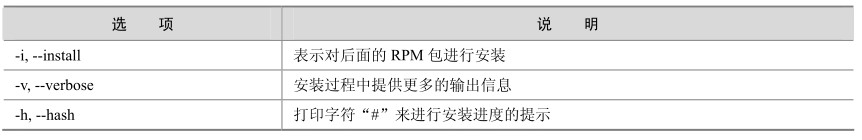

RPM 包的安装步骤在第 1 章中已经详细介绍过了，这里再简单说一下。大多数情况下，下载Server包和Client包就可以满足大部分应用，下载的文件名通常是以下格式：

MySQL-包类型（例如Server或者Client）-版本类型（例如社区版或者企业版）-版本号（例如5.0.41）-0.操作系统类型(rhel3).CPU类型（例如i386）.rpm

例如，下面两个文件分别是基于 x86架构的Redhat Linux操作系统上的社区版MySQL的Server包和Client包，版本都为5.0.41。

MySQL-server-community-5.0.41-0.rhel3.i386.rpm

MySQL-client-community-5.0.41-0.rhel3.i386.rpm

对于RPM文件一般使用“rpm -ivh文件名”的方式进行安装，其中“rpm”是RPM包的管理工具，“-ivh”分别是RPM的3个选项，具体含义如表24-2所示。

表24-2 rpm选项及其说明

RPM工具更详细的参数使用方法，可以使用 rpm --help命令来查看。例如，对上例中RPM包的安装方法如下：

shell> rpm -ivh MySQL-server-community-5.0.41-0.rhel3.i386.rpm

shell> rpm -ivh MySQL-client-community-5.0.41-0.rhel3.i386.rpm

