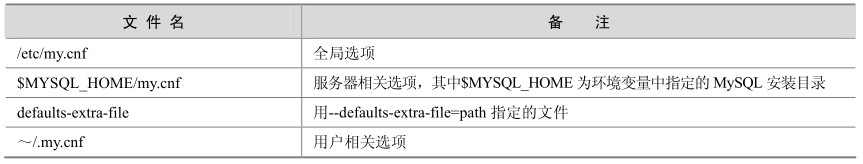

在MySQL中，参数的初始化是通过参数文件来进行设置，如果不设置参数文件，MySQL就按照系统中所有参数的默认值来进行启动，通过“mysqld –verbose –help”命令可以来查看参数文件中所有参数的当前设置值。

在Windows和Linux 上，参数文件可以被放在多个位置，数据库启动的时候将按照不同的顺序来搜索，如果在多个位置都有参数文件，则搜索顺序靠后的文件中的参数将覆盖靠前的参数。表24-3和表24-4分别给出了在不同操作系统中数据库启动时MySQL搜索参数文件的顺序。

表24-3 Windows平台上MySQL参数文件的读取顺序

表24-4 Linux平台上MySQL参数文件读取顺序

WINDIR典型名称为C：\WINDOWS或C：\WINNT。用户可以使用以下命令从WINDIR环境变量值确定自己的确切位置：

C：\> echo %WINDIR%

INSTALLDIR是MySQL的安装目录，比如c:\mysql。

defaults-extra-file 是 MySQL 启动时可选择的附带选项，用此参数可以指定任何路径下的配置文件。

“全局选项”表示如果一台服务器上安装了多个MySQL，则每个MySQL服务启动的时候都会首先从此选项中读取参数。

**注意：**不管在Windows还是Linux平台上，为了避免混淆，建议最好只在一个位置指定配置文件。

对于初学者，建议从$MYSQL_HOME/support-files 下面按照需要 cp 合适的配置文件为数据库配置文件，例如：

cp my-large.cnf /etc/my.cnf

当参数需要修改时，可以选择以下3种修改方式（命令行中para_name表示要修改的参数名，value表示要修改的目标参数值）。

session级修改（只对本session有效），在mysql提示符下执行如下命令：

mysql>set para_name=value;

全局级修改（对所有新的连接都有效，但是对本session无效，数据库重启后失效），在mysql提示符下执行如下命令：

mysql>set global para_name=value;

永久修改。将参数在my.cnf中增加或者修改，数据库重启后生效。

