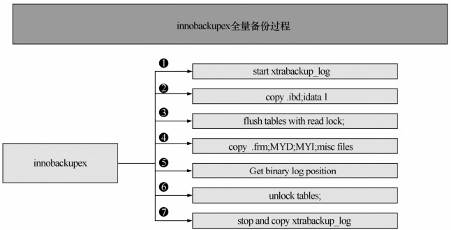
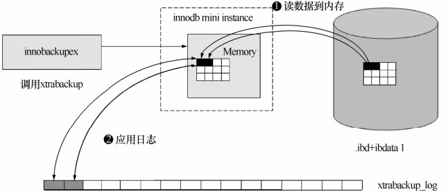
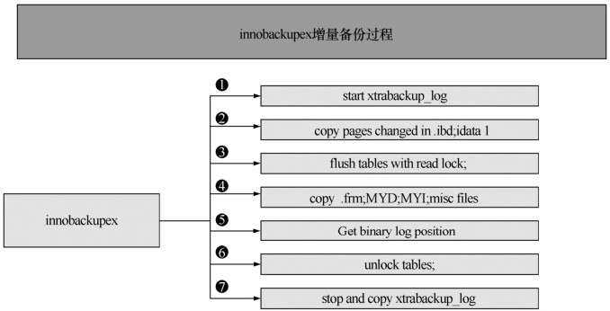
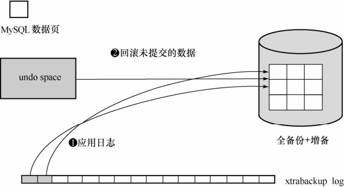

在 MySQL 中，对于不同的存储引擎热备份方法也有所不同，下面主要介绍 MyISAM 和InnoDB两种最常用的存储引擎的热备份方法。

**1．MyISAM存储引擎**

MyISAM 存储引擎的热备份有很多方法，本质其实就是将要备份的表加读锁，然后再 cp数据文件到备份目录。常用的有以下两种方法。

方法1：使用mysqlhotcopy工具。

mysqlhotcopy是MySQL自带的一个热备份工具，使用方法很简单：

shell > mysqlhotcopy db_name [/path/to/new_directory]

mysqlhotcopy有很多选项，具体可以使用“--help”查看帮助：

mysqlhotcopy –help

方法2：手工锁表copy。

在mysqlhotcopy使用不正常的情况下，可以手工来做热备份，操作步骤如下。

首先数据库中所有表加读锁：

mysql>flush tables for read ;

然后cp数据文件到备份目录即可。

**2．InnoDB存储引擎**

ibbackup是Innobase公司（***www.innodb.com***）的一个热备份工具，专门对InnoDB存储引擎进行物理热备份，此工具是收费的，但可以免费使用1个月。Innobase公司已经于2005年被Oracle公司所收购。

下面简单介绍一下使用ibbackup工具的备份步骤。

（1）编辑用于启动的配置文件my.cnf和用于备份的配置文件backup-my.cnf。

my.cnf的例子如下：

[mysqld]

datadir = /home/heikki/data

innodb_data_home_dir = /home/heikki/data

innodb_data_file_path = ibdata1:100M;ibdata2:200M;ibdata3:500M:autoextend

innodb_log_group_home_dir = /home/heikki/data

set-variable = innodb_log_files_in_group=2

set-variable = innodb_log_file_size=20M

（2）如果想备份到/home/heikki/backup，则backup-my.cnf的例子如下：

[mysqld]

datadir = /home/heikki/backup

innodb_data_home_dir = /home/heikki/backup

innodb_data_file_path = ibdata1:100M;ibdata2:200M;ibdata3:500M:autoextend

innodb_log_group_home_dir = /home/heikki/backup

set-variable = innodb_log_files_in_group=2

set-variable = innodb_log_file_size=20M

（3）开始备份，具体如下：

$ ibbackup /home/pekka/my.cnf /home/pekka/backup-my.cnf

InnoDB Hot Backup version 2.0-beta3; Copyright 2003 Innobase Oy

License A00001 is granted to Innobase Oy

Type ibbackup –license for detailed license terms, –help for help

Contents of /home/pekka/my.cnf:

innodb_data_home_dir got value /home/heikki/data

innodb_data_file_path got value ibdata1:100M;ibdata2:200M;ibdata3: 500M: autoextend

datadir got value /home/heikki/data

innodb_log_group_home_dir got value /home/heikki/data

innodb_log_files_in_group got value 3

innodb_log_file_size got value 10485760

Contents of /home/pekka/backup-my.cnf:

innodb_data_home_dir got value /home/heikki/backup

innodb_data_file_path got value ibdata1:100M;ibdata2:200M;ibdata3:500M: autoextend

datadir got value /home/heikki/backup

innodb_log_group_home_dir got value /home/heikki/backup

innodb_log_files_in_group got value 3

innodb_log_file_size got value 10485760

ibbackup: Found checkpoint at lsn 0 268331310

ibbackup: Starting log scan from lsn 0 268331008

040121 17:35:46 ibbackup: Copying log…

040121 17:35:47 ibbackup: Switching to log file 2, lsn 0 272584704

040121 17:35:49 ibbackup: Log copied, lsn 0 282171935

ibbackup: We wait 10 seconds before starting copying the data files…

040121 17:35:59 ibbackup: Copying /home/heikki/data/ibdata1

040121 17:35:59 ibbackup: Switching to log file 0, lsn 0 283068416

040121 17:36:42 ibbackup: Copying /home/heikki/data/ibdata2

040121 17:38:19 ibbackup: Copying /home/heikki/data/ibdata3

ibbackup: A copied database page was modified at 0 284263243

ibbackup: Scanned log up to lsn 0 291666654

ibbackup: Was able to parse the log up to lsn 0 291666654

ibbackup: Maximum page number for a log record 3127

040121 17:42:15 ibbackup: Full backup completed!

**注意：**ibbackup 工具不会覆盖任何重名的文件，因此在新的备份开始之前，需要确保备份目录中没有重名文件，否则备份很可能会失败。

（4）备份完成后，备份目录下包含有数据文件和日志文件，如下所示：

$ ls -lh /home/heikki/backup

total 824M

-rw-r—– 1 pekka dev 22M Jan 21 17:42 ibbackup_logfile

-rw-r—– 1 pekka dev 100M Jan 21 17:36 ibdata1

-rw-r—– 1 pekka dev 200M Jan 21 17:38 ibdata2

-rw-r—– 1 pekka dev 500M Jan 21 17:42 ibdata3

因为在cp数据文件时，文件内容在不断地变化，因此在不同时间点cp的数据块中的数据很可能是不一致的。因此，ibbackup在备份期间用一个日志文件ibbackup_logfile记录了备份期间数据的变化，在恢复的时候就可以用此日志文件对备份的数据文件进行日志重做，使得备份的数据能够保持完整性和一致性。

当主数据库出现故障时，我们需要用备份进行恢复，恢复的步骤如下。

进行日志重做。如前面所述，利用下面的命令对备份数据进行日志重做。

shell>ibbackup --apply-log /home/pekka/backup-my.cnf

恢复后重启数据库服务：

shell>./bin/mysqld_saft --defaults-file=/home/pekka/backup-my.cnf &

服务重启后，利用BINLOG日志将备份点与故障点之间的剩余数据进行恢复。

mysqlbinlog binlog-file | mysql -u root –p***

ibbackup还有一些其他的功能，比如压缩备份、不完全恢复等，这里就不再赘述。更详细的使用方法读者可以用“ ibbackup --help”命令进行查看，或者参阅官方帮助文档（***http://www.innodb.com/support/documentation/innodb-hot-backup-manual/***）。对于 InnoDB 和MyISAM混合的数据库，Innobase公司还提供了一个开源的Perl脚本innobackup，它可以将两种存储引擎的表一起进行备份，具体使用方法读者可以参阅上述链接中的文档。

**3．Xtrabackup热备工具**

Xtrabackup是Percona公司CTO Vadim参与开发的一款基于 InnoDB的在线热备工具，具有开源、免费、支持在线热备、备份恢复速度快、占用磁盘空间小等特点，并且支持不同情况下的多种备份形式。Xtrabackup的官方下载地址为***http://www.percona.com/redir/downloads/XtraBackup***。

Xtrabackup包含两个主要的工具，即xtrabackup和innobackupex，二者区别如下：

xtrabackup只能备份InnoDB和XtraDB两种数据表，而不能备份MyISAM数据表；

innobackupex 是一个封装了 xtrabackup 的 Perl 脚本，支持同时备份 InnoDB 和MyISAM，但在对MyISAM备份时需要加一个全局的读锁。

下面以innobackupex为例，来介绍一下此工具备份、恢复、增量备份恢复的原理。

（1）备份过程。

innobackupex备份过程如图27-1所示。

图27-1 innobackupex备份过程

在图 27-1中，备份开始时首先会开启一个后台检测进程，实时检测mysql redo的变化，一旦发现 redo 中有新日志写入，立刻将日志记入后台日志文件 xtrabackup_log 中。之后复制InnoDB的数据文件和系统表空间文件 ibdata1，待复制结束后，执行 flush tables with read lock操作，复制.frm、.MYI、.MYD等文件（执行 flush tables with read lock的目的是为了防止数据表发生DDL操作，并且在这一时刻获得 binlog的位置），最后会发出 unlock tables，把表设置为可读写状态，最终停止xtrabackup_log。

（2）全备恢复。

这一阶段会启动XtraBackup内嵌的InnoDB实例，回放xtrabackup日志xtrabackup_log，将提交的事务信息变更应用到 InnoDB 数据/表空间，同时回滚未提交的事务（这一过程类似InnoDB的实例恢复）。恢复过程原理如图27-2所示。

图27-2 innobackupex恢复过程

（3）增量备份。

innobackupex增量备份过程中的“增量”处理，其实主要是相对InnoDB而言，对MyISAM和其他存储引擎而言，它仍然是一个全拷贝。

“增量”备份的过程主要是通过拷贝InnoDB中有变更的“页”（这些变更的数据页指的是“页”的LSN大于xtrabackup_checkpoints中给定的LSN）。增量备份是基于全备的，第一次增备的数据必须要基于上一次的全备，之后的每次增倍都是基于上一次的增倍，最终达到一致性的增备。

增量备份过程如图27-3所示，和全备过程很类似，区别仅在第②步。

图27-3 innobackupex增量备份过程

（4）增量备份恢复。

和全备份恢复类似，也需要两步，一是数据文件的恢复，如图 27-4 所示，这里的数据来源由 3部分组成：全备份、增量备份和 xtrabackup log。二是对未提交事务的回滚，如图 27-5所示。

图27-4 innobackupex增量备份恢复过程1

图27-5 innobackupex增量备份恢复过程2

**4．innobacupex使用示例**

下面我们将通过例子向读者详细介绍innobacupex的使用方法。首先从http://www.percona.com下载和安装Percona XtraBackup软件：

wget -c

http://www.percona.com/redir/downloads/XtraBackup/XtraBackup-2.1.2/binary/Linux/x86_6 4/percona-xtrabackup-2.1.2-611.tar.gz

tar xvzf percona-xtrabackup-2.1.2-611.tar.gz

cd percona-xtrabackup-2.1.2

mv percona-xtrabackup-2.1.2 /usr/local/xtrabackup

export PATH=/usr/local/xtrabackup/bin/:$PATH

（1）全量备份。

创建备份用户：

mysql> CREATE USER 'backup'@'%' IDENTIFIED BY '123456';

mysql> GRANT RELOAD, LOCK TABLES, REPLICATION CLIENT, CREATE TABLESPACE, SUPER ON *.* TO 'backup'@'%';

规划好备份目录路径为 mkdir -p /data/backup/hotbackup/。创建 innobackupex的配置文件/tmp/my.cnf，如下所示：

[mysqld]

datadir = "/home/mysql_test/mysqlhome/data/"

innodb_data_home_dir = "/home/mysql_test/mysqlhome/data1"

innodb_data_file_path = "ibdata1:10M:autoextend"

innodb_log_group_home_dir = "/home/mysql_test/mysqlhome/data/"

innodb_log_files_in_group = 2

innodb_log_file_size = 536870912

创建测试表：

Mysql>use test;

create table test(id int auto_increment not null primary key,name varchar(20));

insert into test(name) values('test1');

insert into test(name) values('test2');

insert into test(name) values('test3');

insert into test(name) values('test4');

进行全备：

innobackupex --user=backup --password=123456 --socket=/tmp/mysql_test.sock --defaults-file=/tmp/my.cnf /data/backup/hotbackup/full --no-timestamp

恢复全备：

innobackupex --apply-log --use-memory=20G /data/backup/hotbackup/full

恢复备份到MySQL的数据文件目录，这一过程要先关闭MySQL数据库，重命名原数据文件目录，再创建一个新的数据文件目录，将备份数据复制到新的数据文件目录下，赋权，启动MySQL数据库：

mysqladmin -S /tmp/mysql_test.sock shut

mv /home/mysql_test/mysqlhome/data /home/mysql_test/mysqlhome/data_bak

mkdir /home/mysql_test/mysqlhome/data

innobackupex --defaults-file=/tmp/my.cnf --copy-back --rsync /data/backup/hotbackup/full/

chown -R mysql_test:mysql_test /home/mysql_test/mysqlhome/data

cd /home/mysql_test/mysqlhome

./bin/mysqld_safe –user=mysql &

校验恢复后数据库的一致性，查看test数据表：

mysql>use test;

mysql>select * from test;

+----+-------+

| id | name |

+----+-------+

| 1 | test1 |

| 2 | test2 |

| 3 | test3 |

| 4 | test4 |

+----+-------+

4 rows in set (0.00 sec)

可以看到test库下test数据表已经成功恢复。

（2）增量备份。

在MySQL中进行增量备份时，首先要进行一次全量备份，第一次增量备份是基于全备的，之后的增量备份是基于上一次的增量备份。

创建基础备份base：

innobackupex --user=backup --password=123456 --socket=/tmp/mysql_test.sock --defaults-file=/tmp/my.cnf /data/backup/hotbackup/base --no-timestamp

在test库下增加增量数据：

mysql> insert into test(name) values('test5');

Query OK, 1 row affected (0.00 sec)

mysql> insert into test(name) values('test6');

Query OK, 1 row affected (0.00 sec)

mysql> insert into test(name) values('test7');

Query OK, 1 row affected (0.02 sec)

mysql> insert into test(name) values('test8');

Query OK, 1 row affected (0.00 sec)

mysql> select * from test;

+----+-------+

| id | name |

+----+-------+

| 1 | test1 |

| 2 | test2 |

| 3 | test3 |

| 4 | test4 |

| 5 | test5 |

| 6 | test6 |

| 7 | test7 |

| 8 | test8 |

+----+-------+

8 rows in set (0.00 sec)

创建增量备份incremental_one：

Innobackupex --user=backup --password=123456 --socket=/tmp/mysql_test.sock --defaults-file=/tmp/my.cnf --incremental /data/backup/hotbackup/incremental_one --incremental-basedir=/data/backup/hotbackup/base --no-timestamp --parallel=2

在test库下继续插入增量数据：

mysql> insert into test(name) values('test9');

Query OK, 1 row affected (0.00 sec)

mysql> insert into test(name) values('test10');

Query OK, 1 row affected (0.00 sec)

mysql> select * from test;

+----+--------+

| id | name |

+----+--------+

| 1 | test1 |

| 2 | test2 |

| 3 | test3 |

| 4 | test4 |

| 5 | test5 |

| 6 | test6 |

| 7 | test7 |

| 8 | test8 |

| 9 | test9 |

| 10 | test10 |

+----+-------+

10 rows in set (0.00 sec)

创建增量备份incremental_two：

innobackupex --user=backup --password=123456 --socket=/tmp/mysql_test.sock --defaults-file=/tmp/my.cnf --incremental /data/backup/hotbackup/incremental_two --incremental-basedir=/data/backup/hotbackup/incremental_one --no-timestamp --parallel=2

（3）增量备份恢复。

增量备份的恢复大体分为3个步骤：

恢复基础备份（全备）；

恢复增量备份到基础备份（开始恢复的增量备份要添加--redo-only参数，到最后一次增量备份去掉--redo-only参数）；

对整体的基础备份进行恢复，回滚那些未提交的数据。

恢复基础备份（注意这里一定要加--redo-only参数，该参数的意思是只应用xtrabackup日志中已经提交的事务数据，不回滚还未提交的数据）：

innobackupex --apply-log --redo-only --use-memory=20G /data/backup/hotbackup/base

将增量备份incremental_one应用到基础备份base：

innobackupex --apply-log --redo-only --use-memory=20G /data/backup/hotbackup/base--incremental-dir=/data/backup/hotbackup/incremental_one/

将增量备份incremental_two应用到基础备份base（注意恢复最后一个增量备份时需要去掉--redo-only参数，回滚xtrabackup日志中那些还未提交的数据）：

innobackupex--apply-log--use-memory=20G/data/backup/hotbackup/base--incremental-dir=/data/backup/hotbackup/incremental_two/

把所有合在一起的基础备份整体进行一次apply操作，回滚未提交的数据：

innobackupex --apply-log --use-memory=20G /data/backup/hotbackup/base

把恢复完的备份复制到数据文件目录中，赋权，然后启动MySQL数据库：

mysqladmin -s /tmp/mysql.sock shut

mv /home/mysql_test/mysqlhome/data /home/mysql_test/mysqlhome/data_bak

mkdir /home/mysql_test/mysqlhome/data

innobackupex --defaults-file=/tmp/my.cnf --copy-back --rsync /data/backup/hotbackup/full/

chown -R mysql_test:mysql_test /home/mysql_test/mysqlhome/data

cd /home/mysql_test/mysqlhome

./bin/mysqld_safe –user=mysql &

查看最终数据：

mysql> select * from test;

+----+--------+

| id | name |

+----+--------+

| 1 | test1 |

| 2 | test2 |

| 3 | test3 |

| 4 | test4 |

| 5 | test5 |

| 6 | test6 |

| 7 | test7 |

| 8 | test8 |

| 9 | test9 |

| 10| test10 |

+----+-------+

10 ows in set (0.00 sec)

（4）不完全恢复。

上文已经详细介绍了如何通过mysqlbinlog进行不完全恢复，mysqlbinlog的不完全恢复的方法同样适合于innobackup热备的不完全恢复。

例如，在2013年6月26日下午14:00的时候开发人员在测试环境上进行了一次误操作， drop掉了一张业务表，这个时候找到DBA，由于库并不是很大，并且为测试库，并没有访问，这个时候我们可以进行基于位置和基于时间点的不完全恢复。

首先我们找到早上的备份：

cd /data/backup/hotbackup/full/20130626

ls –l

total 2361376

-rw-r--r-- 1 root root 262 Jun 26 18:46 backup-my.cnf

-rw-r----- 1 root root 2418016256 Jun 26 18:47 ibdata1

drwxr-xr-x 2 root root 4096 Jun 26 18:47 mysql

drwxr-xr-x 2 root root 4096 Jun 26 18:47 performance_schema

drwxr-xr-x 2 root root 4096 Jun 26 18:47 ps_helper

drwx------ 2 root root 143 Jun 26 18:47 test

-rw-r--r-- 1 root root 13 Jun 26 18:47 xtrabackup_binary

-rw-r--r-- 1 root root 26 Jun 26 18:47 xtrabackup_binlog_info

-rw-r----- 1 root root 97 Jun 26 18:47 xtrabackup_checkpoints

-rw-r----- 1 root root 2560 Jun 26 18:47 xtrabackup_logfile

找到记录备份结束时刻的 binlog 的位置文件 xtrabackup_binlog_info，查看备份结束时刻binlog的名称和位置。

cat xtrabackup_binlog_info

mysql-bin.000001 516847

查看当前数据库的binlog文件和位置：

mysql> show master logs;

+------------------+-----------+

| Log_name | File_size |

+------------------+-----------+

| mysql-bin.000001 | 517340 |

| mysql-bin.000002 | 107 |

+------------------+-----------+

2 rows in set (0.00 sec)

从全备中恢复数据库，恢复全备，之后再从热备结束时刻binlog的位置开始，恢复到误操作时刻14:00之前的binlog。

mysqlbinlog --start-position="516847" --stop-datetime=” 2013-06-26 13:59:59” /home/mysql_test/data/mysql-bin.000001 /home/mysql_test/data/mysql-bin.000002 | mysql -u root –pmypwd

跳过故障点的误操作的时间点，应用之后的所有binlog文件。

Mysqlbinlog --start-datetime="2013-06-26 14:01:00" /home/mysql_test/data/ mysql-bin.000001/home/mysql_test/data/ mysql-bin.000002 | mysql -u root -pmypwd

到此为止，一次基于位置和时间点的不完全恢复完成。

（5）克隆slave。

在日常生活中，我们做得比较多的操作是在线添加从库，比如线上有一主一从两个数据库，由于业务的需要一台从库的读取量无法满足现在的需求，这样就需要我们在线添加从库，出于安全考虑，我们通常需要在从库上进行在线克隆slave。

克隆slave时，常用参数--slave-info和--safe-slave-backup。

--slave-info会将Master的binary log的文件名和偏移位置保存到xtrabackup_slave_info文件中。

--safe-slave-backup则会暂停Slave的SQL线程，直到没有打开的临时表的时候开始备份。待备份结束后SQL线程会自动启动，这样操作的目的主要是确保一致性的复制状态。

下面的例子，将介绍一主一从情况下在线搭建新的从库，环境如下：

Master:192.168.1.1 //主机名为master

Slave:192.168.1.2//主机名为slave

NewSlave:192.168.1.3 //主机名为newslave

在上述案例中，主机名为newslave的主机即为新搭建的从库。在主机名为slave的主机上进行备份：

[root@slave~]#innobackupex --user=backup --password=123456 --socket=/tmp/mysql_test. sock --defaults-file=/tmp/my.cnf --slave-info --safe-slave-backup /data/backup/hotbackup/cloneslave--no-timestamp --parallel=2

查看目录下生成的文件：

[root@slave~]# ls -lrt /data/backup/hotbackup/cloneslave

total 2361380

-rw-r--r-- 1 root root 262 May 29 10:49 backup-my.cnf

-rw-r----- 1 root root 2418016256 May 29 10:50 ibdata1

-rw-r--r-- 1 root root 26 May 29 10:50 xtrabackup_binlog_info

-rw-r--r-- 1 root root 74 May 29 10:50 xtrabackup_slave_info

drwxr-xr-x 2 root root 4096 May 29 10:50 performance_schema

drwxr-xr-x 2 root root4096 May 29 10:50 ps_helper

drwxr-xr-x 2 root root4096 May 29 10:50 mysql

drwx------ 2 root root 143 May 29 10:50 test

-rw-r----- 1 root root 2560 May 29 10:50 xtrabackup_logfile

-rw-r----- 1 root root 97 May 29 10:50 xtrabackup_checkpoints

-rw-r--r-- 1 root root 13 May 29 10:50 xtrabackup_binary

查看 xtrabackup_slave_info文件的内容，这个内容即为搭建从库时刻的 change mater to参数：

[root@slave~]#cat /data/backup/hotbackup/cloneslave/xtrabackup_slave_info

CHANGE MASTER TO MASTER_LOG_FILE='mysql-bin.000044', MASTER_LOG_POS=27399

在主机名为slave的主机上进行还原：

[root@slave~]#innobackupex --apply-log --redo-only --use-memory=20G /data/backup/hotbackup/cloneslave

将还原的文件复制到新的从库newslave上：

[root@slave~]#rsync -avprP -e ssh /data/backup/hotbackup/cloneslave newslave: /home/mysql_test/mysqlhome/data

在主机名为master的主库上添加对主机newslave的授权：

mysql> GRANT REPLICATION SLAVE ON *.* TO 'repl'@'slave2'

IDENTIFIED BY '123456';

在主机newsalve上拷贝主机为slave的my.cnf文件，并且修改server-id参数，修改完毕后，启动新的从库newslave：

[root@newslave~]# scp slave:/etc/mysql/my.cnf /etc/mysql/my.cnf

skip-slave-start

server-id=3

log-slave-updates=1

查找主机 slave 备份后生成的 xtrabackup_slave_info 文件，提取其中的 master_log_file 和master_log_pos信息，然后在新的从库 newslave上进行 change master to操作。

在newslave上：

mysql> CHANGE MASTER TO

MASTER_HOST='master'

MASTER_USER='repl',

MASTER_PASSWORD='123456',

MASTER_LOG_FILE='mysql-bin.000044',

MASTER_LOG_POS=27399;

启动从库，并且检查复制是否正常：

mysql> START SLAVE;

Slave_IO_Running: Yes

Slave_SQL_Running: Yes

…

