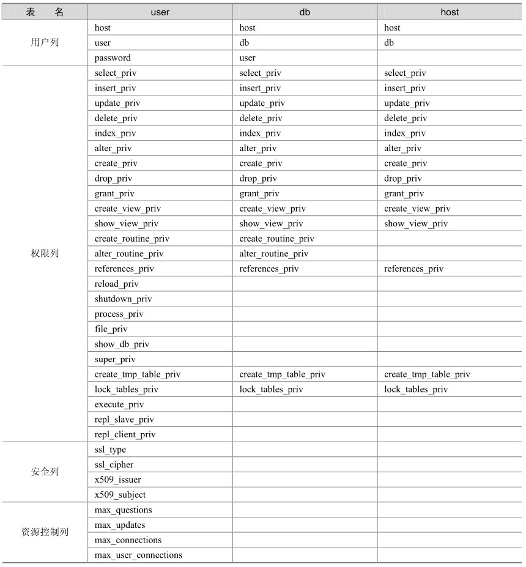

在权限存取的两个过程中，系统会用到“mysql”数据库（安装MySQL时被创建，数据库名称叫“mysql”）中user、host和db这3个最重要的权限表，它们的定义如表28-1所示。

表28-1 mysql数据库中的3个权限表定义

在这3个表中，最重要的表是user表，其次是db表，host表在大多数情况下并不使用。user中的列主要分为4个部分：用户列、权限列、安全列和资源控制列。

通常用得最多的是用户列和权限列，其中权限列又分为普通权限和管理权限。普通权限主要用于数据库的操作，比如 select_priv、create_priv 等；而管理权限主要用来对数据库进行管理的操作，比如process_priv、super_priv等。

当用户进行连接时，权限表的存取过程有以下两个阶段。

先从user表中的host、user和password这3个字段中判断连接的IP、用户名和密码是否存在于表中，如果存在，则通过身份验证，否则拒绝连接。

如果通过身份验证，则按照以下权限表的顺序得到数据库权限：userÆdbÆtables_privÆ columns_priv。

在这几个权限表中，权限范围依次递减，全局权限覆盖局部权限。上面的第一阶段好理解，下面以一个例子来详细解释一下第二阶段。

（1）创建用户z1@localhost，并赋予所有数据库上的所有表的select权限。

mysql> grant select on *.* to z1@localhost;

Query OK, 0 rows affected (0.00 sec)

mysql> select * from user where user='z1' and host='localhost' \G;

********************************* 1. row *********************************

Host: localhost

User: z1

Password:

Select_priv: Y

Insert_priv: N

Update_priv: N

Delete_priv: N

Create_priv: N

Drop_priv: N

…

（2）再来看db表：

mysql> select * from db;

Empty set (0.00 sec)

可以发现，user表的select_priv列是“Y”，而db表中并没有记录，也就是说，对所有数据库都具有相同权限的用户记录并不需要记入db表，而仅仅需要将user表中的select_priv改为“Y”即可。换句话说，user表中的每个权限都代表了对所有数据库都有的权限。

（3）将z1@localhost上的权限改为只对test1数据库上所有表的select权限。

mysql> revoke select on *.* from z1@localhost;

Query OK, 0 rows affected (0.00 sec)

mysql> grant select on test1.* to z1@localhost;

Query OK, 0 rows affected (0.01 sec)

mysql> select * from user where user='z1' and host='localhost' \G;

********************************* 1. row *********************************

Host: localhost

User: z1

Password:

Select_priv: N

Insert_priv: N

Update_priv: N

Delete_priv: N

Create_priv: N

Drop_priv: N

mysql> select * from db \G;

********************************* 1. row *********************************

Host: localhost

Db: test1

User: z1

Select_priv: Y

Insert_priv: N

Update_priv: N

Delete_priv: N

Create_priv: N

Drop_priv: N

Grant_priv: N

References_priv: N

Index_priv: N

Alter_priv: N

Create_tmp_table_priv: N

Lock_tables_priv: N

Create_view_priv: N

Show_view_priv: N

Create_routine_priv: N

Alter_routine_priv: N

Execute_priv: N

1 row in set (0.00 sec)

这个时候发现，user表中的select_priv变为“N”，而db表中则增加了db为test1的一条记录。也就是说，当只授予部分数据库某些权限时，user表中的相应权限列保持“N”，而将具体的数据库权限写入db表。table和column的权限机制和db类似，这里就不再赘述。

从上面的例子可以看出，当用户通过权限认证，进行权限分配时，将按照userÆdbÆtables_privÆcolumns_priv的顺序进行权限分配，即先检查全局权限表user，如果user中对应权限为“Y”，则此用户对所有数据库的权限都为“Y”，将不再检查 db、tables_priv 和columns_priv；如果为“N”，则到db表中检查此用户对应的具体数据库，并得到db中为“Y”的权限；如果db中相应权限为“N”，则检查tables_priv中此数据库对应的具体表，取得表中为“Y”的权限；如果tables_priv中相应权限为“N”，则检查columns_priv中此表对应的具体列，取得列中为“Y”的权限。

