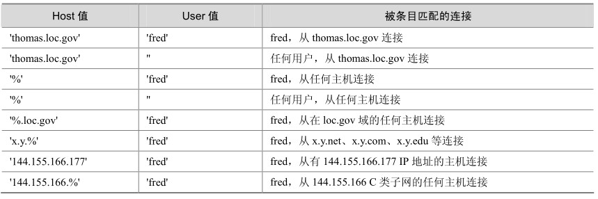

Insert_priv: Y

理解了权限系统的工作原理后，本节开始介绍账号的管理。账号管理也是 DBA日常工作中很重要的工作之一，主要包括账号的创建、权限更改和账号的删除。用户连接数据库的第一步都从账号创建开始。

**1．创建账号**

有两种方法可以用来创建账号：使用GRANT语法创建或者直接操作授权表，但更推荐使用第一种方法，因为操作简单，出错几率更少。下面将详细讲述这两种方式的使用方法。

GRANT的常用语法如下：

GRANT priv_type [(column_list)] [, priv_type [(column_list)]] . .

ON [object_type] {tbl_name |* |*.* | db_name.*}

TO user [IDENTIFIED BY [PASSWORD] 'password']

[, user [IDENTIFIED BY [PASSWORD] 'password']] . .

[WITH GRANT OPTION]

object_type =

TABLE

| FUNCTION

| PROCEDURE

来看下面几个例子。

例1：创建用户z1，权限为可以在所有数据库上执行所有权限，只能从本地进行连接。

mysql> grant all privileges on *.* to z1@localhost;

Query OK, 0 rows affected (0.00 sec)

mysql> select * from user where user='z1' and host='localhost' \G;

********************************* 1. row *********************************

Host: localhost

User: z1

Password:

Select_priv: Y

Insert_priv: Y

Update_priv: Y

Delete_priv: Y

Create_priv: Y

Drop_priv: Y

Reload_priv: Y

Shutdown_priv: Y

Process_priv: Y

File_priv: Y

Grant_priv: N

References_priv: Y

Index_priv: Y

Alter_priv: Y

Show_db_priv: Y

Super_priv: Y

Create_tmp_table_priv: Y

Lock_tables_priv: Y

Execute_priv: Y

Repl_slave_priv: Y

Repl_client_priv: Y

Create_view_priv: Y

Show_view_priv: Y

Create_routine_priv: Y

Alter_routine_priv: Y

Create_user_priv: Y

…

可以发现，除了Grant_priv权限外，所有权限在user表里面都是“Y”。

例2：在例1基础上，增加对z1的grant权限。

mysql> grant all privileges on *.* to z1@localhost with grant option;

Query OK, 0 rows affected (0.00 sec)

mysql> select * from user where user='z1' and host='localhost' \G;

********************************* 1. row *********************************

Host: localhost

User: z1

Password:

Select_priv: Y

Update_priv: Y

Delete_priv: Y

Create_priv: Y

Drop_priv: Y

Reload_priv: Y

Shutdown_priv: Y

Process_priv: Y

File_priv: Y

Grant_priv: Y

…

例3：在例2基础上，设置密码为“123”。

mysql> grant all privileges on *.* to z1@localhost identified by '123' with grant option;

Query OK, 0 rows affected (0.00 sec)

从user表中查看修改的密码：

mysql> select * from user where user='z1' and host='localhost' \G;

********************************* 1. row *********************************

Host: localhost

User: z1

Password: *23AE809DDACAF96AF0FD78ED04B6A265E05AA257

Select_priv: Y

Insert_priv: Y

Update_priv: Y

Delete_priv: Y

Create_priv: Y

…

可以发现，密码变成了一堆加密后的字符串。在MySQL 5.0里面，密码的算法是生成一个以“*”开始的 41位的字符串，而MySQL 4.0之前是 16位，因此安全性大大提高。

例 4：创建新用户 z2，可以从任何 IP 进行连接，权限为对 test1 数据库里的所有表进行SELECT、UPDATE、INSERT和DELETE操作，初始密码为“123”。

mysql> grant select,insert,update,delete on test1.* to 'z2'@'%' identified by '123';

Query OK, 0 rows affected (0.00 sec)

mysql> select * from user where user='z2' and host='%' \G;

********************************* 1. row *********************************

Host: %

User: z2

Password: *23AE809DDACAF96AF0FD78ED04B6A265E05AA257

Select_priv: N

Insert_priv: N

Update_priv: N

Delete_priv: N

…

mysql> select * from db where user='z2' and host='%' \G;

********************************* 1. row *********************************

Host: %

Db: test1

User: z2

Select_priv: Y

Insert_priv: Y

Update_priv: Y

Delete_priv: Y

…

如上文所述，user表中的权限都是“N”，db表中增加的记录权限则都是“Y”。一般地，我们只授予用户适当的权限，而一般不会授予过多的权限，本例中的权限适合于大多数应用账号。

本例中的IP限制为所有IP都可以连接，因此设置为“*”，mysql数据库中是通过user表的host字段来进行控制，host可以是以下类型的赋值。

Host值可以是主机名或IP号，或“localhost”指出本地主机。

可以在Host列值使用通配符字符“%”和“_”。

Host值“%”匹配任何主机名，空Host值等价于“%”。它们的含义与LIKE操作符的模式匹配操作相同。例如“，%”的Host值与所有主机名匹配，而“%.mysql.com”匹配mysql.com域的所有主机。

表28-2 host和user组合进行连接的例子

可能读者会有这样的疑问，如果权限表中的host既有“thomas.loc.gov”，又有“%”，而此时，连接从主机 thomas.loc.gov过来。显然，user表里面这两条记录都符合匹配条件，那系统会选择哪一个呢？

如果有多个匹配，服务器必须选择使用哪个条目。按照下述原则来解决：

服务器在启动时读入user表后进行排序；

然后当用户试图连接时，以排序的顺序浏览条目；

服务器使用与客户端和用户名匹配的第一行。

当服务器读取表时，它首先以最具体的Host值排序。主机名和IP号是最具体的。“%”意味着“任何主机”并且是最不特定的。有相同Host值的条目首先以最具体的User值排序（空User值意味着“任何用户”并且是最不特定的）。下例是排序前和排序后的结果。

排序前：

+-----------+----------+-

| Host | User | …

+-----------+----------+-

| % | root | …

| % | jeffrey | …

| localhost | root | …

| localhost | | …

+-----------+----------+-

排序后：

+-----------+----------+-

| Host | User | …

+-----------+----------+-

| localhost | root | …

| localhost | | …

| % | jeffrey | …

| % | root | …

+-----------+----------+-

很显然，在上面的例子中应该匹配host为“thomas.loc.gov”所对应的权限。

**注意：**mysql数据库的user表中host的值为“*”或者空，表示所有外部IP都可以连接，但是不包括本地服务器localhost，因此，如果要包括本地服务器，必须单独为localhost赋予权限。

例5：授予SUPER、PROCESS、FILE权限给用户z3@%。

mysql> grant super,process,file on *.* to 'z3'@'%';

Query OK, 0 rows affected (0.00 sec)

因为这几个权限都属于管理权限，因此不能够指定某个数据库，on后面必须跟“*.*”，下面的语法将提示错误：

mysql> grant super,process,file on test1.* to 'z3'@'%';

ERROR 1221 (HY000): Incorrect usage of DB GRANT and GLOBAL PRIVILEGES

例6：只授予登录权限给z4@localhost。

mysql> grant usage on *.* to 'z4'@'localhost';

Query OK, 0 rows affected (0.00 sec)

mysql> exit

Bye

[zzx@localhost～]$ mysql -uz4

Welcome to the MySQL monitor. Commands end with ; or \g.

Your MySQL connection id is 10

Server version: 5.0.41-community-log MySQL Community Edition (GPL)

Type 'help;' or '\h' for help. Type '\c' to clear the buffer.

mysql> show databases;

+--------------------+

| Database |

+--------------------+

| information_schema |

+--------------------+

1 row in set (0.00 sec)

usage权限只能用于数据库登录，不能执行任何操作。

直接操作权限表也可以进行权限的创建，其实GRANT操作的本质就是修改权限表后进行权限的刷新，因此，GRANT比操作权限表更简单，下面继续以上文的例4为例子来说明一下更新权限表的用法。

创建新用户z2，可以从任何IP进行连接，权限为对test1数据库里的所有表进行SELECT、UPDATE、INSERT和DELETE，初始密码为123，用grant实现如下：

mysql> grant select,insert,update,delete on test1.* to 'z2'@'%' identified by '123';

Query OK, 0 rows affected (0.00 sec)

直接操作权限表如下：

[zzx@localhost～]$ mysql -uz2

Welcome to the MySQL monitor. Commands end with ; or \g.

Your MySQL connection id is 20

Server version: 5.0.41-community-log MySQL Community Edition (GPL)

Type 'help;' or '\h' for help. Type '\c' to clear the buffer.

mysql> show databases;

+--------------------+

| Database |

+--------------------+

| information_schema |

+--------------------+

1 row in set (0.00 sec)

mysql> exit

Bye

[zzx@localhost～]$ mysql -uroot

Welcome to the MySQL monitor. Commands end with ; or \g.

Your MySQL connection id is 21

Server version: 5.0.41-community-log MySQL Community Edition (GPL)

Type 'help;' or '\h' for help. Type '\c' to clear the buffer.

mysql> insert into db (host,db,user,select_priv,insert _priv,update_priv, delete_priv) values('%','test1','z2','Y','Y','Y','Y');

Query OK, 1 row affected (0.00 sec)

mysql> flush privileges;

Query OK, 0 rows affected (0.00 sec)

mysql> exit

Bye

[zzx@localhost～]$ mysql -uz2

Welcome to the MySQL monitor. Commands end with ; or \g.

Your MySQL connection id is 22

Server version: 5.0.41-community-log MySQL Community Edition (GPL)

Type 'help;' or '\h' for help. Type '\c' to clear the buffer.

mysql> show databases;

+--------------------+

| Database |

+--------------------+

| information_schema |

| test1 |

+--------------------+

2 rows in set (0.01 sec)

创建完账号后，时间长了可能就会忘记分配的权限而需要查看账号权限，也有可能会经过一段时间后需要更改以前的账号权限。

2．查看账号权限

账号创建好后，可以通过如下命令查看权限：

show grants for user@host;

如下例所示：

mysql> show grants for z1@localhost;

+-------------------------------------------------------+

| Grants for z1@localhost |

+-------------------------------------------------------+

| GRANT USAGE ON *.* TO 'z1'@'localhost' |

| GRANT SELECT, INSERT ON 'test1'.* TO 'z1'@'localhost' |

+-------------------------------------------------------+

2 rows in set (0.00 sec)

host可以不写，默认是“%”，如下所示：

mysql> show grants for z1;

ERROR 1141 (42000): There is no such grant defined for user 'z1' on host '%'

mysql> grant select on test1.* to 'z1'@'%';

Query OK, 0 rows affected (0.00 sec)

mysql> show grants for z1;

+---------------------------------------+

| Grants for z1@% |

+---------------------------------------+

| GRANT USAGE ON *.* TO 'z1'@'%' |

| GRANT SELECT ON 'test1'.* TO 'z1'@'%' |

+---------------------------------------+

2 rows in set (0.00 sec)

对于MySQL 5.0以后的版本，也可以利用新增的 information_schema数据库进行权限的查看：

mysql> use information_schema;

Reading table information for completion of table and column names

You can turn off this feature to get a quicker startup with -A

Database changed

mysql> select * from SCHEMA_PRIVILEGES where grantee="'z1'@'localhost'";

+--------------+--------------+------------+---------------+------------+

| GRANTEE | TABLE_CATALOG | TABLE_SCHEMA| PRIVILEGE_TYPE | IS_GRANTABLE|

+--------------+-------------+------------+---------------+------------+

|'z1'@'localhost'| NULL| test1| SELECT| NO|

|'z1'@'localhost'| NULL| test1| INSERT| NO|

+--------------+--------------+------------+---------------+------------+

2 rows in set (0.00 sec)

**3．更改账号权限**

可以进行权限的新增和回收。和账号创建一样，权限变更也有两种方法：使用GRANT（新增）和REVOKE（回收）语句，或者更改权限表。

第二种方法和前面一样，直接对user、db、tables_priv和columns_priv中的权限列进行更新即可，这里重点介绍第一种方法。

和创建账号语法完全一样，GRANT可以直接用来对账号进行增加。其实GRANT语句在执行的时候，如果权限表中不存在目标账号，则创建账号；如果已经存在，则执行权限的新增。来看下面的一个例子。

（1）z2@localhost目前只有登录权限。

mysql> show grants for z2@localhost;

+----------------------------------------+

| Grants for z2@localhost|

+----------------------------------------+

| GRANT USAGE ON *.* TO 'z2'@'localhost' |

+----------------------------------------+

1 row in set (0.00 sec)

（2）赋予z2@localhost所有数据库上的所有表的SELECT权限。

mysql> grant select on *.* to 'z2'@'localhost';

Query OK, 0 rows affected (0.00 sec)

mysql> show grants for z2@localhost;

+-----------------------------------------+

| Grants for z2@localhost|

+-----------------------------------------+

| GRANT SELECT ON *.* TO 'z2'@'localhost' |

+-----------------------------------------+

1 row in set (0.00 sec)

（3）继续给z2@localhost赋予SELECT和INSERT权限，和已有的SELECT权限进行合并。

mysql> grant select,insert on *.* to 'z2'@'localhost';

Query OK, 0 rows affected (0.00 sec)

mysql> show grants for z2@localhost;

+-------------------------------------------------+

| Grants for z2@localhost |

+-------------------------------------------------+

| GRANT SELECT, INSERT ON *.* TO 'z2'@'localhost' |

+-------------------------------------------------+

1 row in set (0.00 sec)

REVOKE语句可以回收已经赋予的权限，语法如下：

REVOKE priv_type [(column_list)] [, priv_type [(column_list)]] . .

ON [object_type] {tbl_name |* |*.* | db_name.*}

FROM user [, user] . .

REVOKE ALL PRIVILEGES, GRANT OPTION FROM user [, user] . .

对于上面的例子，这里决定要收回z2@localhost上的INSERT和SELECT权限：

mysql> revoke select,insert on *.* from z2@localhost;

Query OK, 0 rows affected (0.00 sec)

mysql> show grants for z2@localhost;

+----------------------------------------+

| Grants for z2@localhost |

+----------------------------------------+

| GRANT USAGE ON *.* TO 'z2'@'localhost' |

+----------------------------------------+

1 row in set (0.00 sec)

usage权限不能被回收，也就是说，REVOKE用户并不能删除用户。

mysql> show grants for z2@localhost;

+----------------------------------------+

| Grants for z2@localhost |

+----------------------------------------+

| GRANT USAGE ON *.* TO 'z2'@'localhost' |

+----------------------------------------+

1 row in set (0.00 sec)

mysql> revoke usage on *.* from z2@localhost;

Query OK, 0 rows affected (0.00 sec)

mysql> show grants for z2@localhost;

+----------------------------------------+

| Grants for z2@localhost |

+----------------------------------------+

| GRANT USAGE ON *.* TO 'z2'@'localhost' |

+----------------------------------------+

1 row in set (0.00 sec)

**4．修改账号密码**

方法1：可以用mysqladmin命令在命令行指定密码。

shell> mysqladmin -u user_name -h host_name password "newpwd"

方法2：执行SET PASSWORD语句。下例中将账号“jeffrey'@'%”的密码改为“biscuit”。

mysql> SET PASSWORD FOR 'jeffrey'@'%' = PASSWORD('biscuit');

如果是更改自己的密码，可以省略for语句：

mysql> SET PASSWORD = PASSWORD('biscuit');

方法3：还可以在全局级别使用GRANT USAGE语句（在“*.*”）来指定某个账户的密码而不影响账户当前的权限。

mysql> GRANT USAGE ON *.* TO 'jeffrey'@'%' IDENTIFIED BY 'biscuit';

方法4：直接更改数据库的user表。

shell> mysql -u root mysql

mysql> INSERT INTO user (Host,User,Password)

-> VALUES('%','jeffrey',PASSWORD('biscuit'));

mysql> FLUSH PRIVILEGES;

shell> mysql -u root mysql

mysql> UPDATE user SET Password = PASSWORD('bagel')

-> WHERE Host = '%' AND User = 'francis';

mysql> FLUSH PRIVILEGES;

方法5：以上方法在更改密码时，用的都是明文，这样就会存在安全问题，比如修改密码的机器被入侵，那么通过命令行的历史执行记录就可以很容易地得到密码。因此，在一些重要的数据库中，可以直接使用MD5密码值来对密码进行更改，如下面的例子：

GRANT USAGE ON *.* TO 'jeffrey'@'%' IDENTIFIED BY PASSWORD '23AE809DDACAF96AF0FD78ED0 4B6A265E05AA257';

或者：

set password = '23AE809DDACAF96AF0FD78ED04B6A265E05AA257'

其中的MD5密码串可以事先用其他方式获得。

**注意：**更改密码时，一定要注意什么时候需要使用PASSWORD函数。

**5．删除账号**

要彻底删除账号，同样也有两种实现方法，即DROP USER命令和修改权限表。

DROP USER语法非常简单，具体如下：

DROP USER user [, user] . .

举一个简单的例子，将z2@localhost用户删除：

mysql> show grants for z2@localhost ;

+----------------------------------------+

| Grants for z2@localhost |

+----------------------------------------+

| GRANT USAGE ON *.* TO 'z2'@'localhost' |

+----------------------------------------+

1 row in set (0.00 sec)

mysql> drop user z2@localhost;

Query OK, 0 rows affected (0.00 sec)

mysql> show grants for z2@localhost ;

ERROR 1141 (42000): There is no such grant defined for user 'z2' on host 'localhost'

修改权限表方法只要把user用户中的用户记录删除即可，这里不再演示。

**6．账号资源限制**

创建 MySQL 账号时，还有一类选项前面没有提及，我们称为账号资源限制（Account Resource Limits），这类选项的作用是限制每个账号实际具有的资源限制，这里的“资源”主要包括以下内容：

单个账号每小时执行的查询次数；

单个账号每小时执行的更新次数；

单个账号每小时连接服务器的次数；

单个账号并发连接服务器的次数。

在实际应用中，可能会发生这种情景，由于程序bug或者系统遭到攻击，使得某些应用短时间内发生了大量的点击，从而对数据库造成了严重的并发访问，造成数据库短期无法响应甚至down掉，对生产带来负面影响。为了防止这种问题的出现，我们可以通过对连接账号进行资源限制的方式来解决，比如按照日常访问量加上一定冗余设置每小时查询1万次，那么1小时内如果超过1万次查询数据库就会给出资源不足的提示，而不会再分配资源进行实际查询。

设置资源限制的语法如下：

GRANT . .with option

其中option的选项可以是以下几个。

MAX_QUERIES_PER_HOUR count：每小时最大查询次数。

MAX_UPDATES_PER_HOUR count：每小时最大更新次数。

MAX_CONNECTIONS_PER_HOUR count：每小时最大连接次数。

MAX_USER_CONNECTIONS count：最大用户连接数。

其中，MAX_CONNECTIONS_PER_HOUR count和MAX_USER_CONNECTIONS count的区别在于前者是每小时累计的最大连接次数，而后者是瞬间的并发连接数。系统还有一个全局参数MAX_USER_CONNECTIONS，它和用户MAX_USER_CONNECTIONS count的区别在于如果后者为0，则此用户的实际值应该为全局参数值，否则就按照用户MAX_USER_CONNE CTIONS count的值来设置。

下面举个例子来说明一下资源限制的使用方法。

创建用户z1，要求具有test库上的select权限，并且每小时查询次数小于3次，最多同时只能有5个此用户进行并发连接，代码如下：

Grant select on test.* to z1@localhost

With MAX_QUERIES_PER_HOUR 3

MAX_USER_CONNECTIONS 5;

从mysql数据库的user表中可以看到相关资源的值：

mysql> select user,max_questions,max_updates,max_connections from user where user='z1';

+------+---------------+-------------+-----------------+

| user | max_questions | max_updates | max_connections |

+------+---------------+-------------+-----------------+

| z1 | 3 |0|5|

+------+---------------+-------------+-----------------+

用z1登录后，执行下面的查询：

[mysql55@bj55 data]$ mysql -uz1 -pz1 test

Welcome to the MySQL monitor. Commands end with ; or \g.

Your MySQL connection id is 88

Server version: 5.5.8-log MySQL Community Server (GPL)

Copyright (c) 2000, 2010, Oracle and/or its affiliates. All rights reserved.

Oracle is a registered trademark of Oracle Corporation and/or its

affiliates. Other names may be trademarks of their respective

owners.

Type 'help;' or '\h' for help. Type '\c' to clear the current input statement.

mysql> select count(1) from t1;

+----------+

| count(1) |

+----------+

| 13704 |

+----------+

1 row in set (0.02 sec)

mysql> select count(1) from t1;

+----------+

| count(1) |

+----------+

| 13704 |

+----------+

1 row in set (0.02 sec)

mysql> select count(1) from t1;

ERROR 1226 (42000): User 'z1' has exceeded the 'max_questions' resource (current value: 3)

可以发现，登录后执行到第3个查询时提示用户z1已经超过了最大查询的资源限制，从而提示出错。这里有些朋友可能有疑问，设置为3应该是执行到第4个查询的时候出错才对，为什么第3个就报错了呢？其实MySQL里面很多非“select”语句都会归类到“查询”，比如“show”语句、“desc”语句等，还有一些隐式的查询也包含在内，上面的查询从日志中可以查到在登录后隐式执行了“select @@version_comment limit 1”这么一个SQL来显示版本信息，这才导致了上面的结果。

需要注意的是，资源限制是对某一个账号进行累计的，而不是对账号的一次连接进行累计。当资源限制到达后，账号的任何一次相关操作都会被拒绝，如果要继续操作，只能清除相关的累加值。可以使用 root执行 flush user_resources/flush privileges/mysqladmin reload这 3个命令中的任何一个来执行清除工作。如果数据库发生重启，则原先累计的计数值清零。

如果要对账号的资源限制进行修改或者删除，将相应参数设置为0即可：

GRANT USAGE ON *.* TO 'z1'@'localhost'

WITH MAX_CONNECTIONS_PER_HOUR 0;

**注意：**账号的资源限制设置一定要非常小心，一般不建议设置。如果一定要设置，就要对系统的高峰访问情况了解清楚并加上足够的冗余后再进行设置，为了防止达到资源限制后所有功能的失效，将不同的功能分给不同的用户是一个可行的办法。

