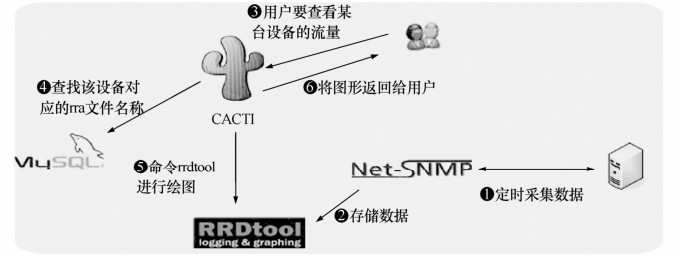

在讨论Cacti之前，首先要引入RRDtool。

RRDtool是一个非常强大的绘图引擎，它具有强大的数据抓取、数据存储和绘图功能。它使用RRDtool的存储格式，数据能重复使用，它可以将一个.rrd文件的数据与另一个.rrd文件中的数据相加；它可以定义在任意时间段画图，即你可以画出一张半年来的数据图，也可以画出一张半小时以来的图。但是RRDtool也是有自身缺点的，它没有 MRTG中集成的数据采集功能，并且其自身的命令行的使用非常复杂，另一方面它也不具备管理功能。

Cacti的出现弥补了RRDtool几乎所有的“缺点”。简单地说，Cacti就是RRDtool的一个前端程序，它运用 SNMP 采集数据，使用 RRDtool 绘图。它内置了快速的获取数据工具、优秀的绘图模板以及许多设计精良的数据获取脚本，从而可以通过结合 RRDtool 强大的数据抓取、数据存储和绘图功能，轻松实现主机负载、网络流量等信息的走势图的绘制。它的界面非常漂亮，能让你根本无需明白RRDtool的参数就能轻易地绘出漂亮的图形。

Cacti运行需要网站服务器LAMP环境的支持。Cacti需要MySQL配合PHP程序存储一些变量数据并对变量数据进行调用，如主机名、主机IP、端口号、模板信息等变量。

Cacti的工作原理如图29-1所示。

图29-1 Cacti工作原理图

在图29-1中，服务器RRDtool对主机负载、网络流量等信息的统计通过SNMP协议进行收集。经过SNMP抓取到的数据会存储于在RRDtool生成的.rrd文件中，这些文件通常位于Cacti的rra目录中。RRDtool对数据的更新和存储就是对.rrd文件的处理，.rrd文件是大小固定的归档文件（Round Robin Archive），它能够存储的数据量在创建时就已经定义。Cacti结合MySQL，在数据库中存取了相关.rra文件的详细信息。当用户通过Cacti界面查看相关信息时，Cacti会去MySQL数据库中查找具体的.rra文件，最终通过RRDtool工具进行绘图，Cacti进行展示。

Cacti具备以下几项监控功能。

（1）网络监控。

（2）主机系统监控。

网络接口流量（进出口网卡流量）。

监控CPU负载、内存使用情况等。

监控磁盘的空间、磁盘使用率等。

（3）Cacti常见的检测对象。

服务器资源：CPU、内存、磁盘、进程、连接数等。

服务器类型：Web、Mail、FTP、数据库、中间件。

网络接口：流量、转发速度、丢包率。

网络设备性能、配置文件、路由数。

安全设备性能、连接数、攻击数。

设备运行状态：风扇、电源、温度。

机房运行环境：电流、电压、温湿度。

