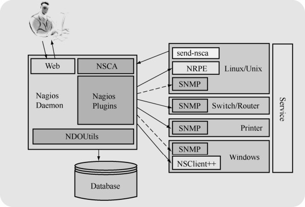

Nagios是一款用于系统和网络监控的应用程序。它可以在你设定的条件下对主机和服务进行监控，当状态改变时发出相关告警信息。

Nagios通常由一个主程序（Nagios）、一个插件程序（Nagios-plugins）和 4个可选的附件组件（NRPE、NSCA、NSClient++和 NDOUtils）组成。Nagios 的监控工作都是通过插件功能实现的，因此，Nagios和Nagios-plugins是服务器端工作所必需的组件。4个附件组件中的功能如下。

NRPE：用来在监控的远程 Linux/UNIX 主机上执行脚本插件以实现对这些主机资源的监控。

NSCA：用来让被监控的远程Linux/UNIX主机主动将监控信息发送给Nagios服务器。

NSClient++：安装在Windows主机上的组件，主要用来监控Windows主机。

NDOUtils：用来将Nagios的配置信息和各Event产生的数据存入数据库，以实现这些数据的快速检索和处理。

这 4 个附件组件中，NRPE 和 NSClient++工作于客户端，NDOUtils 工作于服务器端，而NSCA则需要同时安装在服务器端和客户端。

Nagios的工作原理如图29-2所示。

图29-2 Nagios工作原理图

Nagios的功能是监控服务和主机，但是它自身并不包括这部分功能，所有的监控、检测功能都是通过各种插件来完成的。启动 Nagios 后，它会周期性地自动调用插件去检测服务器状态，同时 Nagios 会维持一个队列，所有插件返回来的状态信息都进入队列，Nagios 每次都从队首开始读取信息，并进行处理后，把状态结果通过Web显示出来。Nagios提供了许多插件，利用这些插件可以方便地监控很多服务状态。安装完成后，在Nagios主目录下的/libexec里放有Nagios自带的可以使用的所有插件，如check_disk是检查磁盘空间的插件，check_load是检查CPU负载的，等等。每一个插件可以通过运行./check_xxx –h来查看其使用方法和功能。Nagios可以识别4种状态的返回信息，即0(OK)表示状态正常，1(WARNING)表示出现一定的异常， 2(CRITICAL)表示出现非常严重的错误，3(UNKNOWN)表示被监控的对象已经停止了。Nagios根据插件返回来的值来判断监控对象的状态，并通过Web显示出来，以供管理员及时发现故障。

Nagios支持的监控功能如下：

（1）网络监控服务（SMTP、POP3、HTTP、NNTP、PING等）；

（2）监控主机资源（处理器负荷、磁盘利用等）；

（3）插件设计使得用户可以方便地扩展自己所需要定制的监控项；

（4）并行服务检测机制；

（5）具备定义网络分层结构的能力，用“parent”主机定义来表达网络主机间的关系，这种关系可被用来发现和明晰主机宕机或不可达状态；

（6）具有快速的消息通知功能，当服务或者主机产生问题时能及时地将告警发送给相关业务负责人（可以通过E-mail、短信、用户定义方式），可高效地保证服务器的维护；

（7）具备定义事件句柄功能，它可以在主机或服务的事件发生时获取更多问题定位；

（8）自动的日志回滚；

（9）可以支持并实现对主机的冗余监控；

（10）友好的Web界面用于查看当前的网络状态、通知和故障历史、日志文件等。

