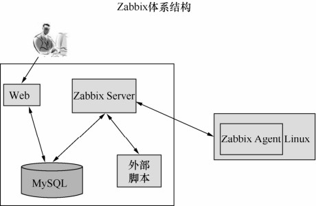

Zabbix是一个基于Web界面的提供分布式系统监视以及网络监视功能的企业级的开源解决方案，由一个国外的团队持续维护并且进行版本更新，可以自由下载使用，运作团队靠提供收费的技术支持赢利。Zabbix 能监视各种网络参数，保证服务器系统的安全运营，并提供柔软的通知机制以让系统管理员快速定位/解决存在的各种问题。其官方网站为***http://www.zabbix.com***。

Zabbix通过C/S模式采集数据，通过B/S模式在Web端展示和配置。Zabbix由2部分构成：Zabbix Server与可选组件Zabbix Agent。

Zabbix Agent需要安装在被监视的目标服务器上，它主要完成对硬件信息或与操作系统有关的内存、CPU等信息的收集。Zabbix Agent可以运行在Linux、Solaris、HP-UX、AIX、Free BSD、Open BSD、OS X、Tru64/OSF1、Windows NT 4.0、Windows 2000/2003/XP/Vista等系统之上。

Zabbix Server可以单独监视远程服务器的服务状态，同时也可以与Zabbix Agent配合，可以轮询Zabbix Agent主动接收监视数据，同时还可被动接收Zabbix Agent发送的数据，通过收集SNMP和Agent发送的数据，写入MySQL数据库，再通过Apache等软件在Web前端显示，Zabbix Server需运行在LAMP（Linux+Apache+MySQL+PHP）环境下，对硬件要求低。

Zabbix的工作原理如图29-3所示。

图29-3 Zabbix工作原理图

Zabbix Agent负责数据收集操作，将定制的数据传送到Zabbix Server，Zabbix Server会把相关数据存入到MySQL数据库中。最终用户通过Zabbix Web端查看数据，并且Zabbix Web端具备报警等功能。

Zabbix的主要特点如下：

安装与配置简单，学习成本低；

支持多语言（包括中文）；

免费开源；

自动发现服务器与网络设备；

分布式监视以及Web集中管理功能；

可以无Agent监视；

用户安全认证和柔软的授权方式；

通过Web界面设置或查看监视结果；

E-mail等通知功能。

Zabbix具有以下几项功能：

具备常见的商业监控软件所具备的功能（主机的性能监控、网络设备性能监控、数据库性能监控、FTP等通信协议的监控、多种告警方式、详细的报表图表绘制）。

支持自动发现网络设备和服务器。

支持分布式，能集中显示、管理分布式的监控点。

扩展性强，Server提供通用接口，可以自己开发完善各类监控。

