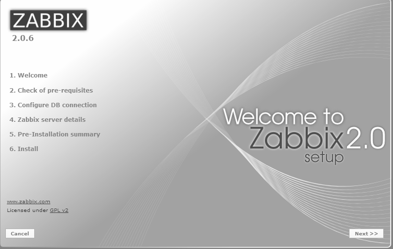
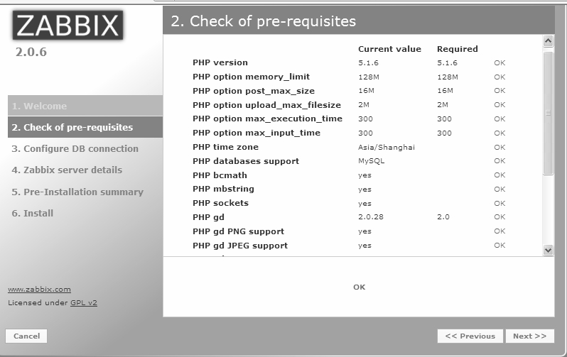
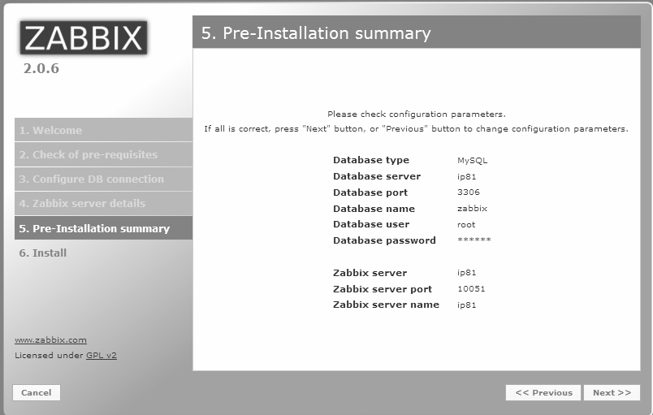
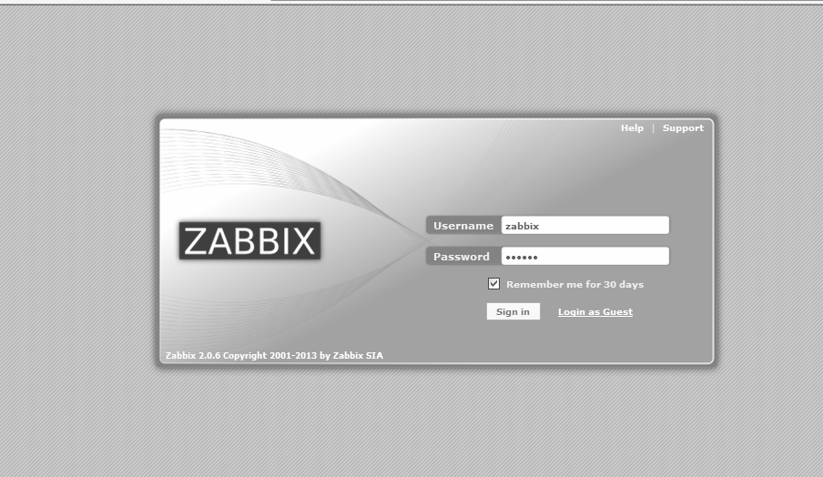

配置Zabbix Web服务大概需要以下几个步骤。

（1）将Zabbix Web文件复制到Apache Web目录中。

在安装目录将 frontends复制到指定的Web root目录中：

[root@ip81 ~]#cd zabbix-2.0.6

[root@ip81 ~]#cp -ra frontends/php/* /var/www/html/

（2）Apache配置：

[root@ip81 ~]#cat /etc/httpd/conf/httpd.conf

…

ServerName 192.168.7.81:80

…

（3）PHP配置。

/etc/php.ini配置如下，注意这里必须这样配置，否则Web界面安装检查会失败。

…

date.timezone = Asia/Shanghai

memory_limit = 128M

post_max_size = 16M

max_execution_time = 300

max_input_time = 300

session.auto_start = 0 ;

mbstring.func_overload = 2

…

（4）Zabbix Web安装。

访问Web界面http://192.168.7.81，进行Zabbix相关的Web配置，配置完成后使用默认用户admin（密码：zabbix）登录即可。Zabbix的安装界面如图29-4所示。

安装过程中的检查信息如图29-5所示，安装后的统计信息如图29-6所示，安装成功后的登录窗口如图29-7所示。

注意这里默认密码是“zabbix”，进入系统第一件事就是修改 Zabbix 的后台默认密码，可以通过AdministrationÆUsersÆAdminÆChange Password来修改。

图29-4 Zabbix安装界面

图29-5 Zabbix安装前的环境检查

图29-6 Zabbix安装成功输出

图29-7 Zabbix安装成功后的登录窗口

