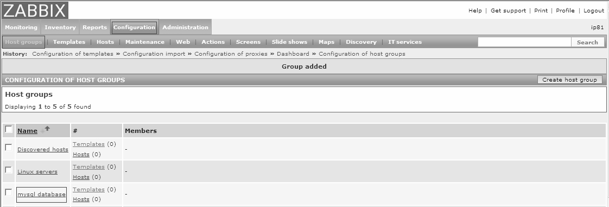
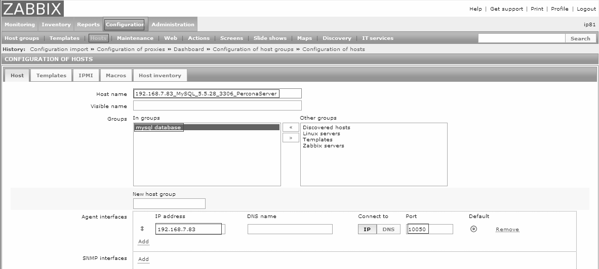
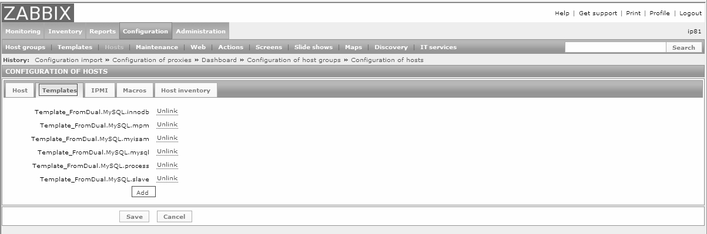
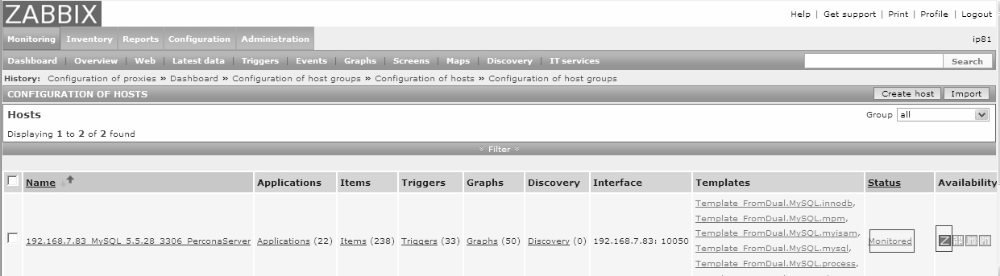
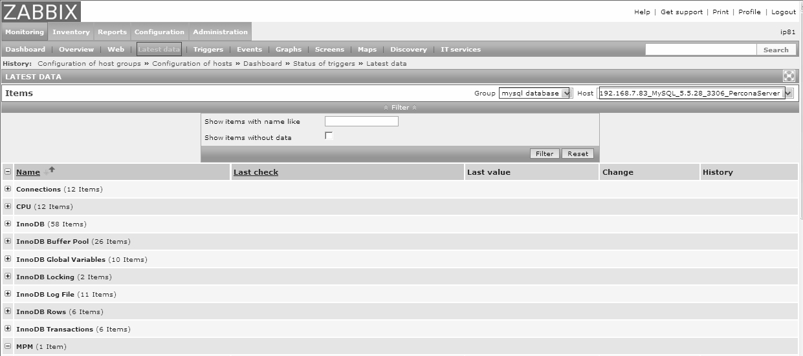
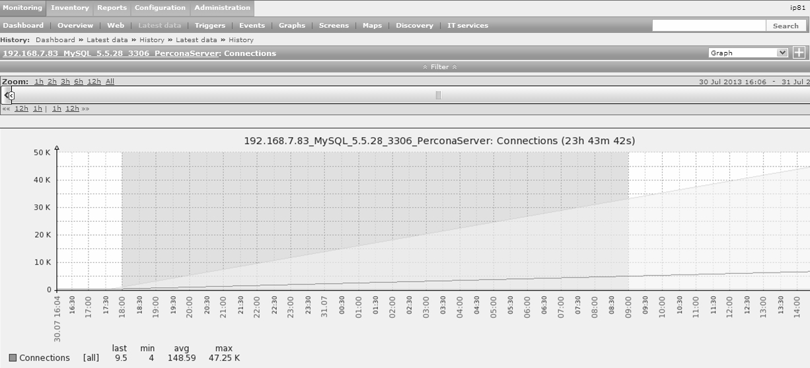

在Zabbix Web中，要实现对被监控主机的监控大概需要以下几个步骤。

（1）通过Zabbix Web端创建监控数据库组。

通过ConfigurationÆHost groupsÆCreate host groupÆ输入相关组名，如图 29-12所示，创建“mysql database”组，该组主要是为了管理所有的MySQL数据库。

图29-12 创建Zabbix监控组

（2）在Zabbix监控组中创建Zabbix监控主机。

创建 Zabbix 监控的主机，主机名为 192.168.7.83_MySQL_5.5.28_3306_PerconaServer。在ConfigurationÆHostsÆCreate host中输入相关主机信息，如图 29-13所示。

图29-13 创建Zabbix被监控主机信息

（3）添加被监控主机所需的模板文件，如图29-14所示。

（4）查看监控端主机的监控状态，如图 29-15 所示。当主机的状态为 Monitores 状态， Availability变为绿色时，代表该主机监控正常。

（5）在Zabbix Web中，选择MonitoringÆLatest data，可以查看监控的具体情况，如图 29-16所示。

图29-14 为监控的客户端配置模板文件

图29-15 查看被监控主机的监控状态

图29-16 Zabbix数据收集状况查看

通过相关输出信息，可以看见agent端的数据库监控信息已经完全发送到了Zabbix Server端。

（6）查看 Zabbix 绘制图形情况，这里选取连接数的绘图，单击 Connections，如图 29-17所示。

图29-17 查看Zabbix趋势图

可以看到，在图29-17中，时间窗口可以任意拖动，窗口中显示最近一段时间的连接数增长趋势。

