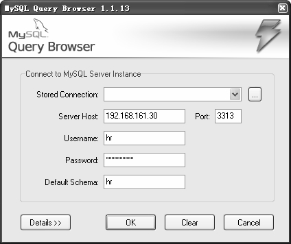
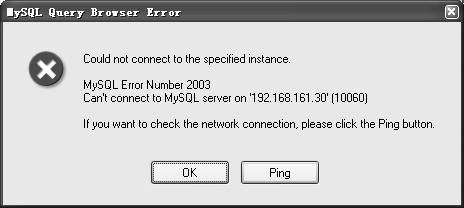
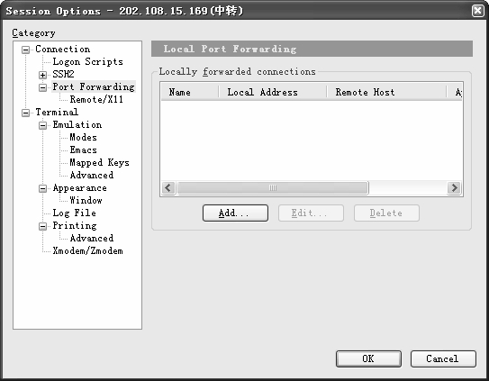
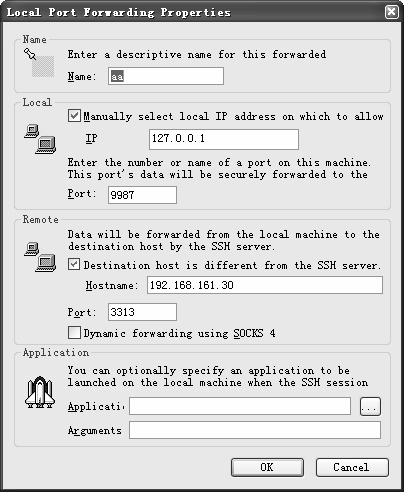
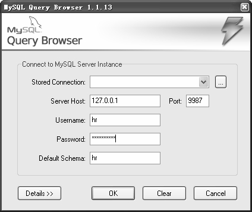
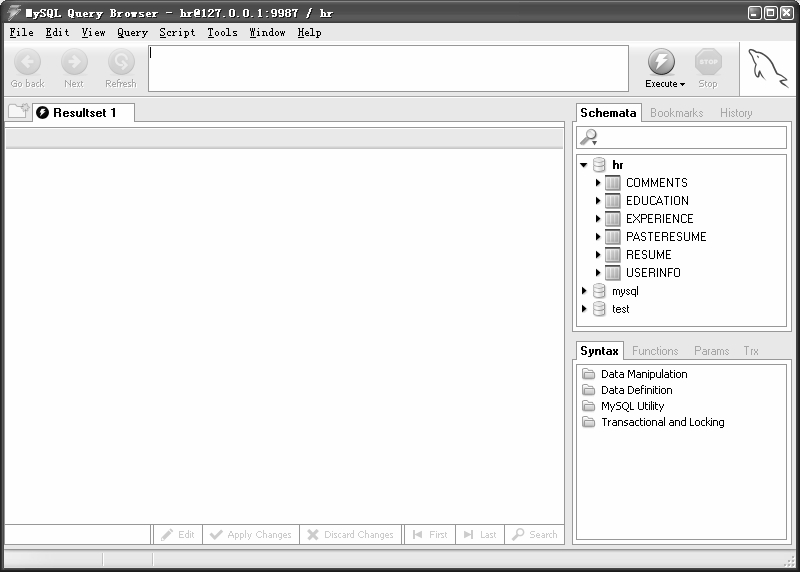

SecureCRT是一个可以通过多种协议连接远程服务器的客户端工具，具体介绍可以参见其官方网站（***http://www.vandyke.com/***）。通过 SecureCRT 工具连接到中转服务器，并创建 SSH Turnal，具体操作步骤如下。

（1）单击Session的属性，选择“Connection”Æ“Port Forwarding”选项，进入如图 30-3所示的界面。

图30-1 客户端登录界面

图30-2 客户端登录失败界面

图30-3 Session Options设置界面

（2）单击“Add”按钮，出现如图 30-4所示的“Local Port Forwarding Properties”对话框，在“Name”文本框中随便输入名字；“Local”栏下的“IP”文本框中输入127.0.0.1，“Port”文本框中随便输入一个未使用的端口，例如9987；“Remote”栏下的“Hostname”文本框中输入内网数据库的IP地址，这里是192.168.161.30，而“Port”文本框中输入“3313”；单击“OK”按钮设置成功。

（3）在内网数据库（其 IP 地址为 192.168.161.30）上增加一个用户 hr，“Host”设置为192.168.161.43。

grant select on dbname.* to test@192.168.161.43 identified by '123';

图30-4“Local Port Forwarding Properties”对话框

（4）客户端重新登录，在“Server Host”文本框中填写本节 IP（127.0.0.1），“Port”文本框中填写“9987”，并在“Username”和“Password”文本框中输入上文中创建的用户名和密码，然后在“Default Schema”文本框中填入登录的数据库名称，如图 30-5所示。

图30-5 重新登录界面

（5）单击“OK”按钮，连接成功，进入数据库hr，如图30-6所示。

图30-6 登录成功后的界面

