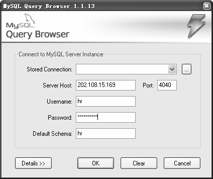
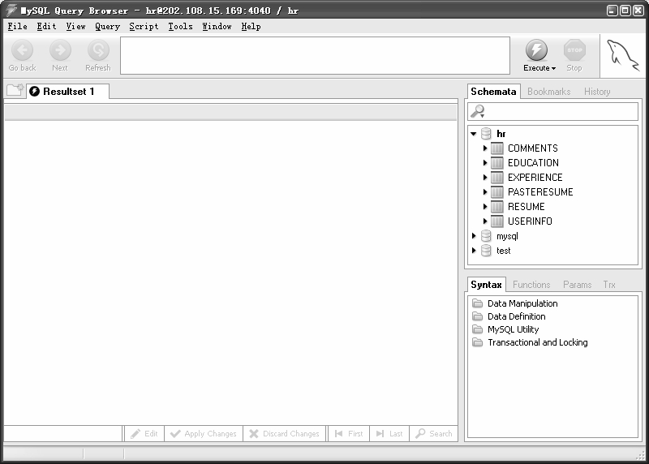

MySQL Proxy（MySQL代理）是MySQL AB公司新开发的一个工具，写作本书的时候还是测试版。它的功能和Oracle的连接管理器（CMAN）有些类似，是位于客户端和服务器中间的一个小程序。但是它的功能比 CMAN 更多，除了可以进行连接的转发外，还可以进行查询的监控、过滤、分析、负载均衡（Load Balance）、失败漂移（Failover）等其他更多的功能，具体功能的使用读者可以查看官方文档（***http://forge.mysql.com/wiki/MySQL_Proxy***）。这里我们仅仅介绍它对于连接转发功能的使用。

（1）在中转服务器（202.108.15.169）上下载MySQL Proxy的最新版本（***http://dev.mysql.com/downloads/mysql-proxy/index.html***），下载的方法和下载MySQL软件类似，这里就不再赘述。下载后的文件名为mysql-proxy-0.6.0-linux-rhas4-x86.tar.gz。

（2）解压下载的文件如下。

[zzx@zzx ~]$ tar xzvf mysql-proxy-0.6.0-linux-rhas4-x86.tar.gz

mysql-proxy-0.6.0-linux-rhas4-x86/

mysql-proxy-0.6.0-linux-rhas4-x86/sbin/

mysql-proxy-0.6.0-linux-rhas4-x86/sbin/mysql-proxy mysql-proxy-0.6.0-linux-rhas4-x86/share/

．．．．．．

mysql-proxy-0.6.0-linux-rhas4-x86/share/mysql-proxy/xtab.lua

（3）进入解压后的目录，发现有两个子目录share和sbin。

[zzx ~]$ cd mysql-proxy-0.6.0-linux-rhas4-x86

[zzx ~/mysql-proxy-0.6.0-linux-rhas4-x86]$ ls -l

总用量 16

drwxr-xr-x 4 zzx zzx 4096 9月 12 08:48 ./

drwx------ 5 zzx zzx 4096 1月 11 15:33 ../

drwxr-xr-x 2 zzx zzx 4096 9月 12 08:48 sbin/

drwxr-xr-x 3 zzx zzx 4096 9月 12 08:48 share/

（4）其中 share中有很多以.lua为后缀的文件，这些是MySQL Proxy对客户端进行查询、监控、分析等操作的脚本。sbin目录中只有一个文件mysql-proxy，用它来启动MySQL Proxy服务。

（5）执行./mysql-proxy --help-all命令，查看mysql-proxy工具的使用方法。

[zzx ~/mysql-proxy-0.6.0-linux-rhas4-x86/sbin]$ ./mysql-proxy --help-all

Usage:

mysql-proxy [OPTION...] - MySQL Proxy

Help Options:

-?, --help Show help options

--help-all Show all help options

--help-admin Show options for the admin-module

--help-proxy Show options for the proxy-module

admin module

--admin-address=<host:port>listening address:port of internal admin-server (default: :4041)

proxy-module

--proxy-address=<host:port>listening address:port of the proxy-server (default: :4040)

--proxy-read-only-backend-addresses=<host:port> address:port of the remote slave-server (default: not set)

--proxy-backend-addresses=<host:port>address:port of the remote backend-servers (default: 127.0.0.1:3306)

--proxy-skip-profiling disables profiling of queries (default: enabled)

--proxy-fix-bug-25371 fix bug #25371 (mysqld > 5.1.12) for older libmysql versions

--proxy-lua-script=<file>filename of the lua script (default: not set)

--no-proxy Don't start proxy-server

Application Options:

-V, --version Show version

--daemon Start in daemon-mode

--pid-file=<file> PID file in case we are started as daemon

这些参数中，对连接转发最重要的参数是--proxy-backend-addresses=<host:port>，它告诉MySQL Proxy要连接到的目标MySQL服务的 IP和端口。

（6）启动MySQL Proxy服务，并指定--proxy-backend-addresses为目标数据库的 IP地址和端口。

[zzx~/mysql-proxy-0.6.0-linux-rhas4-x86/sbin]$ ./mysql-proxy --proxy-backend-addresses=192.168.161.30:3313 &

[2] 3690

[1] Done ./mysql-proxy proxy-backend-addresses=192.168.161.30:3313

（7）用netstat观察一下启动的服务：

[zzx ~/mysql-proxy-0.6.0-linux-rhas4-x86/sbin]$ netstat -nlp

(Not all processes could be identified, non-owned process info

will not be shown, you would have to be root to see it all.)

Active Internet connections (only servers)

Proto Recv-Q Send-Q Local Address Foreign Address State PID/Program name

tcp 0 0 0.0.0.0:4040 0.0.0.0:* LISTEN 3690/mysql-proxy

tcp 0 0 0.0.0.0:4041 0.0.0.0:* LISTEN 3690/mysql-proxy

…

其中，4040 端口是默认的代理端口，客户端连接的时候直接指向此端口；4041 是默认的管理模块端口，这里不用管它。

（8）在Windows客户端启动MySQL Query Browser，在登录界面的“Server Host”文本框中输入中转服务器的 IP地址，在“Port”文本框中输入MySQL Proxy的代理端口 4040，在“Username”和“Password”文本框中输入实际数据库的用户名和密码，如图30-7所示。

图30-7 使用MySQL Proxy的登录界面

（9）单击“OK”按钮，成功登录数据库，如图30-8所示。

从方法一和方法二可以看出，方法一的优点是更通用，不仅能对 MySQL 服务进行连接的转发，而且对其他类似的问题也可以采用这种办法进行解决，以达到客户端正常访问内网服务的目的。但是这种方法也有自己的缺点，就是必须要打开secureCRT相应的SESSION，连接才可以生效；方法二的优点是不依赖于客户端的其他服务，只要中转服务器上启动代理服务，客户端就可以正常访问，缺点是只针对 MySQL 适用。读者可以根据自己的实际应用环境进行选择。

图30-8 使用MySQL Proxy成功登录数据库后的界面

