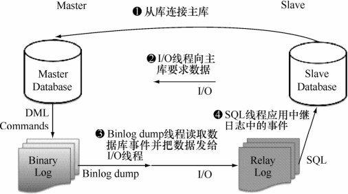

MySQL的复制原理大致如下。

（1）首先，MySQL主库在事务提交时会把数据变更作为事件Events记录在二进制日志文件Binlog中；MySQL主库上的sync_binlog参数控制Binlog日志刷新到磁盘。

（2）主库推送二进制日志文件Binlog中的事件到从库的中继日志Relay Log，之后从库根据中继日志Relay Log重做数据变更操作，通过逻辑复制以此来达到主库和从库的数据一致。

MySQL通过 3个线程来完成主从库间的数据复制：其中Binlog Dump线程跑在主库上， I/O线程和SQL线程跑在从库上。当在从库上启动复制（START SLAVE）时，首先创建 I/O线程连接主库，主库随后创建Binlog Dump线程读取数据库事件并发送给 I/O线程，I/O线程获取到事件数据后更新到从库的中继日志Relay Log中去，之后从库上的SQL线程读取中继日志Relay Log中更新的数据库事件并应用，如图 31-1所示。

图31-1 MySQL复制流程

可以通过SHOW PROCESSLIST命令在主库上查看Binlog Dump线程，从Binlog Dump线程的状态可以看到，MySQL 的复制是主库主动推送日志到从库去的，是属于“推”日志的方式来做同步：

mysql> show processlist\G

*************************** 1. row ***************************

Id: 2

User: root

Host: localhost

db: demo

Command: Query

Time: 0

State: NULL

Info: show processlist

*************************** 2. row ***************************

Id: 4

User: repl

Host: 192.168.7.200:32904

db: NULL

Command: Binlog Dump

Time: 2060

State: Has sent all binlog to slave; waiting for binlog to be updated

Info: NULL

2 rows in set (0.00 sec)

同样地，在从库上通过SHOW PROCESSLIST可以看到 I/O线程和SQL线程，I/O线程等待主库上的Binlog Dump线程发送事件并更新到中继日志Relay Log，SQL线程读取中继日志Relay Log并应用变更到数据库：

mysql> show processlist\G

*************************** 1. row ***************************

Id: 4

User: system user

Host:

db: NULL

Command: Connect

Time: 1941

State: Waiting for master to send event

Info: NULL

*************************** 2. row ***************************

Id: 5

User: system user

Host:

db: NULL

Command: Connect

Time: 202

State: Slave has read all relay log; waiting for the slave I/O thread to update it

Info: NULL

*************************** 3. row ***************************

Id: 6

User: root

Host: localhost

db: demo

Command: Query

Time: 0

State: NULL

Info: show processlist

3 rows in set (0.00 sec)

从MySQL的复制流程可以了解到MySQL的复制是异步的。从库上的数据和主库存在一定的延时。

