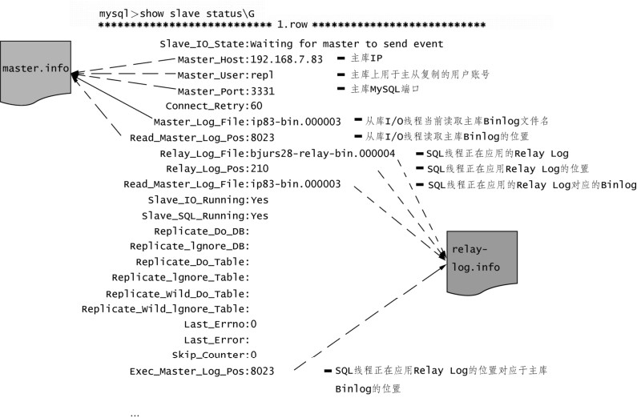

从MySQL复制流程可以看到复制过程中涉及了两类非常重要的日志文件：二进制日志文件（Binlog）和中继日志文件（Relay Log）。

二进制日志文件（Binlog）会把 MySQL 中的所有数据修改操作以二进制的形式记录到日志文件中，包括Create、Drop、Insert、Update、Delete操作等，但二进制日志文件（Binlog）不会记录Select操作，因为Select操作并不修改数据。

可以通过 show variables查看Binlog的格式，Binlog支持Statement、Row、Mixed三种格式，也对应了MySQL的3种复制技术（会在下一小节中详细讨论）：

mysql>show variables like '%binlog_format';

+---------------+-------+

| Variable_name | Value |

+---------------+-------+

| binlog_format | ROW |

+---------------+-------+

1 row in set (0.00 sec)

中继日志文件Relay Log的文件格式、内容和二进制日志文件Binlog一样，唯一的区别在于从库上的SQL线程在执行完当前中继日志文件Relay Log中的事件之后，SQL线程会自动删除当前中继日志文件Relay Log，避免从库上的中继日志文件Relay Log占用过多的磁盘空间。

为了保证从库Crash重启之后，从库的I/O线程和SQL线程仍然能够知道从哪里开始复制，从库上默认还会创建两个日志文件master.info和relay-log.info用来保存复制的进度。这两个文件在磁盘上以文件形式分别记录了从库的 I/O 线程当前读取主库二进制日志 Binlog 的进度和SQL线程应用中继日志Relay Log的进度。例如，通过SHOW SLAVE STATUS命令能够看到当前从库复制的状态，如图31-2所示。

图31-2 MySQL从库复制中的状态值

其中master.info记录的是 I/O线程连接主库的一些参数，主要包括SHOW SLAVE STATUS显示出的以下5列（master.info不止包括以下5项内容，仅说明较重要的5项）。

Master Host：主库的 IP。

Master User：主库上，主从复制使用的用户账号。

Master Port：主库MySQL的端口号。

Master_Log_File：从库的I/O线程当前正在读取的主库Binlog的文件名。

Read_Master_Log_Pos：从库I/O线程当前读取到的位置。

而 relay-log.info记录的是SQL线程应用中继日志Relay Log的一些参数，主要包括SHOW SLAVE STATUS显示出的以下 4列（同样的，relay-log.info不止包含这 4项内容，仅说明较重要的4项）。

Relay_Log_File：从库SQL线程正在读取和应用的中继日志Relay Log的文件名。

Relay_Log_Pos：从库SQL线程当前读取并应用的中继日志Relay Log的位置。

Relay_Master_Log_File：从库 SQL 线程正在读取和应用的 Relay Log 对应于主库Binlog的文件名。

Exec_Master_Log_Pos：中继日志Relay Log中Relay_Log_Pos位置对应于主库Binlog的位置。

