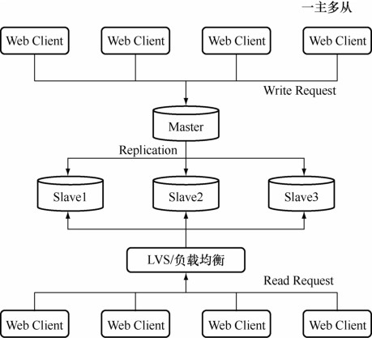
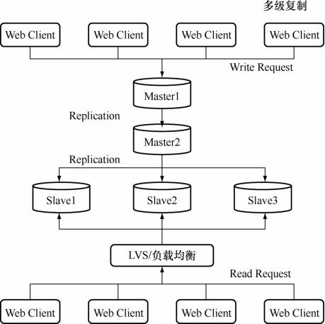
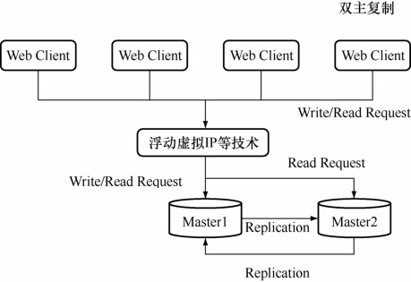
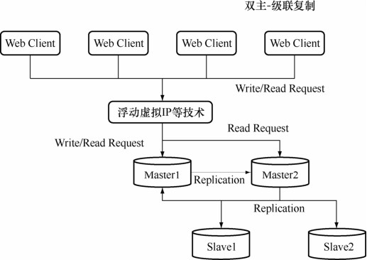

复制的 3种常见架构有一主多从复制架构、多级复制架构和双主复制/Dual Master架构

**1．一主多从复制架构**

在主库读取请求压力非常大的场景下，可以通过配置一主多从复制架构实现读写分离，把大量对实时性要求不是特别高的读请求通过负载均衡分布到多个从库上，降低主库的读取压力，如图31-3所示。

图31-3 MySQL一主多从复制架构

在主库出现异常宕机的情况下，可以把一个从库切换为主库继续提供服务。

**2．多级复制架构**

一主多从的架构能够解决大部分读请求压力特别大的场景的需求，考虑到MySQL的复制是主库“推送”Binlog日志到从库，主库的I/O压力和网络压力会随着从库的增加而增长（每个从库都会在主库上有一个独立的Binlog Dump线程来发送事件），而多级复制架构解决了一主多从场景下，主库额外的 I/O 和网络压力。MySQL 的多级复制架构如图31-4所示。

图31-4 MySQL多级复制架构

对比一主多从的架构图，多级复制仅仅是在主库Master1复制到从库Slave1、Slave2、Slave3的中间增加一个二级主库Master2，这样，主库Master1只需要给一个从库Master2“推送”Binlog日志皆可，减轻主库Master1推送的压力。二级主库Master2再“推送”Binlog日志给从库Slave1、Slave2、Slave3。

多级复制解决了一主多从场景下，主库的 I/O 负载和网络压力，当然也有缺点：MySQL的复制是异步复制，多级复制场景下主库的数据是经历两次复制才到达从库 Slave1、Slave2、Slave3的，期间的延时比一主多从复制场景下只经历一次复制的要大。

可以通过在二级主库 Master2 上选择表引擎为 BLACKHOLE 来降低多级复制的延时。顾名思义，BLACKHOLE引擎是一个“黑洞”引擎，写入BLACKHOLE表的数据并不会写回到磁盘上，BLACKHOLE 表永远都是一个空表，INSERT/UPDATE/DELETE 操作仅仅在 Binlog中记录事件。

mysql> CREATE TABLE test(i INT, c CHAR(10)) ENGINE = BLACKHOLE;

Query OK, 0 rows affected (0.03 sec)

mysql> INSERT INTO test VALUES(1,'record one'),(2,'record two');

Query OK, 2 rows affected (0.00 sec)

Records: 2 Duplicates: 0 Warnings: 0

mysql> SELECT * FROM test;

Empty set (0.00 sec)

BLACKHOLE引擎非常适合二级主库Master2的场景：Master2并不承担读写请求，仅仅负责将Binlog日志尽快传送给从库。

**3．双主复制/Dual Master架构**

双主/Dual Master 架构特别适用于 DBA 做维护等需要主从切换的场景，通过双主/Dual Master架构避免了重复搭建从库的麻烦，双主的架构如图31-5所示。

图31-5 MySQL双主复制架构

主库Master1和Master2互为主从，所有Web Client客户端的写请求都访问主库Master1，而读请求可以选择访问主库Master1或Master2。假如，DBA需要做日常维护操作，为了避免影响服务：

首先，在Master1库上停止Slave线程（STOP SLAVE），避免后续对Master2库的维护操作被实时复制到Master1库上对服务造成影响；

其次，在Master2库上停止Slave线程（STOP SLAVE），开始日常维护操作，例如创建索引等；

然后，在Master2库上完成维护操作之后，打开Master2库上的Slave线程（START SLAVE），让Master2库的数据和Master1库同步，同步完成后，把应用的读写操作切换到Master2库上；

最后，确认Master1库上无应用访问后，打开Master1库的Slave线程（START SLAVE）即可。

通过双主复制/Dual Master架构能够大大减轻一主多从架构下对主库进行维护带来的额外搭建从库的工作。

当然双主复制还能和主从复制联合起来使用：在Master2库下配置从库Slave1、Slave2等，这样即可通过从库Slave1等来分担读取压力，同时在DBA做维护的同时，避免了重建从库的额外工作。MySQL的双主多级复制架构如图31-6所示。

图31-6 MySQL双主多级复制架构

由于MySQL的Binlog中会记录事件初始发生的 server id，以Master1上的Binlog为例：

# at 533

#130719 14:35:42 server id 24 end_log_pos 631 Query thread_id=5 exec_time=0

error_code=0

…

# at 658

#130719 14:40:15 server id 2 end_log_pos 717 Query thread_id=9

exec_time=4294967039 error_code=0

…

MySQL库只应用和自己 server id不同的Binlog日志，MySQL通过判断Binlog事件中的不同 server id即可判断当前库是否是事件发生的初始发生 server，所以双主复制加上级联复制（打开了log_slave_updates）也不会出现循环复制。

