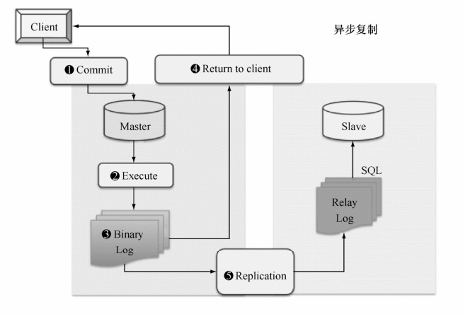
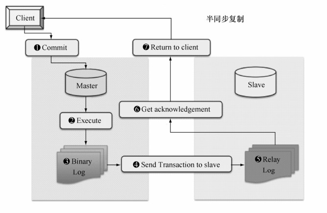

在MySQL 5.5之前，MySQL的复制是异步操作，主库和从库的数据之间存在一定的延迟，这样存在一个隐患：当在主库上写入一个事务并提交成功，而从库尚未得到主库推送的Binlog日志时，主库宕机了，例如主库可能因磁盘损坏、内存故障等造成主库上该事务Binlog丢失，此时从库就可能损失这个事务，从而造成主从不一致。

为了解决这个问题，MySQL 5.5引入了半同步复制机制。在MySQL 5.5之前的异步复制时，主库执行完 Commit 提交操作后，在主库写入 Binlog 日志后即可成功返回客户端，无需等待Binlog日志传送给从库，如图31-7所示。

图31-7 MySQL的异步复制流程

而半同步复制时，为了保证主库上的每一个 Binlog 事务都能够被可靠的复制到从库上，主库在每次事务成功提交时，并不及时反馈给前端应用用户，而是等待其中一个从库也接收到 Binlog事务并成功写入中继日志后，主库才返回Commit操作成功给客户端。半同步复制保证了事务成功提交后，至少有两份日志记录，一份在主库的 Binlog 日志上，另一份在至少一个从库的中继日志Relay Log上，从而更进一步保证了数据的完整性。半同步复制的大致流程如图31-8所示。

图31-8 MySQL半同步复制流程

半同步复制模式下，假如在图 31-8 的步骤①、②、③中的任何一个步骤中主库宕机，则事务并未提交成功，从库上也没有收到事务对应的Binlog日志，所以主从数据是一致的；假如在步骤④传送Binlog日志到从库时，从库宕机或者网络故障，导致Binlog并没有及时地传送到从库上，此时主库上的事务会等待一段时间（时间长短由参数rpl_semi_sync_master_timeout设置的毫秒数决定），如果Binlog在这段时间内都无法成功推送到从库上，则MySQL自动调整复制为异步模式，事务正常返回提交结果给客户端。

半同步复制很大程度上取决于主从库之间的网络情况，往返时延 RTT 越小决定了从库的实时性越好。通俗地说，主从库之间网络越快，从库越实时。

**注意：**往返时延RTT（Round-Trip Time）在计算机网络中是一个重要的性能指标，它表示从发送端发送数据开始到发送端接收到接收端的确认，总共经历的时长。

半同步模式是作为MySQL 5.5的一个插件来实现的，主库和从库使用不同的插件。安装比较简单，在上一小节异步复制的环境上，安装半同步复制插件即可。

（1）首先，判断MySQL服务器是否支持动态增加插件：

mysql> select @@have_dynamic_loading;

+------------------------+

| @@have_dynamic_loading |

+------------------------+

| YES|

+------------------------+

1 row in set (0.00 sec)

（2）确认支持动态增加插件后，检查 MySQL 的安装目录下是否存在插件，一般默认在$MYSQL_HOME/lib/plugin 目录下存在主库插件 semisync_master.so 和从库插件 semisync_slave.so：

$MYSQL_HOME/lib/plugin/semisync_master.so

$MYSQL_HOME/lib/plugin/semisync_slave.so

在主库上安装插件semisync_master.so：

mysql> install plugin rpl_semi_sync_master SONAME 'semisync_master.so';

从库上则安装semisync_slave.so插件：

mysql> install plugin rpl_semi_sync_slave SONAME 'semisync_slave.so';

安装完成后，从plugin表中能够看到刚才安装的插件：

mysql> select * from mysql.plugin;

+----------------------+--------------------+

| name | dl |

+----------------------+--------------------+

| rpl_semi_sync_master | semisync_master.so |

+----------------------+--------------------+

1 row in set (0.00 sec)

也就是说，安装完成后，MySQL会在系统表plugin中记录刚才安装的插件，下次系统重启后会自动加载插件。

（3）需要分别在主库和从库上配置参数打开半同步 semi-sync，默认半同步设置是不打开的，主库上配置全局参数：

mysql> set global rpl_semi_sync_master_enabled=1;

Query OK, 0 rows affected (0.00 sec)

mysql> set global rpl_semi_sync_master_timeout = 30000;

Query OK, 0 rows affected (0.00 sec)

从库上一样配置全局参数：

mysql> set global rpl_semi_sync_slave_enabled=1;

Query OK, 0 rows affected (0.00 sec)

注意，由于之前配置的复制是异步复制，所以需要重启一下从库上的I/O线程（如果是全新配置的半同步复制则不需要）：

mysql> STOP SLAVE IO_THREAD; START SLAVE IO_THREAD;

Query OK, 0 rows affected (0.00 sec)

Query OK, 0 rows affected (0.00 sec)

到此半同步配置完毕，下面可以来验证一下。主库上通过SHOW STATUS命令能够看到当前半同步复制的一些状态值：

mysql> show status like '%semi_sync%';

+--------------------------------------------+-------+

| Variable_name | Value |

+--------------------------------------------+-------+

| Rpl_semi_sync_master_clients | 1 |

| Rpl_semi_sync_master_net_avg_wait_time | 8844 |

| Rpl_semi_sync_master_net_wait_time | 8844 |

| Rpl_semi_sync_master_net_waits | 1 |

| Rpl_semi_sync_master_no_times | 1 |

| Rpl_semi_sync_master_no_tx | 3 |

| Rpl_semi_sync_master_status | ON |

| Rpl_semi_sync_master_timefunc_failures | 0 |

| Rpl_semi_sync_master_tx_avg_wait_time | 0 |

| Rpl_semi_sync_master_tx_wait_time | 0 |

| Rpl_semi_sync_master_tx_waits | 0 |

| Rpl_semi_sync_master_wait_pos_backtraverse | 0 |

| Rpl_semi_sync_master_wait_sessions | 0|

| Rpl_semi_sync_master_yes_tx | 0|

+--------------------------------------------+-------+

14 rows in set (0.00 sec)

**注意：**由于各人的环境不同，所以SHOW STATUS显示的状态值可能存在不一致，着重关注这些状态值的变化，而不是这些状态的初始值。

着重关注以下3个状态值。

Rpl_semi_sync_master_status：值为ON，表示半同步复制目前处于打开状态。

Rpl_semi_sync_master_yes_tx：值为 0，表示主库当前尚未有任何一个事务是通过半同步复制到从库。

Rpl_semi_sync_master_no_tx：值为3，表示当前有3个事务不是半同步模式下从库及时响应的（记住这个值，后面会有对比）。

执行一个事务，再检查一下状态：

mysql> insert into demo.emp (empno) values (1001);

Query OK, 1 row affected (0.05 sec)

mysql> show status like '%semi_sync%';

+--------------------------------------------+-------+

| Variable_name | Value |

+--------------------------------------------+-------+

| Rpl_semi_sync_master_clients | 1 |

| Rpl_semi_sync_master_net_avg_wait_time | 4626 |

| Rpl_semi_sync_master_net_wait_time | 9252 |

| Rpl_semi_sync_master_net_waits | 2|

| Rpl_semi_sync_master_no_times | 1|

| Rpl_semi_sync_master_no_tx | 3 |

| Rpl_semi_sync_master_status| ON|

| Rpl_semi_sync_master_timefunc_failures | 0|

| Rpl_semi_sync_master_tx_avg_wait_time | 0|

| Rpl_semi_sync_master_tx_wait_time | 0|

| Rpl_semi_sync_master_tx_waits | 0|

| Rpl_semi_sync_master_wait_pos_backtraverse | 0|

| Rpl_semi_sync_master_wait_sessions | 0 |

| Rpl_semi_sync_master_yes_tx | 1 |

+--------------------------------------------+-------+

14 rows in set (0.00 sec)

此时会发现Rpl_semi_sync_master_yes_tx的值变为1，即刚才的INSERT事务通过半同步复制到从库上了，Rpl_semi_sync_master_yes_tx 计数增加 1。到从库确认一下，数据确实被复制过去了：

mysql> select * from emp where empno = 1001;

+----+-------+-------+------+------+----------+------+------+--------+

| id | empno | ename | job | mgr | hiredate | sal | comm | deptno |

+----+-------+-------+------+------+----------+------+------+--------+

| 13 | 1001 | NULL | NULL | NULL | NULL | NULL | NULL | NULL |

+----+-------+-------+------+------+----------+------+------+--------+

1 row in set (0.00 sec)

再尝试一下网络异常的场景下，主库在等待rpl_semi_sync_master_timeout毫秒超时后，自动转成异步复制的场景。

（1）首先，在主库上确认半同步复制会等待30s超时：

mysql> show variables like '%semi%time%';

+------------------------------+--------+

| Variable_name | Value |

+------------------------------+--------+

| rpl_semi_sync_master_timeout | 30000 |

+------------------------------+--------+

1 row in set (0.00 sec)

（2）在从库上通过iptables命令模拟从库宕机或者网络故障：

# 192.168.7.83为主库IP

iptables -A INPUT -s 192.168.7.83 -j DROP

（3）在主库上执行一个事务并提交（默认提交即可），主库上的提交操作会被阻塞30秒：

mysql> insert into demo.emp (empno) values (1002);

新开一个窗口检查当前主库的线程，会发现提交操作在等待从库上半同步复制操作的响应：

mysql> show processlist\G

*************************** 1. row ***************************

Id: 3

User: root

Host: localhost

db: NULL

Command: Query

Time: 19

State: Waiting for semi-sync ACK from slave

Info: insert into demo.emp (empno) values (1002)

*************************** 2. row ***************************

Id: 5

User: repl

Host: 192.168.7.200:33410

db: NULL

Command: Binlog Dump

Time: 4831

State: Master has sent all binlog to slave; waiting for binlog to be updated

Info: NULL

*************************** 3. row ***************************

Id: 6

User: root

Host: localhost

db: NULL

Command: Query

Time: 0

State: NULL

Info: show processlist

3 rows in set (0.00 sec)

（4）主库上等待30超时：

mysql> insert into demo.emp (empno) values (1002);

Query OK, 1 row affected (30.04 sec)

检查半同步复制的一些状态值：

mysql> show status like '%semi_sync%';

+--------------------------------------------+----------+

| Variable_name | Value |

+--------------------------------------------+----------+

| Rpl_semi_sync_master_clients | 1|

| Rpl_semi_sync_master_net_avg_wait_time | 10001681 |

| Rpl_semi_sync_master_net_wait_time | 30005043 |

| Rpl_semi_sync_master_net_waits | 3|

| Rpl_semi_sync_master_no_times | 2 |

| Rpl_semi_sync_master_no_tx | 4 |

| Rpl_semi_sync_master_status | OFF |

| Rpl_semi_sync_master_timefunc_failures | 0 |

| Rpl_semi_sync_master_tx_avg_wait_time | 0 |

| Rpl_semi_sync_master_tx_wait_time | 0 |

| Rpl_semi_sync_master_tx_waits | 0|

| Rpl_semi_sync_master_wait_pos_backtraverse | 0|

| Rpl_semi_sync_master_wait_sessions | 0|

| Rpl_semi_sync_master_yes_tx | 1 |

+--------------------------------------------+----------+

14 rows in set (0.00 sec)

仍然看之前着重关注的3个状态值。

Rpl_semi_sync_master_status：值变为OFF了，表示主库上半同步复制已经关闭了，目前复制模式为异步复制；

Rpl_semi_sync_master_yes_tx：值仍然为 1，表示刚才的事务并不是通过半同步复制完成的，所以半同步成功事务仍然为1，并不累加；

Rpl_semi_sync_master_no_tx：值更新为4，比原来的3累加了1，表示在半同步模式下，从库没有及时响应的事务增加1个。

继续确认下一个场景：从库正常连接上主库之后，确认主库是否会自动切换回半同步复制模式。

（1）在之前的场景下，从库上取消iptables过滤规则：

iptables –F

检查从库上的I/O线程的状态，去掉iptables规则之后，从库会自动尝试连接主库，几秒钟后I/O线程的状态从Connecting变成了YES，并且主库和从库的数据一致了：

mysql> show slave status\G

*************************** 1. row ***************************

Slave_IO_State: Reconnecting after a failed master event read

Master_Host: 192.168.7.83

Master_User: repl

Master_Port: 3331

Connect_Retry: 60

Master_Log_File: ip83-bin.000006

Read_Master_Log_Pos: 989

Relay_Log_File: ip200-relay-bin.000013

Relay_Log_Pos: 474

Relay_Master_Log_File: ip83-bin.000006

Slave_IO_Running: Connecting

Slave_SQL_Running: Yes

…

Seconds_Behind_Master: NULL

Master_SSL_Verify_Server_Cert: No

Last_IO_Errno: 2003

Last_IO_Error: error reconnecting to master 'repl@192.168.7.83:3331' -

retry-time: 60 retries: 86400

Last_SQL_Errno: 0

Last_SQL_Error:

Replicate_Ignore_Server_Ids:

Master_Server_Id: 2

1 row in set (0.00 sec)

mysql> show slave status\G

*************************** 1. row ***************************

Slave_IO_State: Waiting for master to send event

Master_Host: 192.168.7.83

Master_User: repl

Master_Port: 3331

Connect_Retry: 60

Master_Log_File: ip83-bin.000006

Read_Master_Log_Pos: 1211

Relay_Log_File: ip200-relay-bin.000014

Relay_Log_Pos: 474

Relay_Master_Log_File: ip83-bin.000006

Slave_IO_Running: Yes

Slave_SQL_Running: Yes

…

Seconds_Behind_Master: 0

Master_SSL_Verify_Server_Cert: No

Last_IO_Errno: 0

Last_IO_Error:

Last_SQL_Errno: 0

Last_SQL_Error:

Replicate_Ignore_Server_Ids:

Master_Server_Id: 2

1 row in set (0.00 sec)

mysql> select * from emp where empno = 1002;

+----+-------+-------+------+------+----------+------+------+--------+

| id | empno | ename | job | mgr | hiredate | sal | comm | deptno |

+----+-------+-------+------+------+----------+------+------+--------+

| 14 | 1002 | NULL | NULL | NULL | NULL | NULL | NULL | NULL |

+----+-------+-------+------+------+----------+------+------+--------+

1 row in set (0.00 sec)

（2）检查主库上半同步复制的状态值，发现 Rpl_semi_sync_master_status 的值自动从OFF变成ON，说明在检测到从库正常之后，主库到从库的复制方式会自动切换为半同步复制模式：

mysql> show status like '%semi_sync%';

+--------------------------------------------+----------+

| Variable_name | Value |

+--------------------------------------------+----------+

| Rpl_semi_sync_master_clients | 1 |

| Rpl_semi_sync_master_net_avg_wait_time | 7502368 |

| Rpl_semi_sync_master_net_wait_time | 30009474 |

| Rpl_semi_sync_master_net_waits | 4|

| Rpl_semi_sync_master_no_times | 2|

| Rpl_semi_sync_master_no_tx | 4 |

| Rpl_semi_sync_master_status | ON |

| Rpl_semi_sync_master_timefunc_failures | 0 |

| Rpl_semi_sync_master_tx_avg_wait_time | 0 |

| Rpl_semi_sync_master_tx_wait_time | 0 |

| Rpl_semi_sync_master_tx_waits | 0 |

| Rpl_semi_sync_master_wait_pos_backtraverse | 0|

| Rpl_semi_sync_master_wait_sessions | 0|

| Rpl_semi_sync_master_yes_tx | 1|

+--------------------------------------------+----------+

14 rows in set (0.00 sec)

（3）在主库上做一个测试，确认当前的复制模式确实是半同步复制：

mysql> insert into demo.emp (empno) values (1003);

Query OK, 1 row affected (0.04 sec)

mysql> show status like '%semi_sync%';

+--------------------------------------------+----------+

| Variable_name | Value|

+--------------------------------------------+----------+

| Rpl_semi_sync_master_clients | 1|

| Rpl_semi_sync_master_net_avg_wait_time | 6001989 |

| Rpl_semi_sync_master_net_wait_time | 30009949 |

| Rpl_semi_sync_master_net_waits | 5 |

| Rpl_semi_sync_master_no_times | 2 |

| Rpl_semi_sync_master_no_tx | 4 |

| Rpl_semi_sync_master_status | ON |

| Rpl_semi_sync_master_timefunc_failures | 0 |

| Rpl_semi_sync_master_tx_avg_wait_time | 0 |

| Rpl_semi_sync_master_tx_wait_time | 0 |

| Rpl_semi_sync_master_tx_waits | 0 |

| Rpl_semi_sync_master_wait_pos_backtraverse | 0 |

| Rpl_semi_sync_master_wait_sessions | 0 |

| Rpl_semi_sync_master_yes_tx | 2 |

+--------------------------------------------+----------+

14 rows in set (0.00 sec)

提交一个事务之后，Rpl_semi_sync_master_yes_tx从1变成2，确认刚才事务的复制是半同步复制。

从半同步复制的流程会发现，半同步复制的“半”就体现在：虽然主库和从库的Binlog日志是同步的，但是主库并不等待从库应用这部分日志就返回提交结果，这部分操作是异步的，从库的数据并不是和主库实时同步的，所以只能称为半同步，而不是完全的实时同步。

