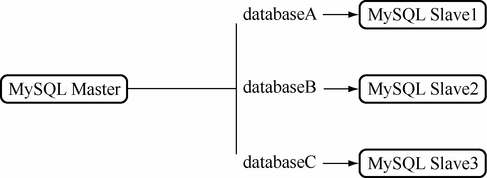
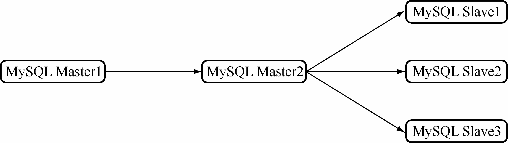

MySQL从库上通过SHOW PROCESSLIST可以看到有且仅有一个SQL线程在解析中继日志Relay Log并应用，例如：

mysql> show processlist\G

*************************** 1. row ***************************

Id: 4

User: system user

Host:

db: NULL

Command: Connect

Time: 1941

State: Waiting for master to send event

Info: NULL

*************************** 2. row ***************************

Id: 5

User: system user

Host:

db: NULL

Command: Connect

Time: 202

State: Slave has read all relay log; waiting for the slave I/O thread to update it

Info: NULL

*************************** 3. row ***************************

Id: 6

User: root

Host: localhost

db: demo

Command: Query

Time: 0

State: NULL

Info: show processlist

3 rows in set (0.00 sec)

那么写入压力特别大的场景下，考虑到主库是多线程并发在写入（应用服务器并发连接写入），而从库仅仅只有一个SQL线程在应用日志，就容易出现从库追不上主库的情况，可以在从库上通过SHOW SLAVE STATUS来查看从库落后主库的时间：

mysql> show slave status\G

*************************** 1. row ***************************

Slave_IO_State: Waiting for master to send event

Master_Host: 192.168.7.83

Master_User: repl

Master_Port: 3331

Connect_Retry: 60

Master_Log_File: ip83-bin.000003

Read_Master_Log_Pos: 4241

Relay_Log_File: ip200-relay-bin.000002

Relay_Log_Pos: 576

Relay_Master_Log_File: ip83-bin.000003

Slave_IO_Running: Yes

Slave_SQL_Running: Yes

Replicate_Do_DB:

Replicate_Ignore_DB:

Replicate_Do_Table:

Replicate_Ignore_Table:

Replicate_Wild_Do_Table:

Replicate_Wild_Ignore_Table:

Last_Errno: 0

Last_Error:

Skip_Counter: 0

Exec_Master_Log_Pos: 4241

Relay_Log_Space: 734

Until_Condition: None

Until_Log_File:

Until_Log_Pos: 0

Master_SSL_Allowed: No

Master_SSL_CA_File:

Master_SSL_CA_Path:

Master_SSL_Cert:

Master_SSL_Cipher:

Master_SSL_Key:

Seconds_Behind_Master: 0

Master_SSL_Verify_Server_Cert: No

Last_IO_Errno: 0

Last_IO_Error:

Last_SQL_Errno: 0

Last_SQL_Error:

Replicate_Ignore_Server_Ids:

Master_Server_Id: 2

1 row in set (0.00 sec)

其中 Seconds_Behind_Master 显示了预估从库落后主库的秒数，不是特别精准，只是一个预估值。

从库的数据落后主库的问题，当然可以通过提高从库配置的硬件来解决。但更推荐通过架构设计来解决这个问题，通过减少从库需要做的写入操作或者在从库上实现多线程写入操作都能够解决。

**1．方案一**

通过拆分减少一个从库上需要数据同步的表来解决。首先考虑配置一主多从的架构，然后在不同的从库上，通过设置不同 replicate-do-db、replicate-do-table、replicate-ignore-db、replicate-ignore-table或replicate-wild-do-table 参数，使得不同的从库复制不同的库/表，减少每个从库上需要写入的数据。

例如，假设主库为M1，从库为S1、S2、S3，其中设置从库S1仅需要复制databaseA，而从库S2仅需要复制databaseB，从库S3仅需要复制databaseC，那么每个从库只需要执行自己需要复制的库/表相关的SQL就可以了，如图31-9所示。

图31-9 MySQL拆分database复制

这时，由于主库M1需要给S1、S2、S3三个从库（或者更多从库）都发送完整的Binlog日志，I/O 和网络压力较大，再改进一下架构：配置 MySQL 多级主从架构减轻主库压力，如图31-10所示。

图31-10 MySQL多级复制

（1）主库M1首先给二级主库M2推送完整的Binlog。

（2）二级主库M2打开log-slave-updates配置，保证主库M1传送过来的Binlog能够被记录在二级主库M2的RelayLog和Binlog中；二级主库M2选择BLACKHOLE引擎作为表引擎，降低二级主库上I/O的压力。

（3）为二级主库M2配置3个从库S1、S2、S3，三个从库通过配置不同replicate-do-db等参数，让S1、S2、S3复制不同的库/表。

通过多级主从的方式，提高从库的复制性能，同时尽量降低对主库的影响。

**注意：**BLACKHOLE引擎就是一个“黑洞”引擎，在创建表的时候，选择BLACKHOLE引擎，那么写入表的数据不会真实地写入磁盘，仅仅记录Binlog日志，极大降低了磁盘的I/O。

方案一的优点在于能够自由拆分从库，方便地把热点数据分散开来；缺点在于维护起来不够简洁，并且由于从库S1、S2、S3上都没有主库完整的数据，在主库M1出现意外宕机的情况，应用处理较为麻烦。需要提前和应用沟通好异常的处理解决方案。

**2．方案二**

MySQL 5.6提供了基于 Schema的多线程复制，允许从库并行更新。例如，主库上存在 2个Schema，即demo和user。

mysql> show databases;

+--------------------+

| Database |

+--------------------+

| information_schema |

| demo |

| mysql |

| performance_schema |

| test |

| user |

+--------------------+

6 rows in set (0.00 sec)

MySQL 5.6的从库在同步主库时，通过设置参数 slave_parallel_workers为 2，让MySQL从库在复制时启动两个SQL线程：

mysql> show variables like '%slave_parallel_workers%';

+------------------------+-------+

| Variable_name | Value |

+------------------------+-------+

| slave_parallel_workers | 2|

+------------------------+-------+

1 row in set (0.01 sec)

mysql> select version();

+------------+

| version() |

+------------+

| 5.6.12-log |

+------------+

1 row in set (0.00 sec)

mysql> show processlist\G

*************************** 1. row ***************************

Id: 6

User: root

Host: localhost

db: mysql

Command: Query

Time: 0

State: init

Info: show processlist

*************************** 2. row ***************************

Id: 17

User: system user

Host:

db: NULL

Command: Connect

Time: 138

State: Waiting for master to send event

Info: NULL

*************************** 3. row ***************************

Id: 18

User: system user

Host:

db: NULL

Command: Connect

Time: 138

State: Slave has read all relay log; waiting for the slave I/O thread to update it

Info: NULL

*************************** 4. row ***************************

Id: 19

User: system user

Host:

db: NULL

Command: Connect

Time: 138

State: Waiting for an event from Coordinator

Info: NULL

*************************** 5. row ***************************

Id: 20

User: system user

Host:

db: NULL

Command: Connect

Time: 138

State: Waiting for an event from Coordinator

Info: NULL

5 rows in set (0.00 sec)

通过设置slave_parallel_workers 参数，让demo和user两个Schema拥有自己独立的SQL线程，这样也大大提高了从库的复制速度。MySQL 5.6分Schema多线程复制的具体内容可以参考MySQL官方文档。这里不做深入讨论。

如果使用Percona分支的MySQL，还可以尝试采用淘宝丁奇的MySQL Transfer来实现从库多线程应用中继日志来解决。丁奇的Blog地址为http://dinglin.iteye.com/blog/1888640。

