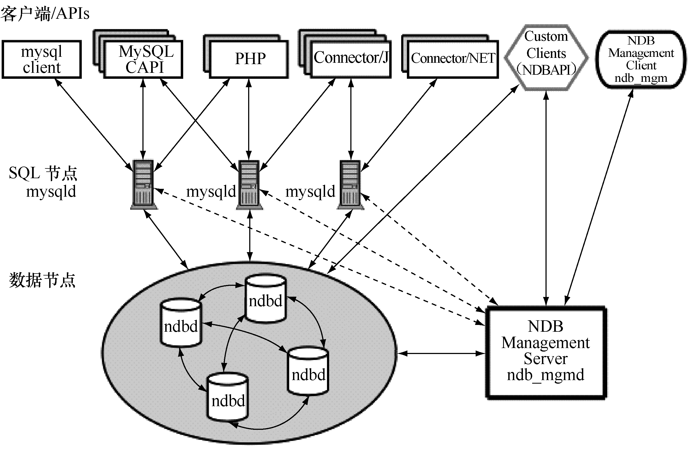

MySQL Cluster的系统架构如图 32-1所示。

从图 32-1中可以看出，MySQL Cluster按照节点类型可以分为 3部分。

管理节点。

顾名思义，管理节点用来对其他节点进行管理。实际操作中，是通过对一个叫作config.ini 的配置文件进行维护而起到管理的作用。该文件可以用来配置有多少需要维护的副本、需要在每个数据节点上为数据和索引分配多少内存、数据节点的位置、在每个数据节点上保存数据的磁盘位置、SQL 节点的位置等信息。管理节点只能有一个，配置要求不高。

图32-1 MySQL Cluster架构

SQL节点。

SQL节点可以理解为应用和数据节点之间的一个桥梁。应用不能直接访问数据节点，只能先访问 SQL 节点，然后 SQL 节点再去访问数据节点来返回数据。Cluster 中可以有多个 SQL节点，通过每个SQL节点查询到的数据都是一致的，通常来说，SQL节点越多，分配到每个SQL节点的负载就越小，系统的整体性能就越好。

数据节点。

数据节点用来存放 Cluster中的数据，可以有多个数据节点。每个数据节点可以有多个镜像节点。任何一个数据节点发生故障，只要它的镜像节点正常，Cluster 就可以正常运行。

这3种逻辑上不同的节点物理上可以存放在不同的服务器上，也可以在同一台服务器上。

通过架构中各个节点的介绍，可以总结一下MySQL Cluster的访问过程：前台应用一定的负载均衡算法将对数据库的访问分散到不同的SQL节点上，然后SQL节点对数据节点进行数据访问并从数据节点返回结果，最后 SQL 节点将收到的结果返给前台应用。而管理节点并不参与访问过程，它只用来对SQL节点和数据节点进行配置管理。

