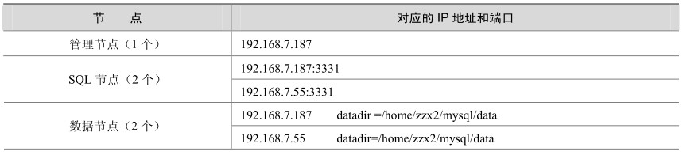

MySQL 5.0目前还不支持Windows平台上的Cluster，本节将以 Linux AS4上的MySQL 5.1.11 Beta版为测试环境，来介绍一下MySQL Cluster的配置方法，本章后面的其他部分也使用此测试环境为例。具体的节点配置如表32-1所示。

表32-1 节点配置说明

由于硬件环境限制，我们将管理节点、一个 SQL 节点和一个数据节点放在一台服务器（192.168.7.187）上；将另外一个SQL节点和一个数据节点放在另外一台服务器（192.168.7.55）上。

