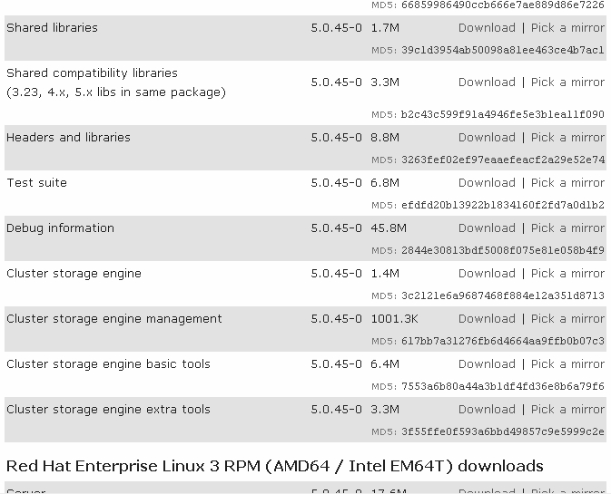

对于RPM安装包，通常只下载Server和Client包就可满足大多数应用。但是，Server包默认是不包括Cluster组件的，为了支持Cluster功能，还需要单独下载Cluster相关包，对于5.0，可以到http://dev.mysql.com/downloads/mysql/5.0.html去下载最新版本的包，如图32-2所示。

图32-2 下载RPM包的Cluster组件界面

通常，对于SQL节点和数据节点，除了必须下载的Server包外，还需要下载Cluster storage engine包。如果是管理节点，则不用下载Server包，但是需要下载Client包，此外还需要下载Cluster storage engine management、Cluster storage engine basic tools和Cluster storage engine extra tools 3个管理工具包。这 3个工具包分别提供了MySQL Cluster管理服务器（ndb_mgmd）、客户端管理工具（最重要的是ndb_mgm）、额外的集群测试和监控工具。其中，前两个包是必须的，最后一个包没有也可以，不会影响 Cluster 的正常运行和管理。下载后的包安装方法和其他RPM包完全一样，可以参考本书的第1章，这里就不再赘述。

对于二进制包，如果要下载5.0版本，则需要下载MAX版才支持Cluster。如果只是测试用，也可以只下载5.1的测试版（写作本书时5.1版本尚未正式发布）。

对于源码包，在编译时，务必使用“--with-ndbcluster”选项，使得编译后的二进制包支持Cluster。

