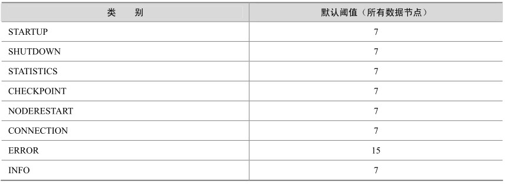
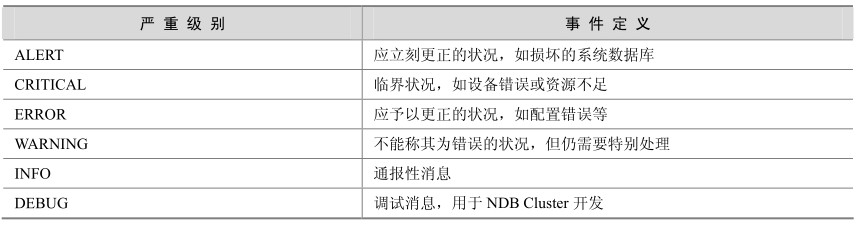

MySQL Cluster提供了两种日志，分别是**集群日志**（cluster log）和**节点日志**（node log）。前者记录了所有 Cluster 节点生成的日志，后者仅仅记录了数据节点的本地事件。在大多数情况下，一般都推荐使用集群日志，因为它在一个地方记录了所有节点的数据，更便于进行管理。节点日志一般只在开发过程中使用，或者用来调试程序代码。

clusterlog一般记录在配置文件（config.ini）所在的目录下，文件名格式为***ndb_<nodeid>_cluster.log，***其中***nodeid***为管理节点号。

下面是测试环境中摘录的一段clusterlog：

2007-12-12 18:00:48 [MgmSrvr] ALERT -- Node 2: Node 6 Disconnected

2007-12-12 18:00:48 [MgmSrvr] INFO -- Node 2: Communication to Node 6 closed

2007-12-12 18:00:48 [MgmSrvr] ALERT -- Node 3: Node 6 Disconnected

2007-12-12 18:00:48 [MgmSrvr] INFO -- Node 3: Communication to Node 6 closed

2007-12-12 18:00:48 [MgmSrvr] INFO -- Mgmt server state: nodeid 6 freed, m_reserved_nodes 0000000000000012.

2007-12-12 18:00:51 [MgmSrvr] INFO -- Node 3: Communication to Node 6 opened

2007-12-12 18:00:52 [MgmSrvr] INFO -- Node 2: Communication to Node 6 opened

可以使用ndb_mgm客户端管理工具打开或者关闭日志，具体操作如下。

（1）在shell中执行ndb_mgm命令：

[zzx2@zzx mysql-cluster]$ ndb_mgm

-- NDB Cluster –– Management Client ––

ndb_mgm>

（2）执行 clusterlog info命令查看当前日志状态：

ndb_mgm> clusterlog info

Connected to Management Server at: localhost:1186

Severities enabled: INFO WARNING ERROR CRITICAL ALERT

（3）当前日志是打开的，用 clusterlog off命令关闭日志：

ndb_mgm> clusterlog off

Cluster logging is disabled

（4）再次查看日志状态，发现已经关闭：

ndb_mgm> clusterlog info

Cluster logging is disabled.

（5）执行 clusterlog on命令将再次打开日志：

ndb_mgm> clusterlog on

Cluster logging is enabled.

Ndb_mgm> clusterlog info

Severities enabled: INFO WARNING ERROR CRITICAL ALERT

Cluster中的日志有很多类型，可以按照如下类别进行过滤，使得日志只记录用户关心的信息。

Category（类别）：可以是STARTUP、SHUTDOWN、STATISTICS、CHECKPOINT、NODERESTART、CONNECTION、ERROR或INFO中的任意值，这些类别包含的事件很多，这里就不再赘述，有兴趣的读者可以查阅MySQL相关文档。

Priority（优先级）：由从1～15的数字表示，“1”表示“最重要”，而“15”表示“最不重要”。每种Category都有一个默认的优先级阈值，如表32-3所示。优先级阈值以下的日志将被记录，反之，优先级阈值以上的日志不会被记录。

表32-3 MySQL Cluster中不同类别日志的默认优先级阈值

Severity Level（严重级别）：可以是下述值之一，ALERT、CRITICAL、ERROR、WARNING、INFO或DEBUG。这些值的具体含义如表32-4所示。

表32-4 MySQL Cluster中不同级别的事件定义

这3种分类让用户可以从3个不同的角度来对日志进行过滤。过滤的方法可以用ndb_mgm工具来完成，具体设置方法如下。

node_id CLUSTERLOG category=threshold：用小于或等于 threshold 的优先级将category事件记录到Cluster日志。node_id可以为ALL（所有节点）或者只指定某个节点。

CLUSTERLOG TOGGLE severity_level：使得指定的 severity_level打开或者关闭。

例如，要将测试环境中的节点2的STARTUP事件只记录级别为3以下的日志，可以进入ndb_mgm后执行如下命令：

ndb_mgm> 2 clusterlog startup=3

Executing CLUSTERLOG STARTUP=3 on node 2 OK!

如果要在Cluster日志中过滤掉DEBUG和INFO信息，可以执行如下命令：

ndb_mgm> clusterlog toggle debug info

DEBUG disabled

INFO disabled

然后查看日志状态，发现DEBUG和INFO信息已经不存在了：

ndb_mgm> clusterlog info

Severities enabled: WARNING ERROR CRITICAL ALERT

