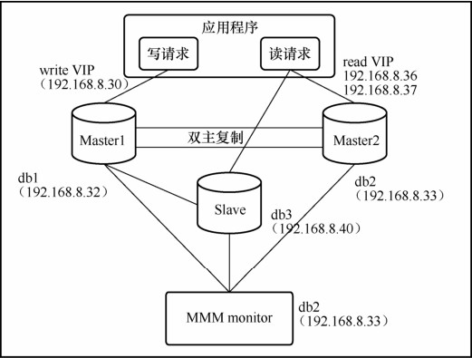
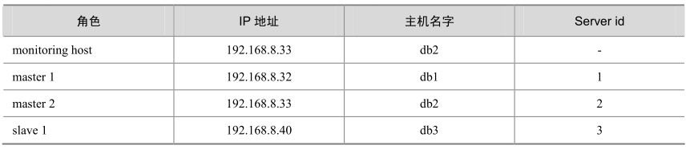
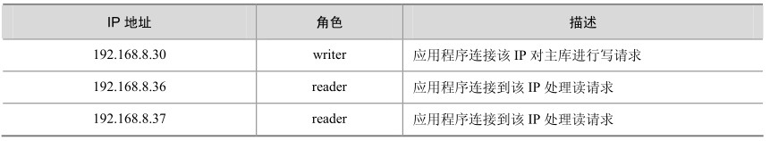
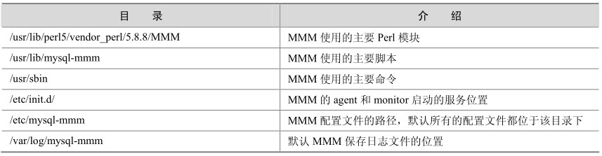
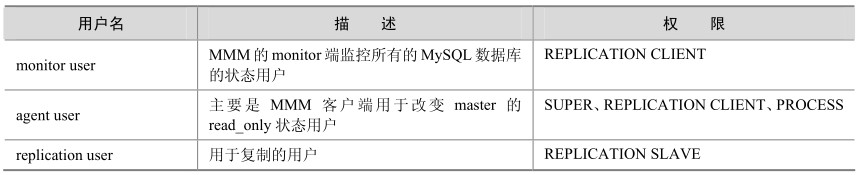

MMM（Master-Master replication manager for MySQL）是一套支持双主故障切换和双主日常管理的脚本程序。MMM使用Perl语言开发，主要用来监控和管理MySQL Master-Master （双主）复制，虽然叫做双主复制，但是业务上同一时刻只允许对一个主进行写入，令一台备选主上提供部分读服务，以加速在主主切换时刻备选主的预热，可以说MMM这套脚本程序一方面实现了故障切换的功能，另一方面其内部附加的工具脚本也可以实现多个 slaves 的read负载均衡。

MMM提供了自动和手动两种方式移除一组服务器中复制延迟较高的服务器的虚拟IP，同时它还可以备份数据、实现两节点之间的数据同步等。接下来我们将主要介绍MMM的故障切换功能。

由于 MMM 无法完全地保证数据一致性，所以 MMM 适用于对数据的一致性要求不是很高，但是又想最大程度的的保证业务可用性的场景对于那些对数据的一致性要求很高的业务，非常不建议采用MMM这种高可用性架构。

接下来，让我们通过一个实际案例来充分了解MMM的内部奥秘，如图33-1所示。具体配置如表33-1所示，业务中服务的IP列表如表33-2所示。

图33-1 MMM部署架构图

表33-1 配置角色的信息

表33-2 服务角色及其描述

具体配置步骤如下。

（1）主机配置。

配置/etc/hosts，在其中添加所有的主机信息：

[root@db1 mysql-mmm]# cat /etc/hosts

192.168.8.32 db1

192.168.8.33 db2

192.168.8.34 db3

（2）MySQL安装和配置。

首先分别在3台主机上安装MySQL（具体安装过程略），然后在每个MySQL的配置文件中加入以下内容，注意server_id不能重复。

在db1上：

/etc/my.cnf

server_id = 1

log_bin = /var/log/mysql/mysql-bin.log

log_bin_index = /var/log/mysql/mysql-bin.log.index

relay_log = /var/log/mysql/mysql-relay-bin

relay_log_index = /var/log/mysql/mysql-relay-bin.index

expire_logs_days = 10

max_binlog_size = 1024M

log_slave_updates = 1

auto-increment-increment = 2

auto-increment-offset = 1

在db2上：

/etc/my.cnf

server_id = 2

log_bin = /var/log/mysql/mysql-bin.log

log_bin_index = /var/log/mysql/mysql-bin.log.index

relay_log = /var/log/mysql/mysql-relay-bin

relay_log_index = /var/log/mysql/mysql-relay-bin.index

expire_logs_days = 10

max_binlog_size = 1024M

log_slave_updates = 1

auto-increment-increment = 2

auto-increment-offset = 2

在db3上：

/etc/my.cnf

server_id = 3

log_bin = /var/log/mysql/mysql-bin.log

log_bin_index = /var/log/mysql/mysql-bin.log.index

relay_log = /var/log/mysql/mysql-relay-bin

relay_log_index = /var/log/mysql/mysql-relay-bin.index

expire_logs_days = 10

max_binlog_size = 1024M

log_slave_updates = 1

（3）安装MMM所需的Perl模块：

install Algorithm::Diff

install Class::Singleton

install DBI

install DBD::mysql

install File::Basename

install File::stat

install File::Temp

install Log::Dispatch

install Log::Log4perl

install Mail::Send

install Net::ARP

install Net::Ping

install Proc::Daemon

install Thread::Queue

install Time::HiRes

出于简单考虑，我们采用了脚本安装 Perl 模块的方式，脚本的主要功能是实现批量 Perl模块安装，脚本中我们把MMM所需的上述模块放入文件list中，批量cpanm安装。安装脚本（install.sh）如下：

install.sh

#!/bin/bash

wget http://xrl.us/cpanm --no-check-certificate

mv cpanm /usr/bin/

chmod 755 /usr/bin/cpanm

cat >/root/list<<EOF

install Algorithm::Diff

install Class::Singleton

install DBI

install DBD::mysql

install File::Basename

install File::stat

install File::Temp

install Log::Dispatch

install Log::Log4perl

install Mail::Send

install Net::ARP

install Net::Ping

install Proc::Daemon

install Thread::Queue

install Time::HiRes

EOF

for package in `cat /root/list`

do

cpanm $package

done

（4）下载mysql-mmm软件，在所有机器上安装mysql-mmm软件：

# wget http://mysql-mmm.org/_media/:mmm2:mysql-mmm-2.2.1.tar.gz

# mv :mmm2:mysql-mmm-2.2.1.tar.gz mysql-mmm-2.2.1.tar.gz

# tar -zxvf mysql-mmm-2.2.1.tar.gz

# cd mysql-mmm-2.2.1

# make install

mysql-mmm安装后的主要拓扑结构如表33-3所示。

表33-3 拓扑结构及其说明

到这里已经完成了 MMM 的基本需求，接下来需要配置具体的配置文件，其中mmm_common.conf、mmm_agent.conf为agent端的配置文件，mmm_mon.conf为monitor端的配置文件。

（5）配置agent端配置文件，需要在db1、db2和db3上分别配置。

在db1主机上配置agent配置文件：

[root@db1 mysql-mmm]# cd /etc/mysql-mmm

[root@db1 mysql-mmm]# cat mmm_common.conf

active_master_rolewriter

<host default>

cluster_interface eth0

pid_path /var/run/mmm_agentd.pid

bin_path/usr/lib/mysql-mmm/

replication_userrepl

replication_passwordrepl

agent_usermmm_agent

agent_passwordmmm_agent

</host>

<host db1>

ip192.168.8.32

modemaster

peerdb2

</host>

<host db2>

ip192.168.8.33

modemaster

peerdb1

</host>

<host db3>

ip192.168.8.40

modeslave

</host>

<role writer>

hostsdb1,db2

ips192.168.8.30

modeexclusive

</role>

<role reader>

hostsdb2,db3

ips 192.168.8.36, 192.168.8.37

mode balanced

</role>

其中**replication_user**用于检查复制的用户，**agent_user**为agent的用户，**mode**标明是否为主或者备选主，或者从库。**mode exclusive** 主为独占模式，同一时刻只能有一个主，**<role write>**中hosts表示目前的主库和备选主的真实主机IP或者主机名，**ips**为对外提供的虚拟IP地址，**<role reader>**中 hosts代表从库真实的 IP和主机名，**ips**代表从库的虚拟 IP。

由于 db2 和 db3 两台主机也要配置 agent 配置文件，出于简单考虑，这里将 mmm_common.conf从db1复制到db2和db3两台主机的/etc/mysql-mmm下。

复制到db2下：

scp /etc/mysql-mmm/mmm_common.conf db2:/etc/mysql-mmm/

复制到db3下：

scp /etc/mysql-mmm/mmm_common.conf db3:/etc/mysql-mmm/

分别在 db1、db2和 db3三台主机的/etc/mysql-mmm/配置 mmm_agent.conf文件，分别用不同的字符标识，注意三台机器的 this db1这块要不同，比如在本套环境中，db1要配置 this db1， db2要配置为 this db2，而 db3要配置为 this db3。

在db1上：

[root@db1 mysql-mmm]# cat mmm_agent.conf

include mmm_common.conf

this db1

在db2上：

[root@db2 mysql-mmm]# cat mmm_agent.conf

include mmm_common.conf

this db2

在db3上：

[root@db3 mysql-mmm]# cat mmm_agent.conf

include mmm_common.conf

this db3

在db2上配置monitor的配置文件：

[root@db2 mysql-mmm]# cat mmm_mon.conf

include mmm_common.conf

<monitor>

ip127.0.0.1

pid_path/var/run/mmm_mond.pid

bin_path/usr/lib/mysql-mmm/

status_path /var/lib/misc/mmm_mond.status

ping_ips 192.168.8.32,192.168.8.33,192.168.8.40

</monitor>

<host default>

monitor_user mmm_monitor

monitor_password mmm_monitor

</host>

debug 0

这里只在原有配置文件中的ping_ips处添加了整个架构被监控主机的IP地址，而在<host defaulut>中配置了用于监控的用户。

（6）创建监控用户，在这里我们需要创建3个监控用户，具体描述如表33-4所示。

表33-4 创建3个监控用户

GRANT REPLICATION CLIENT ON *.* TO 'mmm_monitor'@'192.168.7.%' IDENTIFIED BY 'mmm_monitor';

GRANT SUPER,REPLICATION CLIENT,PROCESS ON *.* TO 'mmm_agent'@'192.168.7.%' IDENTIFIED BY 'mmm_agent';

GRANT REPLICATION SLAVE ON *.* TO 'repl'@'192.168.7.%' IDENTIFIED BY 'repl';

（7）启动agent服务。

最后我们分别在db1、db2和db3 上启动agent，并在db2上启动monitor程序。

在db1、db2和db3上启动agent：

# /etc/init.d/mysql-mmm-agent start

Daemon bin: '/usr/sbin/mmm_agentd'

Daemon pid: '/var/run/mmm_agentd.pid'

Starting MMM Agent daemon... Ok

在db2上启动monitor：

# /etc/init.d/mysql-mmm-monitor start

Daemon bin: '/usr/sbin/mmm_mond'

Daemon pid: '/var/run/mmm_mond.pid'

Starting MMM Monitor daemon: Ok

**注意：**其中agent的日志位于/var/log/mysql-mmm/mmm_agentd.log，monitor日志位于/var/log/mysql-mmm/mmm_mond.log，启动中有什么问题，通常日志中都会详细记录。

（8）在monitor主机db2上检查集群主机的状态：

[root@db2 wanghq]# mmm_control checks all

db2 ping [last change: 2012/11/02 20:57:20] OK

db2 mysql [last change: 2012/11/02 23:30:17] OK

db2 rep_threads [last change: 2012/11/03 00:11:08] OK

db2 rep_backlog [last change: 2012/11/02 20:57:20] OK: Backlog is null

db3 ping [last change: 2012/11/03 01:49:50] OK

db3 mysql [last change: 2012/11/03 01:49:53] OK

db3 rep_threads [last change: 2012/11/02 20:57:20] OK

db3 rep_backlog [last change: 2012/11/02 20:57:20] OK: Backlog is null

db1 ping [last change: 2012/11/02 20:57:20] OK

db1 mysql [last change: 2012/11/03 00:07:18] OK

db1 rep_threads [last change: 2012/11/02 20:57:20] OK

db1 rep_backlog [last change: 2012/11/02 20:57:20] OK: Backlog is null

（9）在monitor主机db2上检查集群环境在线状况：

mmm_control show

db3(192.168.8.40) slave/AWAITING_RECOVERY. Roles:

db1(192.168.8.32) master/AWAITING_RECOVERY. Roles:

db2(192.168.8.33) master/AWAITING_RECOVERY. Roles:

（10）online（上线）所有主机。

分别 online相关主机，在monitor主机 db2上，分别 online db1、db2和 db3：

[root@db1 mysqlhome]# mmm_control set_online db1

OK: State of 'db1' changed to ONLINE. Now you can wait some time and check its new roles!

[root@db2 mysqlhome]# mmm_control set_online db2

OK: State of 'db2' changed to ONLINE. Now you can wait some time and check its new roles!

[root@db3 mysqlhome]# mmm_control set_online db3

OK: State of 'db3' changed to ONLINE. Now you can wait some time and check its new roles!

（11）查看集群状态：

[root@db2 ~]# mmm_control show

db3(192.168.8.40) slave/ONLINE. Roles: reader(192.168.7.37)

db1(192.168.8.32) master/ONLINE. Roles: writer(192.168.7.30)

db2(192.168.8.33) master/ONLINE. Roles: reader(192.168.7.36)

至此整个集群配置完毕。从输出中可以看到虚拟 IP 192.168.7.30 已经顺利添加到主机192.168.8.32上作为主对外提供写服务，虚拟 IP 192.168.7.36添加到主机 192.168.8.33上对外提供读服务，而虚拟 IP 192.168.7.37添加到192.168.8.40主机上对外提供读服务。

（12）MMM高可用环境测试。

这里我们已经基本配置好了高可用环境了，下面就可以做MMM的HA测试了。首先查看整个集群状态，可以看到整个集群状态正常：

[root@db2 mysql-mmm]# mmm_control show

db1(192.168.8.32) master/ONLINE. Roles: writer(192.168.8.30)

db2(192.168.8.33) master/ONLINE. Roles: reader(192.168.8.37)

db3(192.168.8.40) slave/ONLINE. Roles: reader(192.168.8.36)

模拟停掉db2，观察monitor的日志：

[root@db2 mysql-mmm]# service mysql stop

Shutting down MySQL (Percona Server).......[ OK ]

[root@db2 mysql-mmm]# tail -f /var/log/mysql-mmm/mmm_mond.log

2012/11/02 23:10:17 ERROR Check 'rep_threads' on 'db2' has failed for 10 seconds! Message:ERROR: Replication is broken

2012/11/02 23:28:07 WARN Check 'rep_threads' on 'db2' is in unknown state! Message: UNKNOWN:Connect error (host = 192.168.8.33:3306, user = mmm_monitor)! Can't connect to MySQL server on '192.168.8.33' (111)

2012/11/02 23:28:07 WARN Check 'rep_backlog' on 'db2' is in unknown state! Message: UNKNOWN:Connect error (host = 192.168.8.33:3306, user = mmm_monitor)! Can't connect to MySQL server on '192.168.8.33' (111)

2012/11/02 23:28:19 ERROR Check 'mysql' on 'db2' has failed for 10 seconds! Message: ERROR:Connect error (host = 192.168.8.33:3306, user = mmm_monitor)! Can't connect to MySQL server on '192.168.8.33' (111)

2012/11/02 23:28:19 FATAL State of host 'db2' changed from ONLINE to HARD_OFFLINE (ping:OK, mysql: not OK)

2012/11/02 23:28:19 INFO Removing all roles from host 'db2':

2012/11/02 23:28:19 INFO Removed role 'reader(192.168.8.37)' from host 'db2'

2012/11/02 23:28:20 INFO Orphaned role 'reader(192.168.8.37)' has been assigned to 'db3'

从日志可以看出，把db2的状态由ONLINE 转为ADMIN_OFFLINE，把db2的读角色移除掉，把读请求转移到 db1的 slave db3。

查看集群的最新状态：

[root@db2 mysql-mmm]# mmm_control show

db1(192.168.8.32) master/ONLINE. Roles: writer(192.168.8.30)

db2(192.168.8.33) master/HARD_OFFLINE. Roles:

db3(192.168.8.40) slave/ONLINE. Roles: reader(192.168.8.36), reader(192.168.8.37)

重启db2，可以看到db2由HARD_OFFLINE转到AWAITING_RECOVERY的角色，注意这里db2并没有再接管读请求。

[root@db2 mysql-mmm]# service mysql start

Starting MySQL (Percona Server).................[ OK ]

[root@db2 mysql-mmm]# tail -f /var/log/mysql-mmm/mmm_mond.log

2012/11/02 23:30:14 INFO Check 'rep_threads' on 'db2' is ok!

2012/11/02 23:30:14 INFO Check 'rep_threads' on 'db3' is ok!

2012/11/02 23:30:15 INFO Check 'rep_backlog' on 'db2' is ok!

2012/11/02 23:30:15 INFO Check 'mysql' on 'db2' is ok!

2012/11/02 23:30:18 FATAL State of host 'db2' changed fromHARD_OFFLINE to AWAITING_RECOVERY

要想让db2接管读请求，就必须把db2设置为在线：

[root@db2 mysql-mmm]# mmm_control set_online db2

OK: State of 'db2' changed to ONLINE. Now you can wait some time and check its new roles!

[root@db2 mysql-mmm]# tail -f /var/log/mysql-mmm/mmm_mond.log

2012/11/02 23:31:21 FATAL Admin changed state of 'db2' from AWAITING_RECOVERY to ONLINE

2012/11/02 23:31:21 INFO Moving role 'reader(192.168.8.37)' from host 'db3' to host 'db2'

查看集群状态：

[root@db2 mysql-mmm]# mmm_control show

db1(192.168.8.32) master/ONLINE. Roles: writer(192.168.8.30)

db2(192.168.8.33) master/ONLINE. Roles: reader(192.168.8.37)

db3(192.168.8.40) slave/ONLINE. Roles: reader(192.168.8.36)

模拟db1主库宕机：

[root@db1 mysql-mmm]# service mysql stop

Shutting down MySQL (Percona Server)...[ OK ]

查看集群状态：

[root@db2 mysql-mmm]# mmm_control show

db1(192.168.8.32) master/HARD_OFFLINE. Roles:

db2(192.168.8.33) master/ONLINE. Roles: reader(192.168.8.37), writer(192.168.8.30)

db3(192.168.8.40) slave/ONLINE. Roles: reader(192.168.8.36)

查看MMM日志：

[root@db2 mysql-mmm]# tail -f /var/log/mysql-mmm/mmm_mond.log

2012/11/02 23:33:33 WARN Check 'rep_threads' on 'db1' is in unknown state! Message: UNKNOWN:Connect error (host = 192.168.8.32:3306, user = mmm_monitor)! Can't connect to MySQL server on '192.168.8.32' (111)

2012/11/02 23:33:33 WARN Check 'rep_backlog' on 'db1' is in unknown state! Message: UNKNOWN:Connect error (host = 192.168.8.32:3306, user = mmm_monitor)! Can't connect to MySQL server on '192.168.8.32' (111)

2012/11/02 23:33:44 ERROR Check 'mysql' on 'db1' has failed for 11 seconds! Message: ERROR:Connect error (host = 192.168.8.32:3306, user = mmm_monitor)! Can't connect to MySQL server on '192.168.8.32' (111)

2012/11/02 23:33:44 FATAL State of host 'db1' changed from ONLINE to HARD_OFFLINE (ping:OK, mysql: not OK)

2012/11/02 23:33:44 INFO Removing all roles from host 'db1':

2012/11/02 23:33:44 INFO Removed role 'writer(192.168.8.30)' from host 'db1'

2012/11/02 23:33:45 INFO Orphaned role 'writer(192.168.8.30)' has been assigned to 'db2'

从上述输出中可以看到db1由以前的ONLINE 转换为HARD_OFFLINE，移除了写角色，因为db2是备选主，所以接管了相关写角色，db3指向新的主库db2，应该说db3实际上找到了db2的 sql现成应用到的位置，即db2 show master的返回值，然后直接在db3上 change master to到db2。

[root@db3 mysql-mmm]# tail -f /home/mysql/error.log

121103 14:14:30 [Note] Slave: received end packet from server, apparent master shutdown:

121103 14:14:30 [Note] Slave I/O thread: Failed reading log event, reconnecting to retry, log 'binlog.000028' at position 107

121103 14:14:30 [ERROR] Slave I/O: error reconnecting to master 'repl@192.168.8.32:3306'- retry-time: 60 retries: 86400, Error_code: 2003

121103 14:14:46 [Warning] IP address '192.168.8.40' could not be resolved: Temporary failure in name resolution

121103 14:14:46 [Note] Error reading relay log event: slave SQL thread was killed

121103 14:14:46 [Note] Slave I/O thread killed during or after a reconnect done to recover from failed read

121103 14:14:46 [Note] Slave I/O thread exiting, read up to log 'binlog.000028', position 107

121103 14:14:46 [Note] 'CHANGE MASTER TO executed'. Previous state master_host='192.168.8.32', master_port='3306', master_log_file='binlog.000028', master_log_pos='107'. New state master_host='192.168.8.33', master_port='3306', master_log_file='binlog.000033', master_log_pos='107'.

121103 14:14:46 [Note] Slave I/O thread: connected to master 'repl@192.168.8.33:3306',replication started in log 'binlog.000033' at position 107

121103 14:14:46 [Note] Slave SQL thread initialized, starting replication in log 'binlog.000033' at position 107, relay log '/home/binlog/relay.000001' position: 4

db1、db2和db3之间为一主两从的复制关系，一旦发生db2、db3延时于db1时，这个时刻 db1 MySQL宕机，db3将会等待数据追上 db1后，再重新指向新的主 db2，进行 change master to db2操作，在 db1宕机的过程中，一旦db2落后于 db1，这时发生切换，db2变成了可写状态，数据的一致性将会无法保证。因此说MMM不适合对于数据的一致性要求很高的场景。

