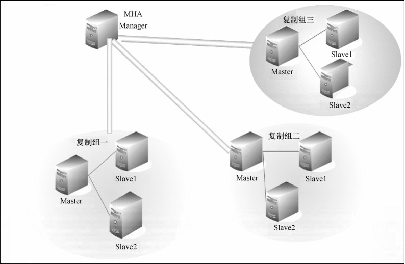

MHA（Master High Availability）目前在MySQL高可用方面是一个相对成熟的解决方案，它由日本DeNA公司youshimaton（现就职于Facebook公司）开发，是一套优秀的作为MySQL高可用性环境下故障切换和主从提升的高可用软件。在 MySQL 故障切换过程中，MHA 能做到在0～30秒之内自动完成数据库的故障切换操作，并且在进行故障切换过程中，MHA能在最大程度上保证数据的一致性，以达到真正意义上的高可用。

它由两部分组成：MHA Manager（管理节点）和MHA Node（数据节点）。MHA Manager可以单独部署在一台独立的机器上管理多个 master-slave 集群，也可以部署在一台 slave 上。MHA node运行在每台MySQL服务器上，MHA Manager会定时探测集群中的master节点，当master出现故障时，它可以自动将最新数据的slave提升为新的master，然后将所有其他的slave重新指向新的master。整个故障转移过程对应用程序是完全透明的。

在 MHA 自动故障切换过程中，MHA 试图从宕掉的主服务器上保存二进制日志，最大程度地保证数据的不丢失，但这并不总是可行的。例如，如果主服务器硬件故障或无法通过 ssh访问，MHA没法保存二进制日志，只进行故障转移而丢失了最新数据。使用MySQL 5.5的半同步复制，可以大大降低数据丢失的风险。MHA 可以与半同步复制结合起来。如果只有一个slave已经收到了最新的二进制日志，MHA可以将最新的二进制日志应用于其他所有的slave服务器上，因此它们彼此保持一致性。

目前 MHA 主要支持一主多从的架构，要搭建 MHA，要求一个复制集群中必须最少有三台数据库服务器，一主二从，即一台充当master，一台充当备用master，另一台充当从库，因为至少需要三台数据库，出于机器成本考虑，淘宝也在此基础上进行了改造，目前淘宝TMHA已经支持一主一从。

图 33-2示意了如何通过MHA Manager管理多组主从复制。可以将MHA工作原理总结为以下几条：

（1）从宕机崩溃的master保存二进制日志事件（binlog events）；

（2）识别含有最新更新的slave；

（3）应用差异的中继日志（relay log）到其他 slave；

图32-2 MHA集群监控图

（4）应用从master保存的二进制日志事件（binlog events）；

（5）提升一个slave为新master；

（6）使其他的slave连接新的master进行复制。

MHA软件由两部分组成，Manager工具包和Node工具包，具体说明如下。

Manager工具包主要包括以下几个工具。

masterha_check_ssh：检查MHA的SSH配置状况。

masterha_check_repl：检查MySQL复制状况。

masterha_manager：启动MHA。

masterha_check_status：检测当前MHA运行状态。

masterha_master_monitor：监测master是否宕机。

masterha_master_switch：控制故障转移（自动或手动）。

masterha_conf_host：添加或删除配置的server信息。

Node工具包（这些工具通常由MHA Manager的脚本触发，无需人手操作）主要包括以下几个工具。

save_binary_logs：保存和复制master的二进制日志。

apply_diff_relay_logs：识别差异的中继日志事件并将其差异的事件应用于其他slave。

filter_mysqlbinlog：去除不必要的ROLLBACK事件（MHA已不再使用这个工具）。

purge_relay_logs：清除中继日志（不会阻塞SQL线程）。

**注意：**为了尽可能地减少因为主库硬件损坏宕机造成的数据丢失，因此在配置 MHA 的同时建议必须配置MySQL 5.5半同步复制。关于半同步复制原理，复制篇已经做过相关介绍。

