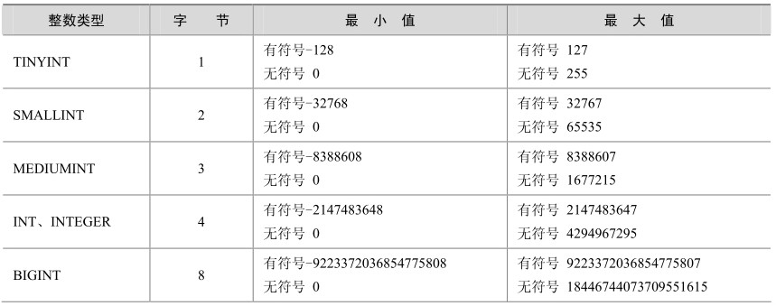
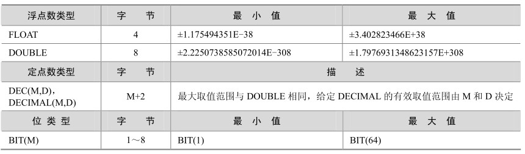

mysql> select * from t1;

MySQL 支持所有标准 SQL 中的数值类型，其中包括严格数值类型（ INTEGER、SMALLINT、DECIMAL和NUMERIC），以及近似数值数据类型（FLOAT、REAL和DOUBLE PRECISION），并在此基础上做了扩展。扩展后增加了TINYINT、MEDIUMINT和BIGINT这3种长度不同的整型，并增加了BIT类型，用来存放位数据。表 3-1中列出了MySQL 5.0中支持的所有数值类型，其中INT是INTEGER的同名词，DEC是DECIMAL的同名词。

表3-1 MySQL中的数值类型

续表

在整数类型中，按照取值范围和存储方式不同，分为tinyint、smallint、mediumint、int和bigint这 5个类型。如果超出类型范围的操作，会发生“Out of range”错误提示。为了避免此类问题发生，在选择数据类型时要根据应用的实际情况确定其取值范围，最后根据确定的结果慎重选择数据类型。

对于整型数据，MySQL还支持在类型名称后面的小括号内指定显示宽度，例如int(5)表示当数值宽度小于5位的时候在数字前面填满宽度，如果不显示指定宽度则默认为int(11)。一般配合zerofill使用，顾名思义，zerofill就是用“0”填充的意思，也就是在数字位数不够的空间用字符“0”填满。以下几个例子分别描述了填充前后的区别。

（1）创建表t1，有id1和id2两个字段，指定其数值宽度分别为int和int(5)：

mysql> create table t1 (id1 int,id2 int(5));

Query OK, 0 rows affected (0.03 sec)

mysql> desc t1;

+-------+---------+------+-----+---------+-------+

| Field | Type | Null | Key | Default | Extra |

+-------+---------+------+-----+---------+-------+

| id1 | int(11) | YES || NULL||

| id2 | int(5) | YES || NULL||

+-------+---------+------+-----+---------+-------+

2 rows in set (0.00 sec)

（2）在id1和id2中都插入数值1，可以发现格式没有异常：

mysql> insert into t1 values(1,1);

Query OK, 1 row affected (0.00 sec)

mysql> select * from t1;

+------+------+

| id1 | id2 |

+------+------+

| 1 | 1 |

+------+------+

1 row in set (0.00 sec)

（3）分别修改id1和id2的字段类型，加入zerofill参数：

mysql> alter table t1 modify id1 int zerofill;

Query OK, 1 row affected (0.04 sec)

Records: 1 Duplicates: 0 Warnings: 0

mysql> alter table t1 modify id2 int(5) zerofill;

Query OK, 1 row affected (0.03 sec)

Records: 1 Duplicates: 0 Warnings: 0

mysql> select * from t1;

+------------+-------+

| id1| id2 |

+------------+-------+

| 0000000001 | 00001 |

+------------+-------+

1 row in set (0.00 sec)

可以发现，在数值前面用字符“0”填充了剩余的宽度。大家可能会有所疑问，设置了宽度限制后，如果插入大于宽度限制的值，会不会截断或者插不进去报错？答案是肯定的：不会对插入的数据有任何影响，还是按照类型的实际精度进行保存，这时，宽度格式实际已经没有意义，左边不会再填充任何的“0”字符。下面在表t1的字段id1中插入数值1，id2中插入数值1111111，位数为7，大于id2的显示位数5，再观察一下测试结果：

mysql> insert into t1 values(1,1111111);

Query OK, 1 row affected (0.00 sec)

mysql> select * from t1;

+------------+---------+

| id1| id2|

+------------+---------+

| 0000000001 | 00001 |

| 0000000001 | 1111111 |

+------------+---------+

2 rows in set (0.00 sec)

很显然，如上面所说，id2中显示了正确的数值，并没有受宽度限制影响。

所有的整数类型都有一个可选属性UNSIGNED（无符号），如果需要在字段里面保存非负数或者需要较大的上限值时，可以用此选项，它的取值范围是正常值的下限取0，上限取原值的2倍，例如，tinyint有符号范围是-128～+127，而无符号范围是0～255。如果一个列指定为zerofill，则MySQL自动为该列添加UNSIGNED属性。

另外，整数类型还有一个属性：AUTO_INCREMENT。在需要产生唯一标识符或顺序值时，可利用此属性，这个属性只用于整数类型。AUTO_INCREMENT值一般从1开始，每行增加1。在插入NULL到一个AUTO_INCREMENT列时，MySQL插入一个比该列中当前最大值大1 的值。一个表中最多只能有一个AUTO_INCREMENT列。对于任何想要使用AUTO_INCREMENT的列，应该定义为NOT NULL，并定义为PRIMARY KEY或定义为UNIQUE键。例如，可按下列任何一种方式定义AUTO_INCREMENT列：

CREATE TABLE AI (ID INT AUTO_INCREMENT NOT NULL PRIMARY KEY);

CREATE TABLE AI(ID INT AUTO_INCREMENT NOT NULL ,PRIMARY KEY(ID));

CREATE TABLE AI (ID INT AUTO_INCREMENT NOT NULL ,UNIQUE(ID));

对于小数的表示，MySQL 分为两种方式：浮点数和定点数。浮点数包括 float（单精度）和double（双精度），而定点数则只有decimal一种表示。定点数在MySQL内部以字符串形式存放，比浮点数更精确，适合用来表示货币等精度高的数据。

浮点数和定点数都可以用类型名称后加“(M,D)”的方式来进行表示，“(M,D)”表示该值一共显示M位数字（整数位+小数位），其中D位位于小数点后面，M和D又称为精度和标度。例如，定义为float(7,4)的一个列可以显示为-999.9999。MySQL保存值时进行四舍五入，因此如果在 float(7,4)列内插入 999.00009，近似结果是 999.0001。值得注意的是，浮点数后面跟“(M,D)”的用法是非标准用法，如果要用于数据库的迁移，则最好不要这么使用。float和double在不指定精度时，默认会按照实际的精度（由实际的硬件和操作系统决定）来显示，而decimal在不指定精度时，默认的整数位为10，默认的小数位为0。

下面通过一个例子来比较float、double和decimal三者之间的不同。

（1）创建测试表，分别将id1、id2、id3字段设置为float(5,2)、double(5,2)、decimal(5,2)：

CREATE TABLE 't1' (

'id1' float(5,2) default NULL,

'id2' double(5,2) default NULL,

'id3' decimal(5,2) default NULL

)

（2）往id1、id2和id3这3个字段中插入数据1.23：

mysql> insert into t1 values(1.23,1.23,1.23);

Query OK, 1 row affected (0.00 sec)

mysql>

mysql> select * from t1;

+------+------+------+

| id1 | id2 | id3 |

+------+------+------+

| 1.23 | 1.23 | 1.23 |

+------+------+------+

1 row in set (0.00 sec)

可以发现，数据都正确地插入了表t1。

（3）再向id1和id2字段中插入数据1.234，而id3字段中仍然插入1.23：

mysql> insert into t1 values(1.234,1.234,1.23);

Query OK, 1 row affected (0.00 sec)

+------+------+------+

| id1 | id2 | id3 |

+------+------+------+

| 1.23 | 1.23 | 1.23 |

| 1.23 | 1.23 | 1.23 |

+------+------+------+

2 rows in set (0.00 sec)

可以发现，id1、id2、id3都插入了表t1，但是id1和id2由于标度的限制，舍去了最后一位，数据变为了1.23。

（4）同时向id1、id2、id3字段中都插入数据1.234：

mysql> insert into t1 values(1.234,1.234,1.234);

Query OK, 1 row affected, 1 warning (0.00 sec)

mysql> show warnings;

+-------+------+------------------------------------------+

| Level | Code | Message |

+-------+------+------------------------------------------+

| Note | 1265 | Data truncated for column 'id3' at row 1 |

+-------+------+------------------------------------------+

1 row in set (0.00 sec)

mysql> select * from t1;

+------+------+------+

| id1 | id2 | id3 |

+------+------+------+

| 1.23 | 1.23 | 1.23 |

| 1.23 | 1.23 | 1.23 |

| 1.23 | 1.23 | 1.23 |

+------+------+------+

3 rows in set (0.00 sec)

此时发现，虽然数据都插入进去，但是系统出现了一个 Warning，报告 id3 被截断。如果是在传统的SQLMode（第16章将会详细介绍SQL Mode）下，这条记录是无法插入的。

（5）将id1、id2、id3字段的精度和标度全部去掉，再次插入数据1.23：

mysql> alter table t1 modify id1 float;

Query OK, 3 rows affected (0.03 sec)

Records: 3 Duplicates: 0 Warnings: 0

mysql> alter table t1 modify id2 double;

Query OK, 3 rows affected (0.04 sec)

Records: 3 Duplicates: 0 Warnings: 0

mysql> alter table t1 modify id3 decimal;

Query OK, 3 rows affected, 3 warnings (0.02 sec)

Records: 3 Duplicates: 0 Warnings: 0

mysql> desc t1;

+-------+---------------+------+-----+---------+-------+

| Field | Type | Null | Key | Default | Extra |

+-------+---------------+------+-----+---------+-------+

| id1 | float | YES | | NULL | |

| id2 | double | YES | | NULL | |

| id3 | decimal(10,0) | YES | | NULL | |

+-------+---------------+------+-----+---------+-------+

3 rows in set (0.00 sec)

mysql> insert into t1 values(1.234,1.234,1.234);

Query OK, 1 row affected, 1 warning (0.00 sec)

mysql> show warnings;

+-------+------+------------------------------------------+

| Level | Code | Message|

+-------+------+------------------------------------------+

| Note | 1265 | Data truncated for column 'id3' at row 1 |

+-------+------+------------------------------------------+

1 row in set (0.00 sec)

mysql> select * from t1;

+-------+-------+------+

| id1 | id2 | id3 |

+-------+-------+------+

| 1.234 | 1.234 | 1 |

+-------+-------+------+

1 row in set (0.00 sec)

这个时候，可以发现id1、id2字段中可以正常插入数据，而id3字段的小数位被截断。

上面这个例子验证了上面提到的浮点数如果不写精度和标度，则会按照实际精度值显示，如果有精度和标度，则会自动将四舍五入后的结果插入，系统不会报错；定点数如果不写精度和标度，则按照默认值decimal(10,0)来进行操作，并且如果数据超越了精度和标度值，系统则会报错。

对于BIT（位）类型，用于存放位字段值，BIT(M)可以用来存放多位二进制数，M范围从1～64，如果不写则默认为1位。对于位字段，直接使用SELECT命令将不会看到结果，可以用bin()（显示为二进制格式）或者hex()（显示为十六进制格式）函数进行读取。

下面的例子中，对测试表t2中的bit类型字段id做insert和select操作，这里重点观察一下select的结果：

mysql> desc t2;

+-------+--------+------+-----+---------+-------+

| Field | Type | Null | Key | Default | Extra |

+-------+--------+------+-----+---------+-------+

| id| bit(1) | YES | | NULL||

+-------+--------+------+-----+---------+-------+

1 row in set (0.00 sec)

mysql> insert into t2 values(1);

Query OK, 1 row affected (0.00 sec)

mysql> select * from t2;

+------+

| id |

+------+

| |

+------+

1 row in set (0.00 sec)

可以发现，直接 select *的结果为NULL。改用 bin()和 hex()函数再试试：

mysql> select bin(id),hex(id) from t2;

+---------+---------+

| bin(id) | hex(id) |

+---------+---------+

| 1 | 1 |

+---------+---------+

1 row in set (0.00 sec)

结果可以正常显示为二进制数字和十六进制数字。

数据插入 bit 类型字段时，首先转换为二进制，如果位数允许，将成功插入；如果位数小于实际定义的位数，则插入失败，下面的例子中，在t2表插入数字2，因为它的二进制码是“10”，而id的定义是bit(1)，将无法进行插入：

mysql> insert into t2 values(2);

Query OK, 1 row affected, 1 warning (0.00 sec)

mysql> show warnings;

+---------+------+------------------------------------------------------+

| Level | Code | Message |

+---------+------+------------------------------------------------------+

| Warning | 1264 | Out of range value adjusted for column 'id' at row 1 |

+---------+------+------------------------------------------------------+

1 row in set (0.01 sec)

将ID定义修改为bit(2)后，重新插入，插入成功：

mysql> alter table t2 modify id bit(2);

Query OK, 1 row affected (0.02 sec)

Records: 1 Duplicates: 0 Warnings: 0

mysql> insert into t2 values(2);

Query OK, 1 row affected (0.00 sec)

mysql> select bin(id),hex(id) from t2;

+---------+---------+

| bin(id) | hex(id) |

+---------+---------+

| 1 | 1 |

| 10 | 2 |

+---------+---------+

2 rows in set (0.00 sec)

