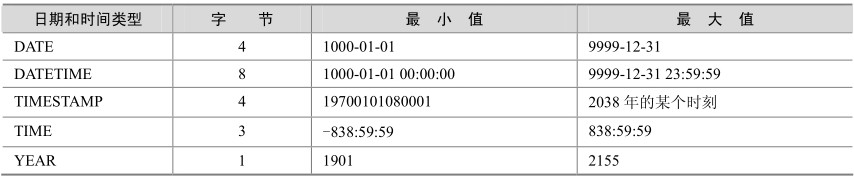
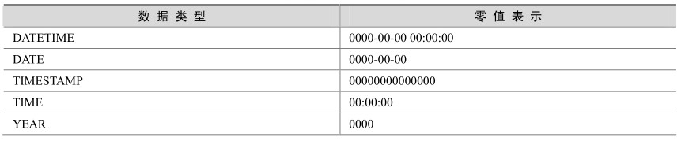

MySQL中有多种数据类型可以用于日期和时间的表示，不同的版本可能有所差异，表3-2中列出了MySQL 5.0中所支持的日期和时间类型。

这些数据类型的主要区别如下。

如果要用来表示年月日，通常用DATE来表示。

如果要用来表示年月日时分秒，通常用DATETIME表示。

如果只用来表示时分秒，通常用TIME来表示。

表3-2 MySQL中的日期和时间类型

如果需要经常插入或者更新日期为当前系统时间，则通常使用TIMESTAMP来表示。TIMESTAMP值返回后显示为“YYYY-MM-DD HH:MM:SS”格式的字符串，显示宽度固定为19个字符。如果想要获得数字值，应在TIMESTAMP 列添加“+0”。

如果只是表示年份，可以用YEAR来表示，它比DATE占用更少的空间。YEAR有2位或4位格式的年。默认是4位格式。在4位格式中，允许的值是1901～2155和0000。在2位格式中，允许的值是70～69，表示从1970～2069年。MySQL以YYYY格式显示YEAR值（从5.5.27开始，2位格式的year已经不被支持）。

从表3-2中可以看出，每种日期时间类型都有一个有效值范围，如果超出这个范围，在默认的SQLMode下，系统会进行错误提示，并将以零值来进行存储。不同日期类型零值的表示如表3-3所示。

表3-3 MySQL中日期和时间类型的零值表示

DATE、TIME和DATETIME是最常使用的3种日期类型，以下例子在3种类型字段插入了相同的日期值，来看看它们的显示结果。

首先创建表t，字段分别为date、time、datetime三种日期类型：

mysql> create table t (d date,t time,dt datetime);

Query OK, 0 rows affected (0.01 sec)

mysql> desc t;

+-------+----------+------+-----+---------+-------+

| Field | Type | Null | Key | Default | Extra |

+-------+----------+------+-----+---------+-------+

| d | date | YES | | NULL||

| t | time | YES | | NULL||

| dt| datetime | YES | | NULL||

+-------+----------+------+-----+---------+-------+

3 rows in set (0.01 sec)

用now()函数插入当前日期：

mysql> insert into t values(now(),now(),now());

Query OK, 1 row affected (0.00 sec)

查看显示结果：

mysql> select * from t;

+------------+----------+---------------------+

| d | t | dt|

+------------+----------+---------------------+

| 2007-07-19 | 17:41:13 | 2007-07-19 17:41:13 |

+------------+----------+---------------------+

1 row in set (0.00 sec)

显而易见，DATETIME是DATE和TIME的组合，用户可以根据不同的需要，来选择不同的日期或时间类型以满足不同的应用。

TIMESTAMP也用来表示日期，但是和DATETIME有所不同，后面的章节中会专门介绍。下例对TIMESTAMP类型的特性进行一些测试。

创建测试表t，字段id1为TIMESTAMP类型：

mysql> create table t (id1 timestamp);

Query OK, 0 rows affected (0.03 sec)

mysql> desc t;

+-------+-----------+------+-----+-------------------+-------+

| Field | Type | Null | Key | Default | Extra |

+-------+-----------+------+-----+-------------------+-------+

| id2 | timestamp | YES | | CURRENT_TIMESTAMP | |

+-------+-----------+------+-----+-------------------+-------+

1 row in set (0.00 sec)

可以发现，系统给tm自动创建了默认值CURRENT_TIMESTAMP（系统日期）。插入一个NULL值试试：

mysql> insert into t values(null);

Query OK, 1 row affected (0.00 sec)

mysql> select * from t;

+---------------------+

| t|

+---------------------+

| 2007-07-04 16:37:24 |

+---------------------+

1 row in set (0.00 sec)

果然，t中正确插入了系统日期。注意，MySQL只给表中的第一个TIMESTAMP字段设置默认值为系统日期，如果有第二个TIMESTAMP类型，则默认值设置为0值，测试如下：

mysql> alter table t add id2 timestamp;

Query OK, 0 rows affected (0.03 sec)

Records: 0 Duplicates: 0 Warnings: 0

mysql> show create table t \G;

*************************** 1. row ***************************

Table: t

Create Table: CREATE TABLE 't' (

'id1' timestamp NOT NULL default CURRENT_TIMESTAMP,

'id2' timestamp NOT NULL default '0000-00-00 00:00:00'

) ENGINE=MyISAM DEFAULT CHARSET=gbk

1 row in set (0.00 sec))

当然，可以修改 id2的默认值为其他常量日期，但是不能再修改为current_timestamp，因为MySQL规定TIMESTAMP类型字段只能有一列的默认值为current_timestamp，如果强制修改，系统会报如下错误提示：

mysql> alter table t modify id2 timestamp default current_timestamp;

ERROR 1293 (HY000): Incorrect table definition; there can be only one TIMESTAMP column with CURRENT_TIMESTAMP in DEFAULT or ON UPDATE clause

TIMESTAMP还有一个重要特点，就是和时区相关。当插入日期时，会先转换为本地时区后存放；而从数据库里面取出时，也同样需要将日期转换为本地时区后显示。这样，两个不同时区的用户看到的同一个日期可能是不一样的，下面的例子演示了这个差别。

（1）创建表t8，包含字段id1（TIMESTAMP）和id2（DATETIME），设置id2的目的是为了和id1做对比：

CREATE TABLE 't8' (

'id1' timestamp NOT NULL default CURRENT_TIMESTAMP,

'id2' datetime default NULL

)

Query OK, 0 rows affected (0.03 sec)

（2）查看当前时区：

mysql> show variables like 'time_zone';

+---------------+--------+

| Variable_name | Value |

+---------------+--------+

| time_zone | SYSTEM |

+---------------+--------+

1 row in set (0.00 sec)

可以发现，时区的值为“SYSTEM”，这个值默认是和主机的时区值一致的，因为我们在中国，这里的“SYSTEM”实际是东八区（+8:00）。

（3）用now()函数插入当前日期：

mysql> select * from t8;

+---------------------+---------------------+

| id1 | id2|

+---------------------+---------------------+

| 2007-09-25 17:26:50 | 2007-09-25 17:26:50 |

+---------------------+---------------------+

1 row in set (0.01 sec)

结果显示id1和id2的值完全相同。

（4）修改时区为东九区，再次查看表中日期：

mysql> set time_zone='+9:00';

Query OK, 0 rows affected (0.00 sec)

mysql> select * from t8;

+---------------------+---------------------+

| id1 | id2 |

+---------------------+---------------------+

| 2007-09-25 18:26:50 | 2007-09-25 17:26:50 |

+---------------------+---------------------+

1 row in set (0.00 sec)

结果中可以发现，id1 的值比 id2 的值快了 1 个小时，也就是说，东九区的人看到的“2007-09-25 18:26:50”是当地时区的实际日期，也就是东八区的“2007-09-25 17:26:50”，如果还是以“2007-09-25 17:26:50”理解时间必然导致误差。

TIMESTAMP的取值范围为19700101080001到2038年的某一天，因此它不适合存放比较久远的日期，下面简单测试一下这个范围：

mysql> insert into t values (19700101080001);

Query OK, 1 row affected (0.00 sec)

mysql> select * from t;

+---------------------+

| t |

+---------------------+

| 1970-01-01 08:00:01 |

+---------------------+

1 row in set (0.00 sec)

mysql> insert into t values (19700101080000);

Query OK, 1 row affected, 1 warning (0.00 sec)

其中19700101080000超出了tm的下限，系统出现警告提示。查询一下，发现插入值变成了0值：

mysql> select * from t;

+---------------------+

| t|

+---------------------+

| 1970-01-01 08:00:01 |

| 0000-00-00 00:00:00 |

+---------------------+

2 rows in set (0.00 sec)

再来测试一下TIMESTAMP的上限值：

mysql> insert into t values('2038-01-19 11:14:07');

Query OK, 1 row affected (0.00 sec)

mysql> select * from t;

+---------------------+

| t|

+---------------------+

| 2038-01-19 11:14:07 |

+---------------------+

1 row in set (0.00 sec)

mysql> insert into t values('2038-01-19 11:14:08');

Query OK, 1 row affected, 1 warning (0.00 sec)

mysql> select * from t;

+---------------------+

| t |

+---------------------+

| 2038-01-19 11:14:07 |

| 0000-00-00 00:00:00 |

+---------------------+

2 rows in set (0.00 sec)

从上面例子可以看出，TIMESTAMP 和 DATETIME 的表示方法非常类似，区别主要有以下几点。

TIMESTAMP支持的时间范围较小，其取值范围从19700101080001到2038年的某个时间，而DATETIME是从 1000-01-01 00:00:00到 9999-12-31 23:59:59，范围更大。

表中的第一个TIMESTAMP列自动设置为系统时间。如果在一个TIMESTAMP列中插入 NULL ，则该列值将自动设置为当前的日期和时间。在插入或更新一行但不明确给TIMESTAMP列赋值时也会自动设置该列的值为当前的日期和时间，当插入的值超出取值范围时，MySQL认为该值溢出，使用“0000-00-00 00:00:00”进行填补。

TIMESTAMP 的插入和查询都受当地时区的影响，更能反映出实际的日期。而DATETIME则只能反映出插入时当地的时区，其他时区的人查看数据必然会有误差的。

TIMESTAMP 的属性受 MySQL 版本和服务器 SQLMode 的影响很大，本章都是以MySQL 5.0为例进行介绍的，对于不同的版本可以参考相应的MySQL帮助文档。

YEAR类型主要用来表示年份，当应用只需要记录年份时，用YEAR比DATE将更节省空间。下面的例子在表t中定义了一个YEAR类型字段，并插入一条记录：

mysql> create table t(y year);

Query OK, 0 rows affected (0.01 sec)

mysql> desc t;

+-------+---------+------+-----+---------+-------+

| Field | Type | Null | Key | Default | Extra |

+-------+---------+------+-----+---------+-------+

| y | year(4) | YES | | NULL||

+-------+---------+------+-----+---------+-------+

1 row in set (0.00 sec)

mysql> insert into t values(2100);

Query OK, 1 row affected (0.00 sec)

mysql> select * from t;

+------+

| y |

+------+

| 2100 |

+------+

1 row in set (0.00 sec)

MySQL以YYYY格式检索和显示YEAR值，范围是1901～2155。当使用两位字符串表示年份时，其范围为“00”到“99”。

“00”到“69”范围的值被转换为2000～2069范围的YEAR值。

“70”到“99”范围的值被转换为1970～1999范围的YEAR值。

细心的读者可能发现，在上面的例子中，日期类型的插入格式有很多，包括整数（如2100）、字符串（如 2038-01-19 11:14:08）、函数（如NOW()）等，读者可能会感到疑惑，到底什么样的格式才能够正确地插入到对应的日期字段中呢？下面以DATETIME为例进行介绍。

YYYY-MM-DD HH:MM:SS或YY-MM-DD HH:MM:SS格式的字符串。允许“不严格”语法，即任何标点符都可以用做日期部分或时间部分之间的间隔符。例如，“98-12-31 11:30:45”、“98.12.31 11+30+45”、“98/12/31 11*30*45”和“98@12@31 11^30^45”是等价的。对于包括日期部分间隔符的字符串值，如果日和月的值小于 10 ，不需要指定两位数。“1979-6-9”与“1979-06-09”是相同的。同样，对于包括时间部分间隔符的字符串值，如果时、分和秒的值小于 10，不需要指定两位数。“1979-10-30 1:2:3”与“1979-10-30 01:02:03”相同。

YYYYMMDDHHMMSS 或 YYMMDDHHMMSS 格式的没有间隔符的字符串，假定字符串对于日期类型是有意义的。例如，“19970523091528”和“970523091528”被解释为“1997-05-23 09:15:28”，但“971122129015”是不合法的（它有一个没有意义的分钟部分），将变为“0000-00-00 00:00:00”。

YYYYMMDDHHMMSS或YYMMDDHHMMSS格式的数字，假定数字对于日期类型是有意义的。例如，19830905132800和830905132800被解释为“1983-09-05 13:28:00”。数字值应为6、8、12或者14位长。如果一个数值是8位或14位长，则假定为YYYYMMDD或YYYYMMDD HHMMSS 格式，前 4 位数表示年。如果数字是 6 位或 12 位长，则假定为 YYMMDD 或YYMMDDHHMMSS格式，前2位数表示年。其他数字被解释为仿佛用零填充到了最近的长度。

函数返回的结果，其值适合DATETIME、DATE或TIMESTAMP上下文，例如NOW()或CURRENT_DATE。

对于其他数据类型，其使用原则与上面的内容类似，限于篇幅，这里就不再赘述。

最后通过一个例子，说明如何采用不同的格式将日期“2007-9-3 12:10:10”插入到DATETIME列中。

mysql> create table t6(dt datetime);

Query OK, 0 rows affected (0.03 sec)

mysql> insert into t6 values('2007-9-3 12:10:10');

Query OK, 1 row affected (0.00 sec)

mysql> insert into t6 values('2007/9/3 12+10+10');

Query OK, 1 row affected (0.00 sec)

mysql> insert into t6 values('20070903121010');

Query OK, 1 row affected (0.01 sec)

mysql> insert into t6 values(20070903121010);

Query OK, 1 row affected (0.00 sec)

mysql> select * from t6;

+---------------------+

| dt |

+---------------------+

| 2007-09-03 12:10:10 |

| 2007-09-03 12:10:10 |

| 2007-09-03 12:10:10 |

| 2007-09-03 12:10:10 |

+---------------------+

4 rows in set (0.00 sec)

