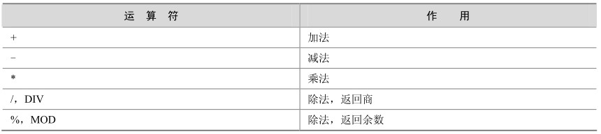

MySQL 支持的算术运算符包括加、减、乘、除和模运算。它们是最常使用、最简单的一类运算符。表4-1列出了这些运算符及其作用。

表4-1 MySQL支持的算术运算符

下例中简单地描述了这几种运算符的使用方法：

mysql> select 0.1+ 0.3333 ,0.1-0.3333, 0.1*0.3333, 1/2,1%2;

+-------------+------------+------------+--------+------+

| 0.1+ 0.3333 | 0.1-0.3333 | 0.1*0.3333 | 1/2 | 1%2 |

+-------------+------------+------------+--------+------+

| 0.4333 | -0.2333 | 0.03333 | 0.5000 |1|

+-------------+------------+------------+--------+------+

1 row in set (0.00 sec)

“+”运算符用于获得一个或多个值的和。

“-”运算符用于从一个值中减去另一个值。

“*”运算符使数字相乘，得到两个或多个值的乘积。

“/”运算符用一个值除以另一个值得到商。

“%”运算符用一个值除以另外一个值得到余数。

在除法运算和模运算中，如果除数为0，将是非法除数，返回结果为NULL，如下例所示：

mysql> select 1/0, 100%0 ;

+------+-------+

| 1/0 | 100%0 |

+------+-------+

| NULL | NULL |

+------+-------+

1 row in set (0.02 sec)

对于模运算，还有另一种表达方式，使用MOD(a,b)函数与a%b效果一样：

mysql> select 3%2,mod(3,2);

+------+----------+

| 3%2 | mod(3,2) |

+------+----------+

| 1 |1|

+------+----------+

1 row in set (0.01 sec)

