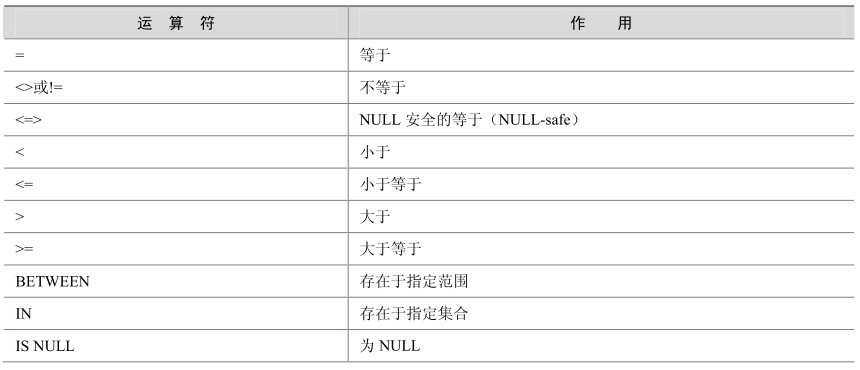
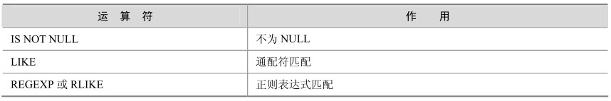

熟悉了最简单的算术运算符，再来看一下比较运算符。当使用SELECT语句进行查询时， MySQL允许用户对表达式的左边操作数和右边操作数进行比较，比较结果为真，则返回1，为假则返回 0，比较结果不确定则返回NULL。表 4-2列出了MySQL 5.0支持的各种比较运算符。

表4-2 MySQL支持的比较运算符

续表

比较运算符可以用于比较数字、字符串和表达式。数字作为浮点数比较，而字符串以不区分大小写的方式进行比较。下面通过实例来学习各种比较运算符的使用。

“=”运算符，用于比较运算符两侧的操作数是否相等，如果两侧操作数相等，则返回值为1，否则为0。注意NULL不能用于“=”比较。

mysql> select 1=0,1=1,NULL=NULL;

+-----+-----+-----------+

| 1=0 | 1=1 | NULL=NULL |

+-----+-----+-----------+

| 0 | 1 |NULL |

+-----+-----+-----------+

1 row in set (0.00 sec)

“<>”运算符，和“=”相反，如果两侧操作数不等，则值为 1，否则为 0。NULL 不能用于“<>”比较。

mysql> select 1<>0,1<>1,null<>null;

+------+------+------------+

| 1<>0 | 1<>1 | null<>null |

+------+------+------------+

| 1 | 0 |NULL |

+------+------+------------+

1 row in set (0.00 sec)

“<=>”运算符，和“=”类似，在操作数相等时值为 1，不同之处在于即使操作的值为NULL也可以正确比较。

mysql> select 1<=>1,2<=>0 ,0<=>0, NULL<=>NULL;

+-------+-------+-------+-------------+

| 1<=>1 | 2<=>0 | 0<=>0 | NULL<=>NULL |

+-------+-------+-------+-------------+

| 1 | 0 | 1 |1|

+-------+-------+-------+-------------+

1 row in set (0.17 sec)

“<”运算符，当左侧操作数小于右侧操作数时，其返回值为1，否则其值为0。

mysql> select 'a'<'b' ,'a'<'a' ,'a'<'c',1<2;

+---------+---------+---------+-----+

| 'a'<'b' | 'a'<'a' | 'a'<'c' | 1<2 |

+---------+---------+---------+-----+

|1|0| 1 | 1 |

+---------+---------+---------+-----+

1 row in set (0.03 sec)

“<=”运算符，当左侧操作数小于等于右侧操作数时，其返回值为1，否则返回值为0。

mysql> select 'bdf'<='b','b'<='b' ,0<1;

+------------+----------+-----+

| 'bdf'<='b' | 'b'<='b' | 0<1 |

+------------+----------+-----+

| 0 | 1 | 1 |

+------------+----------+-----+

1 row in set (0.00 sec)

“>”运算符，当左侧操作数大于右侧操作数时，其返回值为1，否则返回值为0。

mysql> select 'a'>'b','abc'>'a' ,1>0;

+---------+-----------+-----+

| 'a'>'b' | 'abc'>'a' | 1>0 |

+---------+-----------+-----+

| 0 | 1 | 1 |

+---------+-----------+-----+

1 row in set (0.03 sec)

“>=”运算符，当左侧操作数大于等于右侧操作数时，其返回值为1，否则返回值为0。

mysql> select 'a'>='b','abc'>='a' ,1>=0 ,1>=1;

+----------+------------+------+------+

| 'a'>='b' | 'abc'>='a' | 1>=0 | 1>=1 |

+----------+------------+------+------+

| 0 | 1 | 1 | 1 |

+----------+------------+------+------+

1 row in set (0.00 sec)

“BETWEEN”运算符的使用格式为“a BETWEEN min AND max”，当 a大于等于min并且小于等于max，则返回值为1，否则返回0；当操作数a、min、max类型相同时，此表达式等价于（a>=min and a<=max），当操作数类型不同时，比较时会遵循类型转换原则进行转换后，再进行比较运算。下例中描述了BETWEEN的用法：

mysql> select 10 between 10 and 20, 9 between 10 and 20;

+----------------------+---------------------+

| 10 between 10 and 20 | 9 between 10 and 20 |

+----------------------+---------------------+

| 1 | 0 |

+----------------------+---------------------+

1 row in set (0.00 sec)

“IN”运算符的使用格式为“a IN (value1,value2,…)”，当 a的值存在于列表中时，则整个比较表达式返回的值为1，否则返回0。

mysql> select 1 in (1,2,3) , 't' in ('t','a','b','l','e'),0 in (1,2);

+--------------+------------------------------+------------+

| 1 in (1,2,3) | 't' in ('t','a','b','l','e') | 0 in (1,2) |

+--------------+------------------------------+------------+

| 1 | 1 | 0 |

+--------------+------------------------------+------------+

1 row in set (0.00 sec)

“IS NULL”运算符的使用格式为“a IS NULL”，当 a的值为NULL，则返回值为 1，否则返回0。

mysql> select 0 is null, null is null;

+-----------+--------------+

| 0 is null | null is null |

+-----------+--------------+

|0|1|

+-----------+--------------+

1 row in set (0.02 sec)

“IS NOT NULL”运算符的使用格式为“a IS NOT NULL”。和“IS NULL”相反，当 a的值不为NULL，则返回值为1，否则返回0。

mysql> select 0 is not null, null is not null;

+----------------+-------------------+

| 0 is not null | null is not null |

+----------------+-------------------+

|1|0|

+----------------+-------------------+

1 row in set (0.00 sec)

“LIKE”运算符的使用格式为“a LIKE %123%”，当 a中含有字符串“123”时，则返回值为1，否则返回0。

mysql> select 123456 like '123%',123456 like '%123%',123456 like '%321%';

+--------------------+---------------------+---------------------+

| 123456 like '123%' | 123456 like '%123%' | 123456 like '%321%' |

+--------------------+---------------------+---------------------+

|1|1|0|

+--------------------+---------------------+---------------------+

1 row in set (0.00 sec)

“REGEXP”运算符的使用格式为“str REGEXP str_pat”，当 str字符串中含有 str_pat相匹配的字符串时，则返回值为1，否则返回0。REGEXP运算符的使用方法将会在第17章中详细介绍。

mysql> select 'abcdef' regexp 'ab' ,'abcdefg' regexp 'k';

+----------------------+----------------------+

| 'abcdef' regexp 'ab' | 'abcdefg' regexp 'k' |

+----------------------+----------------------+

|1|0|

+----------------------+----------------------+

1 row in set (0.00 sec)

