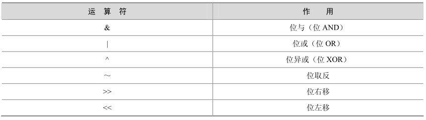

位运算是将给定的操作数转化为二进制后，对各个操作数每一位都进行指定的逻辑运算，得到的二进制结果转换为十进制数后就是位运算的结果。MySQL 5.0支持 6种位运算符，如表4-4所示。

表4-4 MySQL支持的位运算符

可以发现，位运算符中的位与“&”和位或“|”和前面介绍的逻辑与和逻辑或非常类似。其他操作符和逻辑操作有所不同，下面将分别举例介绍。

“位与”对多个操作数的二进制位做逻辑与操作，例如2&3，因为2的二进制数是10， 3是11，所有10&11的结果是10，十进制数字还是2，来看实际结果：

mysql> select 2&3;

+-----+

| 2&3 |

+-----+

| 2 |

+-----+

1 row in set (0.00 sec)

可以对2个以上操作数做“或”操作，测试一下2&3&4，因为4的二进制是100，和上面的10做与操作100&010后，结果应该是000，可以看实际结果：

mysql> select 2&3&4;

+-------+

| 2&3&4 |

+-------+

|0|

+-------+

1 row in set (0.00 sec)

“位或”对多个操作数的二进制位做逻辑或操作，还是上面的例子，2|3的结果应该是10|11，结果还是11，应该是3，实际结果如下：

mysql> select 2|3;

+-----+

| 2|3 |

+-----+

| 3 |

+-----+

1 row in set (0.00 sec)

“位异或”对操作数的二进制位做异或操作，10^11的结果是01，结果应该是1，可以看实际结果为：

mysql> select 2^3;

+-----+

| 2^3 |

+-----+

| 1 |

+-----+

1 row in set (0.00 sec)

“位取反”对操作数的二进制位做NOT操作，这里的操作数只能是一位，下面看一个经典的取反例子：对1做位取反，具体如下所示：

mysql> select～1 ,～ 18446744073709551614;

+----------------------+------------------------+

|～1 |～ 18446744073709551614 |

+----------------------+------------------------+

| 18446744073709551614 | 1 |

+----------------------+------------------------+

1 row in set (0.00 sec)

结果可能会令人感到疑惑，1 的位取反怎么会是这么大的数字？来研究一下，在 MySQL中，常量数字默认会以8个字节来表示，8个字节就是64位，常量1的二进制表示为63个“0”加1个“1”，位取反后就是63个“1”加一个“0”，转换为二进制后就是18446744073709551614，实际结果如下：

mysql> select bin(18446744073709551614);

+------------------------------------------------------------------+

| bin(18446744073709551614) |

+------------------------------------------------------------------+

| 1111111111111111111111111111111111111111111111111111111111111110 |

+------------------------------------------------------------------+

1 row in set (0.00 sec)

“位右移”对左操作数向右移动右操作数指定的位数。例如100>>3，就是对100的二进制数0001100100右移3位，左边补0，结果是0000001100，转换为二进制数是12，实际结果如下：

mysql> select 100>>3;

+--------+

| 100>>3 |

+--------+

|12 |

+--------+

1 row in set (0.00 sec)

“位左移”对左操作数向左移动右操作数指定的位数。例如100<<3，就是对100的二进制数0001100100左移3位，右边补0，结果是1100100000，转换为二进制数是800，实际结果如下：

mysql> select 100<<3;

+--------+

| 100<<3 |

+--------+

| 800 |

+--------+

1 row in set (0.00 sec)

