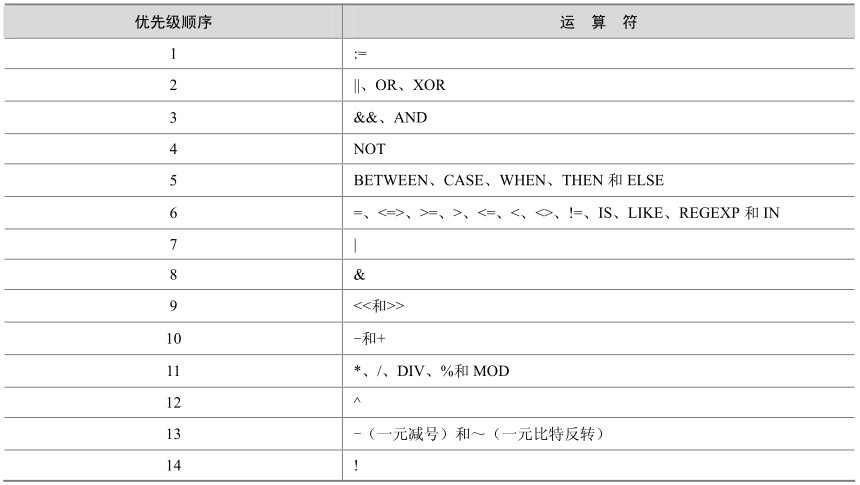

前面介绍了MySQL支持的各种运算符的使用方法。在实际应用中，很可能将这些运算符进行混合运算，那么应该先进行哪些运算符的操作呢？表4-5中列出了所有的运算符，优先级由低到高排列，同一行中的运算符具有相同的优先级。

表4-5 MySQL中的运算符优先级

在实际运行的时候，可以参考表4-5中的优先级。实际上，很少有人能将这些优先级熟练记忆，很多情况下我们都是用“（）”来将需要优先的操作括起来，这样既起到了优先的作用，又使得其他用户看起来更易于理解。

