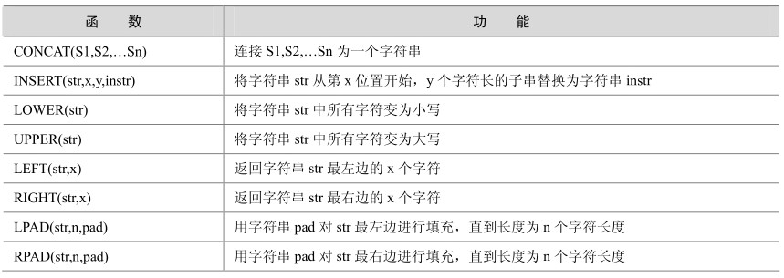
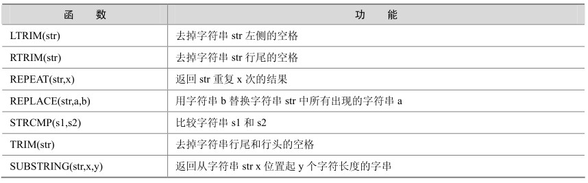

字符串函数是最常用的一种函数，如果读者编写过程序，不妨回过头去看看自己使用过的函数，可能会惊讶地发现字符串处理的相关函数占已使用过的函数很大一部分。在MySQL中，字符串函数同样是最丰富的一类函数，表5-1列出了这些常用字符串函数，以供参考。

表5-1 MySQL中的常用字符串函数

续表

下面通过具体的实例来逐个地研究每个函数的用法，需要注意的是，这里的例子仅仅用于说明各个函数的使用方法，所以函数都是单个出现的，但是在一个具体的应用中通常可能需要综合几个甚至几类函数才能实现相应的应用。

CONCAT(S1,S2,…Sn)函数：把传入的参数连接成为一个字符串。

下面的例子把“aaa”、“bbb”、“ccc”3个字符串连接成了一个字符串“aaabbbccc”。另外，任何字符串与NULL进行连接的结果都将是NULL。

mysql> select concat('aaa', 'bbb', 'ccc') ,concat('aaa',null);

+---------------------------+--------------------+

| concat('aaa','bbb','ccc') | concat('aaa',null) |

+---------------------------+--------------------+

| aaabbbccc | NULL |

+---------------------------+--------------------+

1 row in set (0.05 sec)

INSERT(str,x,y,instr)函数：将字符串str从第x位置开始，y个字符长的子串替换为字符串instr。

下面的例子把字符串“beijing2008you”中从第12个字符开始以后的3个字符替换成“me”。

mysql> select INSERT('beijing2008you',12,3, 'me') ;

+-------------------------------------+

| INSERT('beijing2008you',12,3, 'me') |

+-------------------------------------+

| beijing2008me |

+-------------------------------------+

1 row in set (0.00 sec)

LOWER(str)和UPPER(str)函数：把字符串转换成小写或大写。

在字符串比较中，通常要将比较的字符串全部转换为大写或者小写，如下例所示：

mysql> select LOWER('BEIJING2008'), UPPER('beijing2008');

+----------------------+----------------------+

| LOWER('BEIJING2008') | UPPER('beijing2008') |

+----------------------+----------------------+

| beijing2008 | BEIJING2008 |

+----------------------+----------------------+

1 row in set (0.00 sec)

LEFT(str,x)和RIGHT(str,x)函数：分别返回字符串最左边的x个字符和最右边的x个字符。如果第二个参数是NULL，那么将不返回任何字符串。

下例中显示了对字符串“beijing2008”应用函数后的结果。

mysql> SELECT LEFT('beijing2008',7),LEFT('beijing',null),RIGHT('beijing2008',4);

+-----------------------+----------------------+------------------------+

| LEFT('beijing2008',7) | LEFT('beijing',null) | RIGHT('beijing2008',4) |

+-----------------------+----------------------+------------------------+

| beijing | | 2008 |

+-----------------------+----------------------+------------------------+

1 row in set (0.00 sec)

LPAD(str,n,pad)和RPAD(str,n,pad)函数：用字符串pad对str最左边和最右边进行填充，直到长度为n个字符长度。

下例中显示了对字符串“2008”和“beijing”分别填充后的结果。

mysql> select lpad('2008',20,'beijing'),rpad('beijing',20,'2008');

+---------------------------+---------------------------+

| lpad('2008',20,'beijing') | rpad('beijing',20,'2008') |

+---------------------------+---------------------------+

| beijingbeijingbe2008 | beijing2008200820082 |

+---------------------------+---------------------------+

1 row in set (0.00 sec)

LTRIM(str)和RTRIM(str)函数：去掉字符串str左侧和右侧空格。

下例中显示了字符串“beijing”加空格进行过滤后的结果。

mysql> select ltrim(' |beijing'),rtrim('beijing| ');

+---------------------+------------------------+

| ltrim(' |beijing') | rtrim('beijing|') |

+---------------------+------------------------+

| |beijing| beijing||

+---------------------+------------------------+

1 row in set (0.00 sec)

REPEAT(str,x)函数：返回str重复x次的结果。

下例中对字符串“mysql”重复显示了3次。

mysql> select repeat('mysql ',3);

+--------------------+

| repeat('mysql ',3) |

+--------------------+

| mysql mysql mysql |

+--------------------+

1 row in set (0.00 sec)

REPLACE(str,a,b)函数：用字符串b替换字符串str中所有出现的字符串a。

下例中用字符串“2008”代替了字符串“beijing_2010”中的“_2010”。

mysql> select replace('beijing_2010','_2010','2008');

+----------------------------------------+

| replace('beijing_2010','_2010','2008') |

+----------------------------------------+

| beijing2008 |

+----------------------------------------+

1 row in set (0.00 sec)

STRCMP(s1,s2)函数：比较字符串s1和s2的ASCII码值的大小。

如果s1比s2小，那么返回-1；如果s1与s2相等，那么返回0；如果s1比s2大，那么返回1，如下例所示。

mysql> select strcmp('a','b'),strcmp('b','b'),strcmp('c','b');

+-----------------+-----------------+-----------------+

| strcmp('a','b') | strcmp('b','b') | strcmp('c','b') |

+-----------------+-----------------+-----------------+

|-1 | 0 |1|

+-----------------+-----------------+-----------------+

1 row in set (0.00 sec)

TRIM(str)函数：去掉目标字符串的开头和结尾的空格。

下例中对字符串“ $ beijing2008 $ ”进行了前后空格的过滤。

mysql> select trim(' $ beijing2008 $ ');

+-----------------------------+

| trim(' $ beijing2008 $ ') |

+-----------------------------+

| $ beijing2008 $ |

+-----------------------------+

1 row in set (0.00 sec)

SUBSTRING(str,x,y)函数：返回从字符串str中的第x位置起y个字符长度的字串。

此函数经常用来对给定字符串进行字串的提取，如下例所示。

mysql> select substring('beijing2008',8,4),substring('beijing2008',1,7);

+------------------------------+------------------------------+

| substring('beijing2008',8,4) | substring('beijing2008',1,7) |

+------------------------------+------------------------------+

| 2008 | beijing |

+------------------------------+------------------------------+

